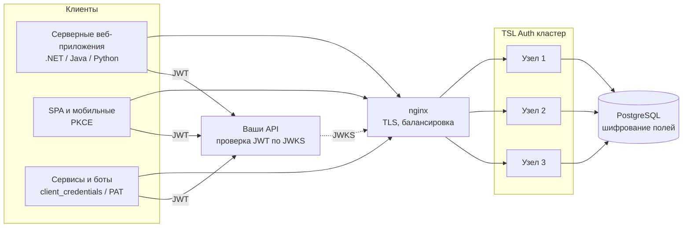

# TSL Auth

Сервис аутентификации и авторизации (аналог Keycloak) на .NET 10 в Docker-контейнере.
OAuth 2.0 / OpenID Connect, JWT, ролевая модель с матрицей доступа для каждого приложения,
кластерный режим без потери сессий, веб-админка и REST API. Работает полностью в закрытом контуре (без интернета).

<!-- Сборка и качество -->
[](https://github.com/akprof2000/tsl-auth/actions/workflows/ci.yml)
[](https://github.com/akprof2000/tsl-auth/actions/workflows/e2e.yml)
[](docs/testing.md)
[](docs/)
[](LICENSE)
[](https://github.com/akprof2000/tsl-auth/commits/main)

<!-- Образ и безопасность -->
[](https://github.com/akprof2000/tsl-auth/pkgs/container/tsl-auth)
[](https://hub.docker.com/r/akprof2000/tsl-auth)
[](https://hub.docker.com/r/akprof2000/tsl-auth)
[](https://hub.docker.com/r/akprof2000/tsl-auth/tags)
[](docs/security.md#образ-контейнера)
[](docs/security.md#результаты-сканирования)
[](docs/security.md#результаты-сканирования)
[](docs/security.md#проверка-подлинности-образа)
[](docs/security.md#проверка-подлинности-образа)
[](docs/security.md#образ-контейнера)
[](.github/dependabot.yml)

<!-- Технологии -->
[](https://dotnet.microsoft.com/)
[](https://documentation.openiddict.com/)
[](docs/integration.md)
[](docs/integration.md#4-формат-токена-и-авторизация-в-api)
[](docs/deployment.md#кластер)
[](docs/deployment.md#одиночный-режим)
[](docs/deployment.md)
[](docs/deployment.md#кластер)
[](docs/deployment.md#закрытый-контур-без-интернета)
[](samples/)



## Возможности

| Область | Что есть |
|---|---|
| **Протоколы** | OAuth 2.0 / OIDC: authorization code + PKCE, client credentials, refresh (ротация), password (legacy), **token exchange (RFC 8693)**, introspection, revocation, userinfo, logout, discovery, JWKS |
| **Токены** | JWT RS256; права из матрицы в claims `role`, `permissions`, `resource_access` (совместимо с Keycloak); сроки жизни настраиваются глобально, для приложения и уменьшаются клиентом |
| **RBAC** | У каждого приложения — разрешения, роли и матрица «роль × разрешение»; роли пользователям и сервисным клиентам; изменения прав применяются при следующем refresh |
| **Пользователи** | Приглашения, одноразовые (временные) пароли, сброс по email и **через бота мессенджера**, самостоятельная регистрация с заявкой на роли и одобрением, персональные токены (PAT) как в GitHub |
| **Приложения** | Регистрация клиентов, **самоуправление** (приложение само ведёт своих пользователей и роли через App API), оформление страницы входа под приложение, CORS для SPA |
| **Безопасность** | Пароли — PBKDF2-SHA512; персональные данные в БД — AES-256-GCM; поиск по логину/email через HMAC; политика паролей и блокировка; журнал безопасности с хранением по типам событий; строгий CSP; rate limiting; контейнер read-only, non-root, без capabilities |
| **Кластер** | Любое число экземпляров за балансировщиком; общие ключи, сессии и настройки в БД; миграции под блокировкой; сессии переживают перезапуск и отказы |
| **БД** | Встроенная SQLite (один узел) или PostgreSQL (кластер); схема создаётся и обновляется автоматически |
| **Интеграция** | Admin API, App API, Bot API, лента событий (long-polling, SSE, вебхуки), OpenAPI + интерактивный справочник `/docs/api`, руководство `/docs` |
| **Интерфейс** | Веб-админка; страницы входа на нескольких языках (языковые пакеты), брендирование под приложение |

## Образы

| Реестр | Страница | Загрузка |
|---|---|---|
| Docker Hub | [hub.docker.com/r/akprof2000/tsl-auth](https://hub.docker.com/r/akprof2000/tsl-auth) | `docker pull akprof2000/tsl-auth:latest` |
| GitHub Container Registry | [ghcr.io/akprof2000/tsl-auth](https://github.com/akprof2000/tsl-auth/pkgs/container/tsl-auth) | `docker pull ghcr.io/akprof2000/tsl-auth:latest` |

Теги: `latest` (ветка `main`), `X.Y.Z` и `X.Y` (релизы), `sha-<коммит>`. Образы собираются GitHub Actions после
тестов и сканирования, подписаны cosign и содержат SBOM — [проверка подлинности](docs/security.md#проверка-подлинности-образа).
Для закрытого контура — [перенос образов без интернета](docs/deployment.md#закрытый-контур-без-интернета).

## Быстрый старт

```bash
docker compose up -d --build
docker logs tsl-auth | grep "временным паролем"
```

Откройте http://localhost:8080, войдите как `admin` с паролем из лога и задайте постоянный пароль.
Руководство по интеграции: http://localhost:8080/docs, справочник API: http://localhost:8080/docs/api.

Кластер (PostgreSQL + 3 узла + nginx):

```bash
cp .env.example .env    # заполните ENCRYPTION_MASTER_KEY и POSTGRES_PASSWORD
docker compose -f docker-compose.ha.yml up -d --build
```

## Документация

| Документ | Содержание |
|---|---|
| [Архитектура](docs/architecture.md) | Компоненты, модель данных, кластер, хранение ключей, схемы |
| [Развёртывание](docs/deployment.md) | Одиночный режим, кластер, внешний PostgreSQL, HTTPS, закрытый контур, обновление, резервное копирование |
| [Конфигурация](docs/configuration.md) | Все параметры окружения и настройки в БД |
| [Интеграция приложений](docs/integration.md) | Потоки OAuth со схемами, JWT, проверка токенов, token exchange, PAT, App API, события, бот |
| [Администрирование](docs/administration.md) | Работа в админке: приложения, матрица доступа, пользователи, заявки, журнал, настройки |
| [Безопасность](docs/security.md) | Модель угроз, меры защиты, результаты сканирования |
| [Тестирование](docs/testing.md) | Пирамида тестов, как запускать, результаты нагрузки и отказоустойчивости |
| [Эксплуатация](docs/operations.md) | Мониторинг, журналы, восстановление доступа, типовые проблемы |

## Структура репозитория

```
src/TslAuth/            сервис (ASP.NET Core, OpenIddict, EF Core)
tests/                  unit, интеграционные, UI (Playwright), нагрузка (k6), отказоустойчивость
samples/                демо-приложения: .NET MVC, Node.js SPA+API, Go API, Python
                        docflow-demo — документооборот: PWA (React) + C# API + бот безопасности
deploy/                 конфигурации nginx (HTTP и TLS)
scripts/                сертификаты для теста HTTPS, перенос образов в закрытый контур
docs/                   документация
```

## Лицензия

[MIT](LICENSE) © 2026 Alexey Kozlov

> ⚠️ Значения в `samples/seed-demo.ps1`, `docker-compose*.yml` по умолчанию и тестах (например `demo-admin-cli-secret-2026`) —
> только для демонстрационного стенда. В продуктиве задавайте свои секреты через `.env`.
