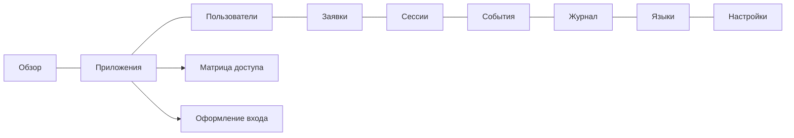

# Администрирование

Веб-админка: `https://<сервер>/Admin`. Доступ определяется матрицей системного приложения `tsl-auth-admin`:

| Роль | Права |
|---|---|
| `administrator` | всё: просмотр и изменения (`view`, `manage`, `events`) |
| `auditor` | только просмотр (кнопки изменений скрыты, POST запрещён) |
| `notifier` | для ботов: лента событий и свои вебхуки (без доступа к админке) |
| `reset-bot` | для бота мессенджера: привязка и сброс пароля (без доступа к админке) |

Права администрирования выдаются как обычные роли: карточка пользователя → «Роли в приложениях» → `tsl-auth-admin`.
Снятие роли действует сразу — права проверяются по БД на каждом запросе.

## Разделы



### Приложения

* **Зарегистрировать** — `client_id` (он же scope и audience приложения как API), название, тип
  (`confidential` — серверное приложение с секретом, `public` — SPA/мобильное без секрета), потоки, redirect URI, scopes.
* **Самоуправление** — приложение само ведёт своих пользователей и роли через App API.
* **Самостоятельная регистрация** — на странице входа приложения появится «Зарегистрироваться».
* **Сроки жизни токенов** — можно сократить относительно глобальных.
* **Роли сервисной учётной записи** — права клиента при `client_credentials` (в т.ч. в других приложениях).
* **Перевыпустить секрет** — старый перестаёт действовать сразу. **Удалить** — отзываются все сессии приложения.

### Матрица доступа

```
                 orders.read   orders.write   reports.view
 viewer  [запр.]     ☑              ☐              ☐
 operator            ☑              ☑              ☐
 manager             ☑              ☑              ☑
```

1. Добавьте **разрешения** — действия в приложении (`orders.read`).
2. Добавьте **роли** — наборы разрешений (`operator`).
3. Отметьте ячейки и нажмите «Сохранить матрицу».
4. «Разрешить запрос» — роль можно запросить при регистрации или в «Запросить доступ».

Изменения матрицы попадают в токены при следующем входе или refresh (не позже срока жизни access-токена).

### Оформление входа

Заголовок, приветствие, логотип (PNG/JPEG/WEBP до 256 КБ, хранится в БД), цвета, подпись и язык по умолчанию.
Кнопка «Предпросмотр» показывает страницу входа так, как её увидит пользователь приложения.

### Пользователи

Поиск — только по **точному** логину или email: эти поля хранятся зашифрованными, поиск по подстроке невозможен
by design (см. [безопасность](security.md)).

Создание пользователя — три способа первичного доступа:

| Способ | Что происходит |
|---|---|
| **Приглашение** | пароля нет; ссылка (7 дней, одноразовая) уходит на email или показывается администратору для передачи |
| **Одноразовый пароль** | генерируется и показывается один раз; при первом входе пользователь обязан его сменить |
| **Постоянный пароль** | задаётся администратором |

В карточке: роли во всех приложениях, **выдать временный пароль** (все сессии завершаются), **ссылка сброса на email**,
повторное приглашение, разблокировка, активные сессии и персональные токены (с отзывом), отключение, удаление.
Отключение пользователя отзывает все его сессии и refresh-токены.

### Заявки

Заявки пользователей на роли (при самостоятельной регистрации или «Запросить доступ»). **Одобрить** — роль назначается,
**Отклонить** — с комментарием. Пользователь видит статус в «Запросить доступ»; при настроенном SMTP получает письмо.
Число ожидающих заявок показывается в меню.

### Сессии

Действующие авторизации (пользователь × приложение) с числом активных токенов. **Отозвать** — refresh-токены
перестают работать на всех узлах сразу; уже выданный access-токен истечёт по сроку.

### События

Лента событий (регистрации, заявки, блокировки, изменения, `security.alert`) и подписки-вебхуки: URL, секрет подписи,
фильтр событий, история доставок, тестовое событие. Инструкция для подключения бота — на самой странице и в
[интеграции](integration.md#8-события-для-ботов-и-мониторинга).

### Журнал безопасности

Все входы (успешные и неудачные), блокировки, выдача токенов, смена и сброс паролей, регистрации, изменения в админке
и через API (кто, что, результат), отказы в доступе (403). Фильтры: тип/группа, уровень, результат, приложение, пользователь,
период. Выгрузка CSV (защищена от формульных инъекций). События уровня warning+ дублируются в ленту для ботов.

### Языки

Встроенные `ru` и `en`. «Добавить язык» → шаблон со всеми ключами → переведите → «Сохранить пакет» (или загрузите `.json`).
Можно переопределить отдельные строки встроенного языка. Пользователь выбирает язык внизу страницы входа.

### Настройки

Политика паролей, сроки жизни токенов, персональные токены, сброс через бота, сроки хранения данных
(в т.ч. по каждому типу событий журнала), ручной запуск очистки. Подробно — [конфигурация](configuration.md#настройки-в-бд).

## Личный кабинет пользователя

Доступен любому вошедшему пользователю (ссылки внизу страниц входа):

| Страница | Назначение |
|---|---|
| `/Account/Tokens` | персональные токены доступа для скриптов |
| `/Account/Messenger` | привязка мессенджера для сброса пароля через бота |
| `/Account/RequestAccess` | запрос ролей, статус своих заявок |
| `/Account/ChangePassword` | смена пароля |

## Автоматизация через Admin API

```bash
TOKEN=$(curl -s -X POST https://auth.corp/connect/token -d grant_type=client_credentials \
  -d client_id=admin-cli -d client_secret=... -d scope=tsl-auth-admin | jq -r .access_token)

curl -H "Authorization: Bearer $TOKEN" https://auth.corp/api/admin/users?search=ivan
curl -X PUT -H "Authorization: Bearer $TOKEN" -H "Content-Type: application/json" \
  https://auth.corp/api/admin/users/<id>/roles -d '[{"clientId":"orders-api","role":"operator"}]'
```

Полный перечень — `/docs/api`. Готовый пример массовой настройки — `samples/seed-demo.ps1`.
