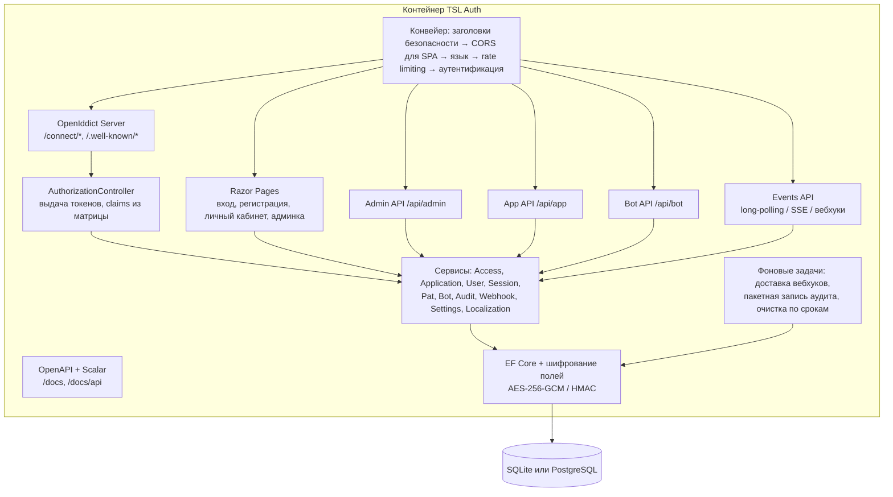
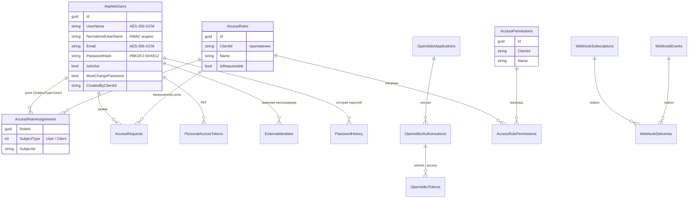
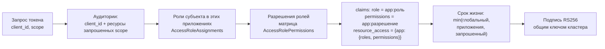
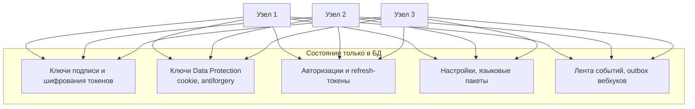
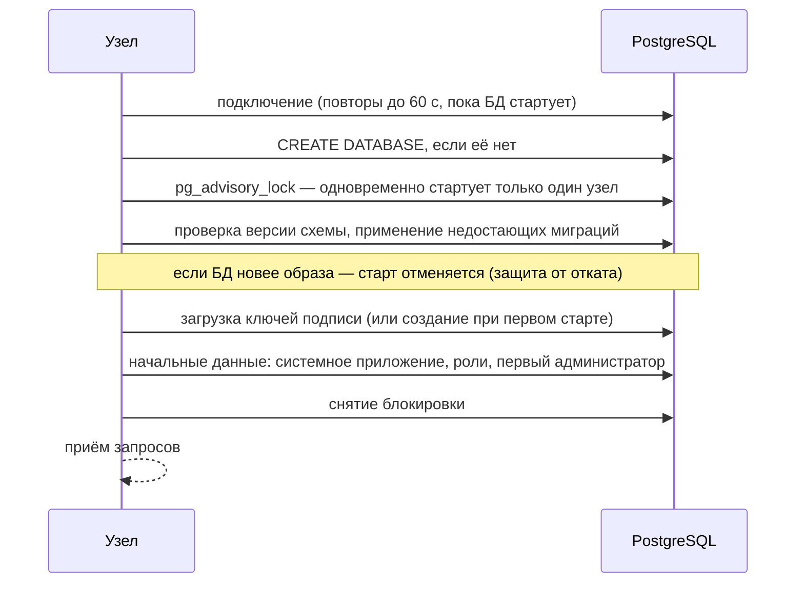
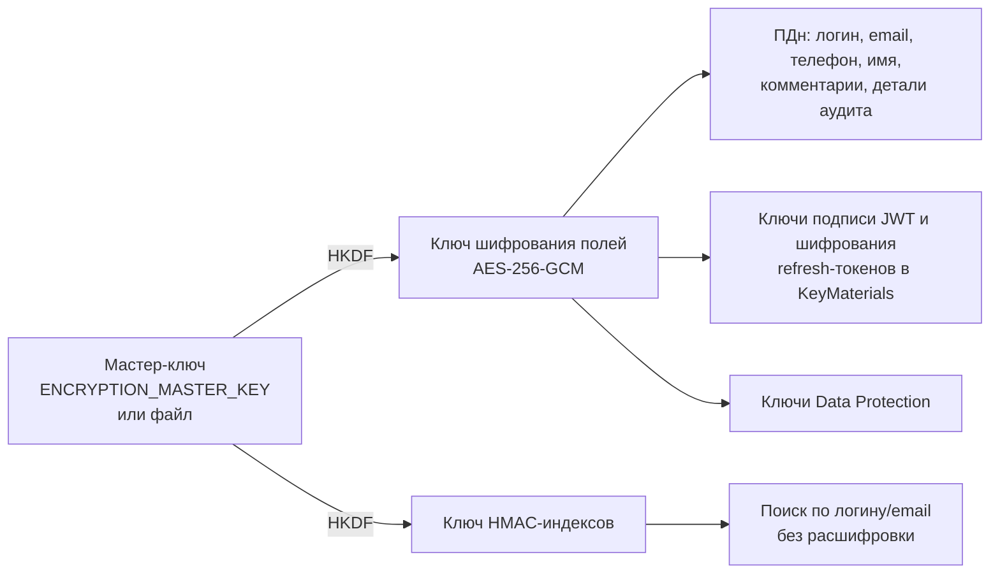

# Архитектура

## Компоненты

| Слой | Каталог | Назначение |
|---|---|---|
| Протокол OAuth/OIDC | `Controllers/AuthorizationController.cs`, OpenIddict | Проверка запросов, выпуск и отзыв токенов, discovery, JWKS |
| Бизнес-логика | `Services/` | RBAC, приложения, пользователи, сессии, PAT, заявки, бот, аудит, события, настройки |
| API | `Api/` | Admin API, App API (самоуправление), Bot API, события |
| Интерфейс | `Pages/` | Страницы пользователя (`Account/`), админка (`Admin/`), документация (`Docs/`) |
| Инфраструктура | `Infrastructure/` | Регистрация сервисов, старт (миграции, ключи, начальные данные), безопасность, CORS, аудит-фильтры, фоновые задачи |
| Безопасность данных | `Security/` | Шифрование полей, мастер-ключ, ключи подписи, политика паролей |
| Данные | `Data/` | Модель EF Core, миграции для SQLite и PostgreSQL |
| Локализация | `Localization/` | Встроенные языковые пакеты, пакеты из БД, выбор языка |

## Модель данных

Прочие таблицы: `KeyMaterials` (ключи подписи и шифрования токенов, зашифрованы), `DataProtectionKeys` (ключи cookie, зашифрованы),
`AuditLog`, `SystemSettings`, `LanguagePacks`, `BotLinkCodes`, `AccessRequests`.

**Приложение = клиент + ресурс.** Каждое зарегистрированное приложение одновременно является OAuth-клиентом
и API-ресурсом: для него создаётся scope с тем же именем. Когда клиент запрашивает scope приложения, оно
попадает в `aud` токена, а права пользователя в этом приложении — в `permissions`.

## Как формируется токен

Права вычисляются **при каждой выдаче**, в том числе при refresh, поэтому изменения матрицы и назначений
вступают в силу без повторного входа пользователя (не позже срока жизни access-токена).

## Кластер и сохранность состояния

Узлы не хранят состояния в памяти (кроме кэшей на 30 секунд), поэтому:

* запрос можно обслужить на любом узле — «липкие» сессии не нужны;
* перезапуск или отказ узла не разрывает сессии пользователей, а ранее выданные JWT остаются валидными (ключи общие);
* изменения настроек, прав и языков видны всем узлам не позже чем через 30 секунд, отзыв сессий действует сразу.

**Старт узла:**

**Фоновые задачи в кластере** не мешают друг другу:

* доставка вебхуков — экземпляр «захватывает» доставку условным `UPDATE`, поэтому каждое событие отправляется ровно одним узлом; если узел упал, блокировка истекает и доставку подхватывает другой;
* очистка по срокам хранения стартует со случайной задержкой, повторный запуск безопасен.

## Хранение секретов

* Мастер-ключ общий для всех узлов и **никогда** не хранится в БД. Без него данные не расшифровать — храните резервную копию отдельно от бэкапов БД.
* Пароли не шифруются, а хешируются (PBKDF2-HMAC-SHA512, 100 000 итераций, соль).
* Секреты клиентов хранятся хешем (OpenIddict), PAT — SHA-256, коды привязки бота — SHA-256.
* Refresh-токены ссылочные: клиент получает случайный идентификатор, содержимое хранится в БД зашифрованным.
