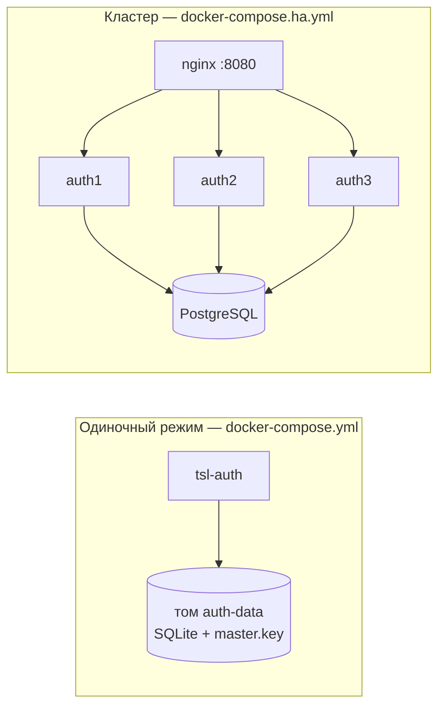
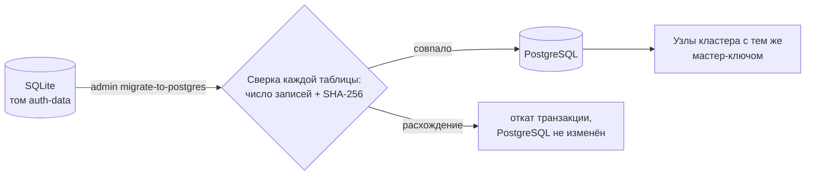
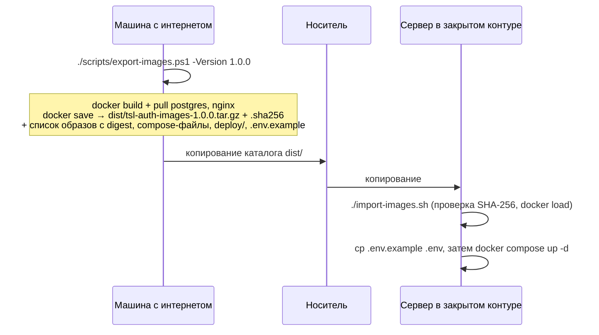

# Развёртывание

## Варианты



| | Одиночный | Кластер |
|---|---|---|
| БД | встроенная SQLite (файл в томе) | PostgreSQL (встроенный контейнер или внешний сервер) |
| Экземпляров | 1 | 2 и более |
| Непрерывность | простой на время рестарта (3–5 с) | рестарт/отказ узла без ошибок для клиентов |
| Мастер-ключ | генерируется автоматически в томе | задаётся явно (`ENCRYPTION_MASTER_KEY`), общий для узлов |
| Когда | тестовые стенды, небольшие установки | продуктив, требования к доступности |

Требования: Docker 24+ с Compose v2; для кластера — PostgreSQL 14+ (в комплекте 17). Ресурсы узла: от 1 vCPU / 512 МБ.

## Одиночный режим

```bash
docker compose up -d --build            # сборка образа из исходников
docker logs tsl-auth | grep "временным паролем"
```

1. Откройте `http://<сервер>:8080`, войдите `admin` с паролем из лога.
2. Задайте постоянный пароль (система потребует сразу).
3. Если сервис будет доступен по другому адресу — задайте `AUTH_ISSUER` (см. ниже) **до** выдачи первых токенов.

**Публичный адрес `AUTH_ISSUER` обязателен.** Из него строятся `iss` в токенах, discovery и ссылки в письмах
(приглашения, сброс пароля); заголовок `Host` запроса для этого не используется, поэтому поддельный `Host` не уведёт
ссылку сброса на чужой домен. Compose по умолчанию подставляет `http://localhost:8080/`; при запуске образа без compose
(`docker run`, Kubernetes) переменная `Auth__Issuer` должна быть задана явно — иначе сервис не стартует.
Дополнительно задайте `AUTH_ALLOWED_HOSTS` (`AllowedHosts`) — имя из адреса, например `auth.corp`: запросы с другим
`Host` получат 400.

Данные (SQLite и сгенерированный `master.key`) лежат в томе `auth-data`. **Сохраните `master.key`** — без него зашифрованные данные не прочитать:

```bash
docker run --rm -v tsl-auth_auth-data:/d busybox cat /d/master.key   # в самом образе сервиса нет shell и cat
```

Полное имя тома — `<проект>_auth-data`, где проект compose — имя каталога с `docker-compose.yml`
(`tsl-auth` при клонировании репозитория; см. `docker volume ls`). Здесь и ниже в примерах — `tsl-auth_*`.
Если БД в томе уже есть, а `master.key` пропал (например, том с ключом не примонтирован), сервис не стартует,
а не создаёт новый ключ: с новым ключом все зашифрованные данные стали бы нечитаемыми.

## Кластер

```bash
cp .env.example .env
# ENCRYPTION_MASTER_KEY: openssl rand -base64 32
# POSTGRES_PASSWORD — обязателен (значения по умолчанию нет)
# BOOTSTRAP_ADMIN_PASSWORD (или оставить пустым — будет сгенерирован и выведен в лог)
docker compose -f docker-compose.ha.yml up -d --build
docker logs tsl-auth-1 | grep -E "Схема|администратор"
```

Без `ENCRYPTION_MASTER_KEY` и `POSTGRES_PASSWORD` (или `AUTH_SECRETS_DIR`, см. [секреты файлами](#секреты-файлами-docker-secrets))
compose откажется запускать кластер.

Точка входа — **только** nginx на `:8080`. Узлы наружу не публикуются: они работают с
`Auth__TrustForwardedHeaders=true` и берут IP клиента и схему из `X-Forwarded-For/Proto`. Будь узел доступен напрямую,
клиент подставил бы в эти заголовки что угодно — обошёл бы лимиты попыток по IP, записал бы в журнал чужой IP,
выдал бы HTTP-запрос за HTTPS. Поэтому заголовки принимаются только от адресов из `Auth__KnownNetworks`
(`AUTH_KNOWN_NETWORKS`; по умолчанию loopback и частные сети, куда входит docker-сеть с nginx).

Для диагностики и тестов отказоустойчивости узлы можно открыть на `127.0.0.1:8081–8083` оверлеем
`docker-compose.ha-nodes.yml`:

```bash
docker compose -f docker-compose.ha.yml -f docker-compose.ha-nodes.yml up -d
```

Даже так запрос с хоста приходит в контейнер с адреса шлюза docker-сети, то есть из доверенной частной сети:
на многопользовательском сервере держите оверлей выключенным.

Добавить узел: скопируйте блок `auth3` в compose с новым именем и добавьте `server auth4:8080 resolve ...` в `deploy/nginx.conf`.

### Внешний PostgreSQL

1. Удалите сервис `postgres` и `depends_on` из `docker-compose.ha.yml`. Если оставить его, задайте и `POSTGRES_PASSWORD`:
   без пароля контейнер postgres не инициализируется, и узлы, ждущие его готовности, не запустятся.
2. В `.env`: `DB_CONNECTION_STRING=Host=db.corp;Port=5432;Database=tsl_auth;Username=tsl_auth;Password=...;SSL Mode=Require`
   (или файл `db_connection_string` в [секретах](#секреты-файлами-docker-secrets)).
3. Базу сервис **создаст сам**, если у пользователя есть право `CREATEDB`; иначе создайте пустую БД заранее:
   ```sql
   CREATE ROLE tsl_auth LOGIN PASSWORD '...';
   CREATE DATABASE tsl_auth OWNER tsl_auth ENCODING 'UTF8';
   ```
   Таблицы и все последующие изменения схемы сервис применяет автоматически.

### Переход с одиночного режима на кластер

Режимы не смешиваются: экземпляр работает либо с SQLite, либо с PostgreSQL (`Database__Provider`). При переключении
на PostgreSQL данные SQLite **сами не переносятся** — для этого есть команда `admin migrate-to-postgres`.



1. Остановите одиночный сервис, чтобы после снимка не появилось новых записей: `docker compose stop`.
2. Поднимите PostgreSQL (узлы кластера пока не запускайте): `docker compose -f docker-compose.ha.yml up -d postgres`.
3. Запустите перенос в контейнере с томом одиночного режима и доступом к PostgreSQL:
   ```bash
   docker run --rm -v tsl-auth_auth-data:/app/data --network tsl-auth_default \
     -e TARGET_DB_CONNECTION_STRING="Host=postgres;Database=tsl_auth;Username=tsl_auth;Password=..." \
     ghcr.io/akprof2000/tsl-auth:latest admin migrate-to-postgres
   ```
   Команда создаст базу и схему, скопирует все таблицы в одной транзакции и выведет сверку:
   ```
   Таблица                              SQLite PostgreSQL  Содержимое
   AspNetUsers                               9          9  совпадает
   OpenIddictTokens                       8532       8532  совпадает
   ...
   Перенос завершён: 28 таблиц, 14279 записей, все совпадают.
   ```
4. Задайте кластеру **тот же мастер-ключ** — содержимое `master.key` из тома одиночного режима:
   `docker run --rm -v tsl-auth_auth-data:/d busybox cat /d/master.key` → `ENCRYPTION_MASTER_KEY` в `.env`.
   Данные переносятся зашифрованными; с другим ключом узлы не смогут их прочитать.
5. Запустите узлы: `docker compose -f docker-compose.ha.yml up -d`.

Пользователи ничего не заметят: те же пароли, права, ключи подписи, а начатые сессии (refresh-токены) продолжаются.

* Если кластер уже запускался и создал своего администратора, приёмник непустой — команда откажется работать.
  Остановите узлы и добавьте `--overwrite`: данные PostgreSQL будут заменены данными SQLite.
* При любом расхождении сверки транзакция откатывается — в PostgreSQL ничего не остаётся, SQLite не изменяется.
* Строку подключения передавайте переменной `TARGET_DB_CONNECTION_STRING` (или `--target "..."`), чтобы пароль не попал в историю shell.
* Имя сети — `<проект>_default` (здесь `tsl-auth_default`, см. `docker network ls`); внешний PostgreSQL указывается адресом сервера.
* `Auth__Issuer` команде переноса не нужен (как и `admin reset-password`): служебные команды CLI его не проверяют.

## HTTPS

### Вариант 1 — сертификат в контейнере сервиса (одиночный режим)

```bash
# сертификат вашего УЦ: certs/tls.crt (с цепочкой) + certs/tls.key
# для проверки — самоподписанный: ./scripts/gen-dev-cert.sh auth.corp.local
AUTH_ISSUER=https://auth.corp.local:8443/ \
docker compose -f docker-compose.yml -f docker-compose.https.yml up -d
```

PFX вместо PEM — отдельный файл `docker-compose.https-pfx.yml` (вместо `docker-compose.https.yml`, не вместе с ним):

```bash
# сертификат: certs/tls.pfx
AUTH_ISSUER=https://auth.corp.local:8443/ TLS_CERT_PASSWORD=... \
docker compose -f docker-compose.yml -f docker-compose.https-pfx.yml up -d
```

Протоколы — только TLS 1.2/1.3. Файлы сертификата должны быть доступны на чтение пользователю сервиса (UID 1654).

### Вариант 2 — TLS на обратном прокси (кластер)

```bash
docker compose -f docker-compose.ha.yml -f docker-compose.ha-https.yml up -d
```

nginx (`deploy/nginx-tls.conf`) принимает HTTPS на `:8443`, перенаправляет HTTP → HTTPS, добавляет HSTS
и передаёт `X-Forwarded-Proto`; узлы внутри сети остаются на HTTP (`Auth__TrustForwardedHeaders=true`).
Если прокси ваш собственный (F5, HAProxy, внешний nginx):

* передавайте `X-Forwarded-For` и `X-Forwarded-Proto` (`X-Forwarded-Host` сервис не принимает — адрес берётся
  из `AUTH_ISSUER`, который задайте внешним HTTPS-адресом);
* укажите подсеть прокси в `AUTH_KNOWN_NETWORKS`, если она не из частных диапазонов, и закройте узлы от прямого доступа;
* для `/api/admin/events` держите таймаут чтения ответа не меньше 75–90 с и отключите буферизацию: long-polling
  ждёт событий до `wait` ≤ 60 с, SSE-поток открыт постоянно (так настроены `deploy/nginx*.conf`).

> При TLS на вашем прокси задайте `AUTH_REQUIRE_HTTPS=true`: сервис будет отклонять OAuth-запросы по HTTP и включит HSTS.
> `docker-compose.https*.yml` и `docker-compose.ha-https.yml` включают это сами.

## Секреты файлами (docker secrets)

По умолчанию секреты передаются переменными из `.env` — их видно в `docker inspect` и в окружении процесса.
Оверлеи `docker-compose.secrets.yml` (одиночный режим) и `docker-compose.ha-secrets.yml` (кластер) передают их файлами
через docker secrets (`/run/secrets/...`), а сервис читает переменные `*File`
([список](configuration.md#секреты-из-файлов-docker-secrets)).

```bash
sudo install -d -m 0700 /etc/tsl-auth/secrets && cd /etc/tsl-auth/secrets
openssl rand -base64 32 | sudo tee master_key > /dev/null
printf '%s' 'пароль-БД'            | sudo tee postgres_password > /dev/null
printf '%s' 'Host=postgres;Port=5432;Database=tsl_auth;Username=tsl_auth;Password=пароль-БД' | sudo tee db_connection_string > /dev/null
printf '%s' 'пароль-администратора' | sudo tee admin_password > /dev/null
printf '%s' 'секрет-admin-cli'      | sudo tee admin_api_client_secret > /dev/null
sudo chmod 0444 *    # compose без Swarm монтирует файлы как есть: читать их должны UID 1654 и postgres

cd ~/tsl-auth
echo AUTH_SECRETS_DIR=/etc/tsl-auth/secrets >> .env   # ENCRYPTION_MASTER_KEY и POSTGRES_PASSWORD тогда не нужны
docker compose -f docker-compose.ha.yml -f docker-compose.ha-secrets.yml up -d
```

Одиночному режиму нужны только `admin_password` и `admin_api_client_secret`
(`docker compose -f docker-compose.yml -f docker-compose.secrets.yml up -d`). Доступ к файлам ограничивает каталог
(`0700`): внутрь контейнеров файлы попадают через монтирование, посторонние пользователи хоста их не прочитают.
Указанный, но отсутствующий файл — ошибка старта сервиса. Если `.env` при этом ещё содержит `BOOTSTRAP_ADMIN_PASSWORD`
или `ENCRYPTION_MASTER_KEY`, оверлеи их обнуляют — действуют только файлы.

## Закрытый контур (без интернета)



В работе сервис не обращается во внешнюю сеть: интерфейс, справочник API, шрифты и скрипты встроены в образ,
логотипы приложений хранятся в БД, почта — через ваш внутренний SMTP.

Можно также брать готовые образы из реестра: `ghcr.io/akprof2000/tsl-auth:<версия>` или Docker Hub
(публикуются GitHub Actions после прохождения тестов, E2E-стенда и сканирования Trivy/Dockle).

`postgres` и `nginx` в compose указаны тегами (`17-alpine`, `1.29-alpine`), а не digest: ссылка по digest после
`docker load` находится не на всех версиях Docker, и запуск в закрытом контуре сорвался бы попыткой скачать образ.
Какие именно образы перенесены, фиксирует `dist/tsl-auth-images-<версия>.txt` (ID и digest каждого).
Без PostgreSQL (внешняя БД) или nginx комплект собирается с ключами `-NoPostgres` / `-NoNginx`.

## Первичная настройка после установки

1. Вход `admin` → смена пароля.
2. **Настройки**: политика паролей, сроки жизни токенов и максимальный срок сессии, сроки хранения журнала.
   После сохранения политики токенов действуют значения из БД; переменные `Auth__*LifetimeMinutes/Days` — только
   значения по умолчанию до этого момента.
3. **Приложения → Зарегистрировать**: клиент для каждого приложения, redirect URI, потоки, scopes.
4. **Матрица доступа** приложения: разрешения, роли, отметки «роль × разрешение».
5. **Пользователи**: приглашения / временные пароли, назначение ролей.
6. Для автоматизации — клиент Admin API: `BOOTSTRAP_API_CLIENT_ID/SECRET` в `.env` или вручную в админке
   (confidential, client_credentials, scope `tsl-auth-admin`, роль `administrator` в «Роли сервисной учётной записи»).
7. Для уведомлений — клиент бота с ролью `notifier`, для сброса паролей через мессенджер — `reset-bot`.

## Обновление версии

```bash
docker compose pull            # или import-images.sh в закрытом контуре
docker compose up -d           # кластер: docker compose -f docker-compose.ha.yml up -d
```

* Схема БД обновляется **автоматически** первым стартующим узлом (под блокировкой), остальные ждут.
* Пользователи обновления не замечают: пароли, роли, выданные access- и refresh-токены продолжают работать
  (проверяется [тестом обновления на живых данных](testing.md#обновление-версии-на-живых-данных) для SQLite и PostgreSQL).
* В кластере обновляйте узлы по одному (`docker compose -f docker-compose.ha.yml up -d --no-deps auth1`, затем `auth2`…) —
  клиенты не заметят обновления (см. [тесты отказоустойчивости](testing.md#отказоустойчивость)).
* Откат образа на версию **старее схемы БД** сервис не допустит: при старте он сообщит, что БД новее, и остановится.
  Для отката восстановите резервную копию БД, сделанную до обновления.

## Резервное копирование

| Что | Как | Важно |
|---|---|---|
| PostgreSQL | `pg_dump -Fc tsl_auth > tsl_auth.dump` | делать перед каждым обновлением |
| SQLite | `docker run --rm -u 1654:1654 -v tsl-auth_auth-data:/d -v $PWD:/b keinos/sqlite3 sqlite3 /d/tsl-auth.db ".backup /b/tsl-auth.db"` | горячий бэкап (WAL) |
| Мастер-ключ | `.env` / `master.key` / docker secret | **хранить отдельно** от бэкапов БД |

Восстановление: вернуть БД из бэкапа и запустить сервис с **тем же** мастер-ключом.
