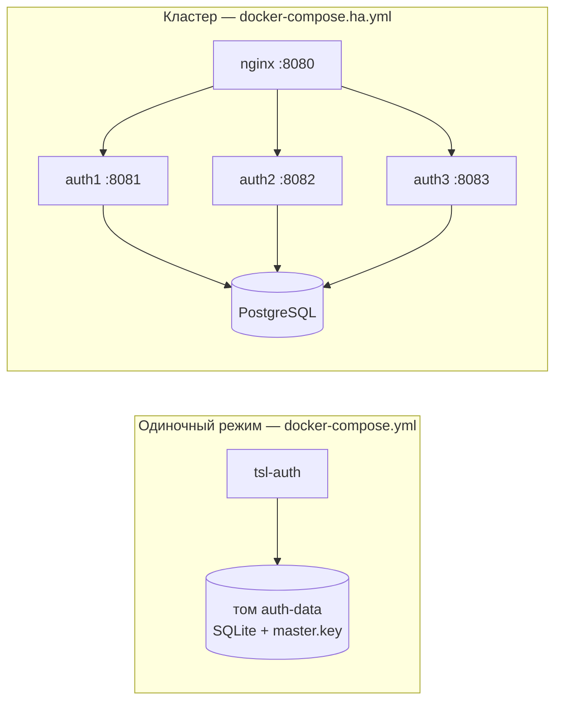

# Развёртывание

## Варианты



| | Одиночный | Кластер |
|---|---|---|
| БД | встроенная SQLite (файл в томе) | PostgreSQL (встроенный контейнер или внешний сервер) |
| Экземпляров | 1 | 2 и более |
| Непрерывность | простой на время рестарта (3–5 с) | рестарт/отказ узла без ошибок для клиентов |
| Мастер-ключ | генерируется автоматически в томе | задаётся явно (`ENCRYPTION_MASTER_KEY`), общий для узлов |
| Когда | тестовые стенды, небольшие установки | продуктив, требования к доступности |

Требования: Docker 24+ с Compose v2; для кластера — PostgreSQL 14+ (в комплекте 17). Ресурсы узла: от 1 vCPU / 512 МБ.

## Одиночный режим

```bash
docker compose up -d --build            # сборка образа из исходников
docker logs tsl-auth | grep "временным паролем"
```

1. Откройте `http://<сервер>:8080`, войдите `admin` с паролем из лога.
2. Задайте постоянный пароль (система потребует сразу).
3. Если сервис будет доступен по другому адресу — задайте `AUTH_ISSUER` (см. ниже) **до** выдачи первых токенов.

Данные (SQLite и сгенерированный `master.key`) лежат в томе `auth-data`. **Сохраните `master.key`** — без него зашифрованные данные не прочитать:

```bash
docker run --rm -v auth_auth-data:/d alpine cat /d/master.key
```

## Кластер

```bash
cp .env.example .env
# ENCRYPTION_MASTER_KEY: openssl rand -base64 32
# POSTGRES_PASSWORD, BOOTSTRAP_ADMIN_PASSWORD (или оставить пустым — будет сгенерирован и выведен в лог)
docker compose -f docker-compose.ha.yml up -d --build
docker logs tsl-auth-1 | grep -E "Схема|администратор"
```

Точка входа — nginx на `:8080`; узлы доступны напрямую на `:8081–8083` для диагностики.
Добавить узел: скопируйте блок `auth3` в compose с новым именем и добавьте `server auth4:8080 resolve ...` в `deploy/nginx.conf`.

### Внешний PostgreSQL

1. Удалите сервис `postgres` и `depends_on` из `docker-compose.ha.yml` (или оставьте — он не будет использоваться).
2. В `.env`: `DB_CONNECTION_STRING=Host=db.corp;Port=5432;Database=tsl_auth;Username=tsl_auth;Password=...;SSL Mode=Require`.
3. Базу сервис **создаст сам**, если у пользователя есть право `CREATEDB`; иначе создайте пустую БД заранее:
   ```sql
   CREATE ROLE tsl_auth LOGIN PASSWORD '...';
   CREATE DATABASE tsl_auth OWNER tsl_auth ENCODING 'UTF8';
   ```
   Таблицы и все последующие изменения схемы сервис применяет автоматически.

## HTTPS

### Вариант 1 — сертификат в контейнере сервиса (одиночный режим)

```bash
# сертификат вашего УЦ: certs/tls.crt (с цепочкой) + certs/tls.key
# для проверки — самоподписанный: ./scripts/gen-dev-cert.sh auth.corp.local
AUTH_ISSUER=https://auth.corp.local:8443/ \
docker compose -f docker-compose.yml -f docker-compose.https.yml up -d
```

PFX вместо PEM: `TLS_CERT_PATH=/certs/tls.pfx TLS_KEY_PATH= TLS_CERT_PASSWORD=...`. Протоколы — только TLS 1.2/1.3.

### Вариант 2 — TLS на обратном прокси (кластер)

```bash
docker compose -f docker-compose.ha.yml -f docker-compose.ha-https.yml up -d
```

nginx (`deploy/nginx-tls.conf`) принимает HTTPS на `:8443`, перенаправляет HTTP → HTTPS, добавляет HSTS
и передаёт `X-Forwarded-Proto`; узлы внутри сети остаются на HTTP (`Auth__TrustForwardedHeaders=true`).
Если прокси ваш собственный (F5, HAProxy, внешний nginx) — передавайте `X-Forwarded-For/Proto/Host` и
задайте `AUTH_ISSUER` с внешним HTTPS-адресом.

> После включения HTTPS задайте `AUTH_REQUIRE_HTTPS=true`: сервис будет отклонять OAuth-запросы по HTTP и включит HSTS.

## Закрытый контур (без интернета)

```mermaid
sequenceDiagram
    participant I as Машина с интернетом
    participant M as Носитель
    participant T as Сервер в закрытом контуре
    I->>I: ./scripts/export-images.ps1 -Version 1.0.0
    Note over I: docker build + pull postgres, nginx<br/>docker save → dist/tsl-auth-images-1.0.0.tar.gz + .sha256<br/>+ compose-файлы, deploy/, .env.example
    I->>M: копирование каталога dist/
    M->>T: копирование
    T->>T: ./import-images.sh (проверка SHA-256, docker load)
    T->>T: cp .env.example .env; docker compose up -d
```

В работе сервис не обращается во внешнюю сеть: интерфейс, справочник API, шрифты и скрипты встроены в образ,
логотипы приложений хранятся в БД, почта — через ваш внутренний SMTP.

Можно также брать готовые образы из реестра: `ghcr.io/akprof2000/tsl-auth:<версия>` или Docker Hub
(публикуются GitHub Actions после прохождения тестов и сканирования Trivy).

## Первичная настройка после установки

1. Вход `admin` → смена пароля.
2. **Настройки**: политика паролей, сроки жизни токенов, сроки хранения журнала.
3. **Приложения → Зарегистрировать**: клиент для каждого приложения, redirect URI, потоки, scopes.
4. **Матрица доступа** приложения: разрешения, роли, отметки «роль × разрешение».
5. **Пользователи**: приглашения / временные пароли, назначение ролей.
6. Для автоматизации — клиент Admin API: `BOOTSTRAP_API_CLIENT_ID/SECRET` в `.env` или вручную в админке
   (confidential, client_credentials, scope `tsl-auth-admin`, роль `administrator` в «Роли сервисной учётной записи»).
7. Для уведомлений — клиент бота с ролью `notifier`, для сброса паролей через мессенджер — `reset-bot`.

## Обновление версии

```bash
docker compose pull            # или import-images.sh в закрытом контуре
docker compose up -d           # кластер: docker compose -f docker-compose.ha.yml up -d
```

* Схема БД обновляется **автоматически** первым стартующим узлом (под блокировкой), остальные ждут.
* В кластере обновляйте узлы по одному (`docker compose -f docker-compose.ha.yml up -d --no-deps auth1`, затем `auth2`…) —
  клиенты не заметят обновления (см. [тесты отказоустойчивости](testing.md#отказоустойчивость)).
* Откат образа на версию **старее схемы БД** сервис не допустит: при старте он сообщит, что БД новее, и остановится.
  Для отката восстановите резервную копию БД, сделанную до обновления.

## Резервное копирование

| Что | Как | Важно |
|---|---|---|
| PostgreSQL | `pg_dump -Fc tsl_auth > tsl_auth.dump` | делать перед каждым обновлением |
| SQLite | `docker run --rm -v auth_auth-data:/d -v $PWD:/b alpine sh -c "apk add sqlite && sqlite3 /d/tsl-auth.db '.backup /b/tsl-auth.db'"` | горячий бэкап (WAL) |
| Мастер-ключ | `.env` / `master.key` / docker secret | **хранить отдельно** от бэкапов БД |

Восстановление: вернуть БД из бэкапа и запустить сервис с **тем же** мастер-ключом.
