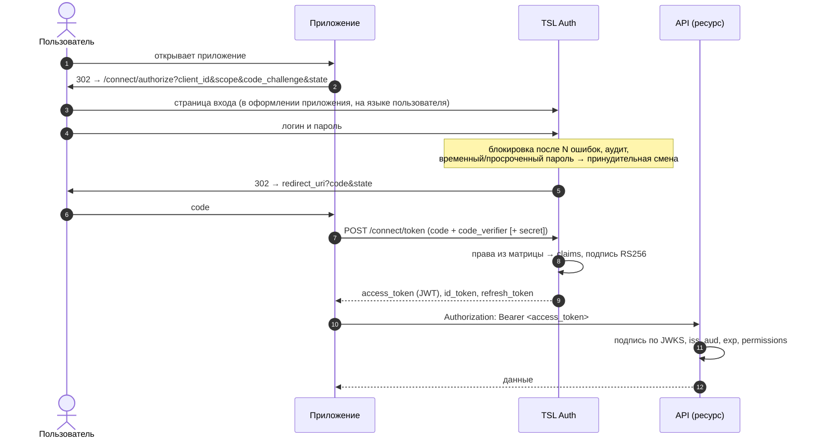
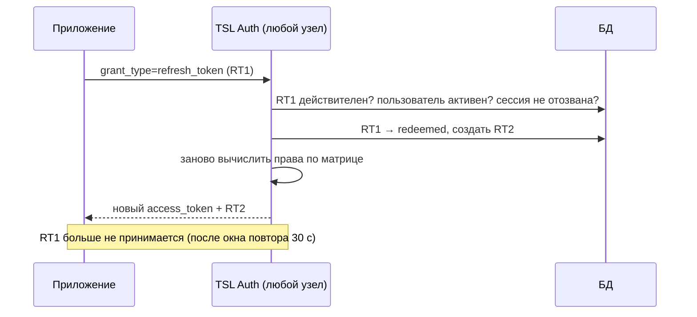
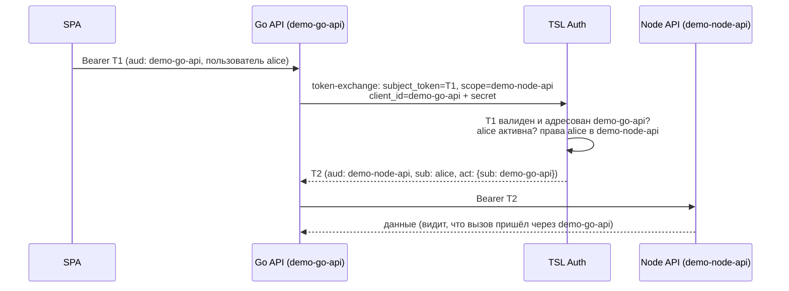
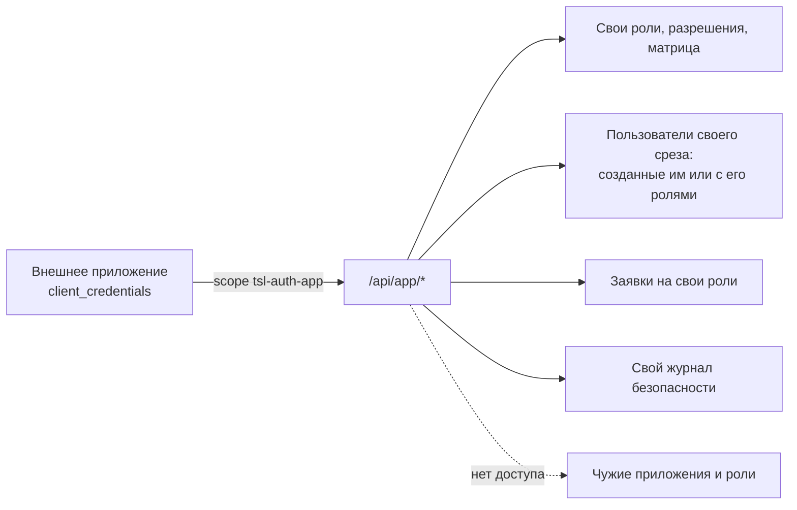
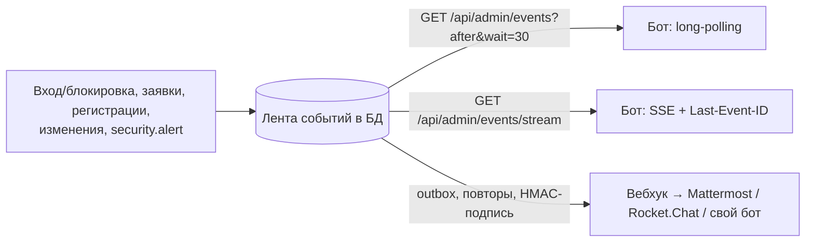
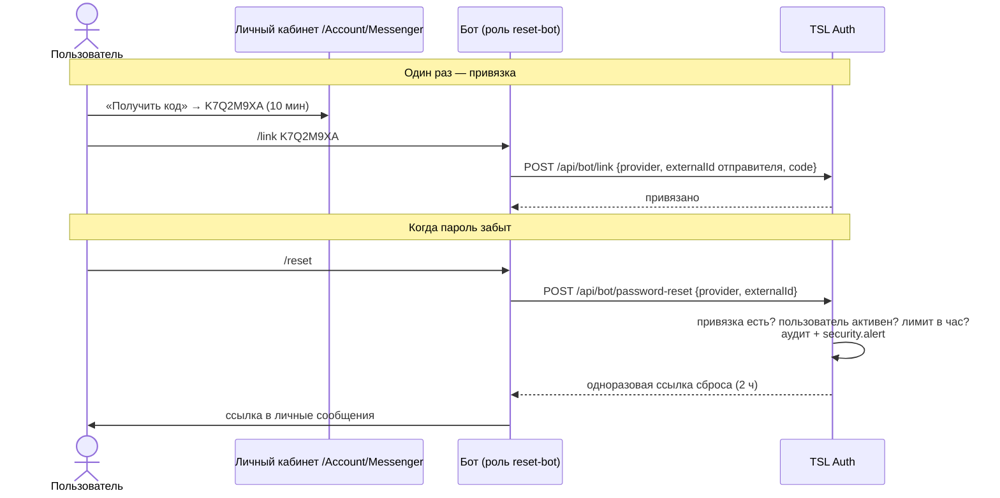

# Интеграция приложений

Краткая версия с готовыми адресами вашего сервера — на странице `/docs`, все эндпоинты с возможностью
выполнить запрос — `/docs/api`. Рабочие примеры на четырёх стеках — в [`samples/`](../samples).

| Пример | Стек | Тип фронта | Что показывает |
|---|---|---|---|
| `samples/dotnet-mvc` | .NET 10 | серверный рендеринг | стандартный OIDC-middleware Microsoft, авторизация по `permissions`, refresh |
| `samples/node-spa` | Node.js (без зависимостей) | SPA на чистом JS + API | PKCE в браузере, refresh, проверка JWT по JWKS на сервере |
| `samples/go-api` | Go (stdlib) | API | проверка RS256 вручную, авторизация, **token exchange** и вызов Node API от имени пользователя |
| `samples/python-app` | Python (stdlib) | серверный HTML | password grant, introspection, **App API** — управление своими пользователями |

## 1. Регистрация приложения

Админка → **Приложения → Зарегистрировать** (или `POST /api/admin/applications`):

```json
{
  "clientId": "orders-web",
  "displayName": "Заказы",
  "clientType": "confidential",
  "grantTypes": ["authorization_code", "refresh_token"],
  "redirectUris": ["https://orders.corp/signin-oidc"],
  "postLogoutRedirectUris": ["https://orders.corp/"],
  "scopes": ["profile", "email", "roles", "orders-api"]
}
```

Секрет confidential-клиента показывается **один раз** в ответе. Затем — матрица доступа приложения
(разрешения, роли, отметки) и назначение ролей пользователям.

## 2. Вход пользователя: authorization code + PKCE



* PKCE обязателен для всех клиентов (`code_challenge_method=S256`).
* SPA обращается к `/connect/token` из браузера: разрешены origin'ы из его Redirect URI (CORS).
* Повторный вход в другое приложение проходит без ввода пароля (SSO по cookie сервиса), пока сессия активна.
* Выход: `GET /connect/logout?id_token_hint=...&post_logout_redirect_uri=...` — с валидным `id_token_hint` сессия
  завершается сразу. Без него (например, по ссылке с чужого сайта) сервис не выходит молча, а показывает вошедшему
  пользователю страницу подтверждения выхода.

## 3. Продление сессии (refresh)



Refresh отклоняется, если пользователь отключён, сменил или сбросил пароль, администратор отозвал сессию,
отозван клиент или истёк срок. Access-токен (JWT) при этом живёт до своего `exp` — делайте его коротким
(по умолчанию 15 мин) или используйте introspection там, где нужен мгновенный отзыв.

## 4. Формат токена и авторизация в API

```json
{
  "iss": "https://auth.corp/", "sub": "9f74af8c-…", "subject_type": "user",
  "aud": ["orders-web", "orders-api"], "preferred_username": "ivan",
  "role": ["orders-api:manager"],
  "permissions": ["orders-api:orders.read", "orders-api:orders.write"],
  "resource_access": { "orders-api": { "roles": ["manager"], "permissions": ["orders.read", "orders.write"] } },
  "exp": 1790168747
}
```

Проверка в API (обязательно все пункты):

1. Ключ по `kid` из `/.well-known/jwks` (кэшировать; при неизвестном `kid` перечитать).
2. Подпись **RS256** (другие алгоритмы отвергать), `iss`, `exp` (допуск ~30 с), `aud` содержит client_id вашего API.
3. Доступ по `permissions`: `"<client_id API>:<разрешение>"`.

```csharp
// ASP.NET Core
builder.Services.AddAuthentication().AddJwtBearer(o =>
{
    o.Authority = "https://auth.corp/";
    o.Audience = "orders-api";
    o.MapInboundClaims = false;
});
builder.Services.AddAuthorization(o =>
    o.AddPolicy("orders.read", p => p.RequireClaim("permissions", "orders-api:orders.read")));
```

```java
// Spring Security (application.yml)
// spring.security.oauth2.resourceserver.jwt.issuer-uri: https://auth.corp/
@Bean SecurityFilterChain api(HttpSecurity http) throws Exception {
  return http.authorizeHttpRequests(a -> a.requestMatchers("/orders/**")
      .access((auth, ctx) -> new AuthorizationDecision(((JwtAuthenticationToken) auth.get())
          .getToken().getClaimAsStringList("permissions").contains("orders-api:orders.read"))))
    .oauth2ResourceServer(o -> o.jwt(Customizer.withDefaults())).build();
}
```

Готовые реализации без сторонних библиотек: Go — `samples/go-api/main.go`, Node.js — `samples/node-spa/server.mjs`,
Python — `samples/python-app/app.py`.

## 5. Сервис → сервис

### От имени самого сервиса (client_credentials)

```bash
curl -X POST https://auth.corp/connect/token \
  -d grant_type=client_credentials -d client_id=billing-worker -d client_secret=... -d scope=orders-api
```

Права — роли, выданные клиенту в карточке («Роли сервисной учётной записи»). В токене `subject_type=client`.

### От имени пользователя (token exchange, RFC 8693)



Требования: у промежуточного сервиса включён поток `token_exchange` и разрешён scope целевого API; обмен
токена, выданного **не для** этого сервиса, отклоняется. Цепочки вложенных вызовов сохраняются во вложенных `act`.

## 6. Персональные токены (PAT) для скриптов

Пользователь создаёт токен в `/Account/Tokens` (приложения, срок), затем:

```bash
JWT=$(curl -s -X POST https://auth.corp/connect/token \
  -d grant_type=urn:tsl:grant-type:pat -d client_id=tsl-pat -d token=tslpat_... | jq -r .access_token)
curl -H "Authorization: Bearer $JWT" https://orders.corp/api/orders
```

JWT по PAT содержит только выбранные приложения и **текущие** права владельца; отключение пользователя
или отзыв токена немедленно прекращает выдачу.

## 7. App API — приложение управляет своими пользователями

Включите в карточке приложения «Самоуправление». Токен приложения — `client_credentials`, scope `tsl-auth-app`.



| Действие | Запрос |
|---|---|
| Список своих пользователей | `GET /api/app/users?skip=0&take=500` — массив, общее число в заголовке `X-Total-Count` (take ≤ 1000) |
| Создать пользователя (временный пароль или приглашение) | `POST /api/app/users` `{"userName","email","roles":["support"],"invite":true}` |
| Изменить созданного им пользователя | `PUT /api/app/users/{id}` — в т.ч. `password` и `mustChangePassword` |
| Выдать свою роль существующему | `POST /api/app/users/link` `{"login":"ivan","roles":["support"]}` |
| Сменить роли (только свои) | `PUT /api/app/users/{id}/roles` `["support"]` |
| Удалить / отвязать | `DELETE /api/app/users/{id}` — удаляет, только если создан этим приложением и не имеет чужих ролей |
| Роли и матрица | `POST /api/app/roles` `{"name":"support","displayName":"Служба поддержки"}`, `PUT /api/app/roles/{name}` (название), `PUT /api/app/matrix` |
| Заявки | `GET /api/app/access-requests`, `POST .../{id}/approve` |
| Журнал | `GET /api/app/audit` |
| Оформление входа | `PUT /api/app/branding` |

Пользователь, созданный **другим** приложением или администратором и лишь привязанный через `/users/link`, виден
приложению ограниченно: `email`, `isActive`, `hasPassword`, `mustChangePassword` в ответах скрыты (`null`/`false`).
Привязка пишется в журнал безопасности с уровнем warning (`app.user_linked`) — администратор видит, какое приложение
взяло под управление чужую учётную запись. Не полагайтесь на эти поля для привязанных пользователей.

## 8. События для ботов и мониторинга

Клиент бота: роль `notifier` в `tsl-auth-admin`, токен со scope `tsl-auth-admin`.



Каждое событие: `{ id, event, occurredAt, text, data }`; `text` — готовое сообщение (поле совместимо с incoming webhook
Mattermost/Rocket.Chat). Курсор `id` монотонный — после перерыва бот продолжает с последнего полученного события.
Проверка подписи вебхука: `X-TSL-Signature == "sha256=" + hex(HMAC_SHA256(secret, body))`.

* Long-polling: `wait` — до 60 с (больше обрезается до 60). Таймаут чтения у бота и у прокси перед сервисом должен быть
  больше `wait` — иначе прокси оборвёт ожидание ответом 504. В `deploy/nginx*.conf` для `/api/admin/events` — 90 с;
  у своего прокси держите не меньше 75–90 с либо уменьшайте `wait`.
* Вебхуки не доставляются на loopback, link-local (`169.254.169.254` и т.п.), multicast; редиректы получателя не
  выполняются. Если задан `Webhooks__AllowedNetworks`, получатель должен быть в одной из этих сетей.

## 9. Сброс пароля через бота мессенджера



### Блокировка и принудительная смена пароля через бота

Роль клиента бота — `security-bot` (разрешения `password_reset`, `user_lock`, `password_force`).
Отправитель команды должен быть привязан (`/link`); кого он может затронуть, решает матрица `tsl-auth-admin`:

| Запрос | Над собой | Над другим пользователем (`target` — логин или email) |
|---|---|---|
| `POST /api/bot/lock` `{provider, externalId, target?}` | любой привязанный («телефон украли») | роль `security-officer` (разрешение `user_lock`) |
| `POST /api/bot/unlock` | нельзя | `security-officer` (`user_lock`) |
| `POST /api/bot/force-password-change` | любой привязанный | `security-officer` (`password_force`) |

Блокировка отключает учётную запись (`isActive=false`), отзывает все сессии и refresh-токены; разблокировка
включает её и снимает блокировку за неверные пароли. Принудительная смена отзывает сессии и ставит флаг
`mustChangePassword`: старый пароль годится только для установки нового. Ответ:
`{action, actor, userName, self, changed}`. Каждая команда пишется в журнал безопасности (уровень warning)
и попадает в ленту событий как `security.alert`. Демо бота со встроенным чатом — `samples/docflow-demo` (готовится).

## 10. Самостоятельная регистрация и заявки на доступ

Включите в карточке клиента «Самостоятельная регистрация» и отметьте в матрицах нужных API роли как
«запрашиваемые». На странице входа приложения появится «Зарегистрироваться»; пользователь выбирает роли
(самого приложения и API, на scope которых у приложения есть доступ) — они назначаются после одобрения
в админке (**Заявки**), через Admin API или самим приложением через App API.
