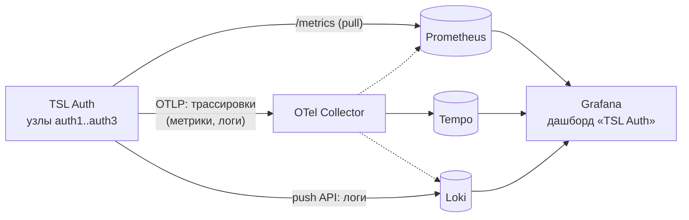

# Эксплуатация

## Проверки состояния

| Эндпоинт | Смысл | Использование |
|---|---|---|
| `/health/live` | процесс жив | liveness-проба, перезапуск контейнера |
| `/health/ready` | есть связь с БД | readiness-проба, балансировщик (503 — вывести из ротации) |
| `/lb-health` (nginx) | балансировщик жив | мониторинг точки входа |

Docker HEALTHCHECK встроен в образ: в distroless-образе нет shell, curl и wget, поэтому проверку выполняет сам сервис
(`dotnet /app/TslAuth.dll healthcheck` → `GET http://127.0.0.1:8080/health/ready`, код выхода 0/1). Если сервис слушает другой
порт, задайте `HEALTHCHECK_URL`.

## Журналы

* Логи сервиса — stdout контейнера (`docker logs tsl-auth-1`): формат `Text` (для чтения) или `Json` (одна строка на запись,
  `LOG_FORMAT`). Уровни по умолчанию — `LOG_LEVEL` / `Logging__LogLevel__*`; **глубина по категориям меняется на лету**
  в админке («Настройки» → «Журналирование») или через `PUT /api/admin/settings` (`loggingPolicy`) — на всех узлах за
  ≤ 35 с, без перезапуска. Для разбора инцидента: `Serilog.AspNetCore.RequestLoggingMiddleware=Information` — строка на
  каждый запрос, `TslAuth=Debug` — подробности сервисов, `Microsoft.EntityFrameworkCore.Database.Command=Information` — SQL.
* Логи не растут бесконечно: в compose драйвер `json-file` держит 5 файлов по 20 МБ на контейнер, ротированные сжаты
  (`compress`). Вне контейнера — `Logging__File__*`: файл на день и по размеру, не более `RetainedFiles` файлов, архивы `.gz`.
* Логи в Loki и по OTLP, метрики и трассировки — раздел [мониторинг](#мониторинг).
* Журнал безопасности — в БД, админка → **Журнал**, `GET /api/admin/audit`, выгрузка CSV.
* Лента событий — для ботов/SIEM: long-polling, SSE, вебхуки (`security.alert` — важные события безопасности).
* nginx пишет в stdout, на какой узел ушёл каждый запрос (`-> 172.19.0.4:8080`).

Пример строки (`Text`): `[14:30:02 WRN] TslAuth.Audit: Учётная запись u***a заблокирована после неудачных попыток входа`.
Логины в логах маскируются, пароли и токены не пишутся никогда.

## Мониторинг

Сервис отдаёт метрики Prometheus, отправляет трассировки, метрики и логи по OTLP и логи — напрямую в Grafana Loki.
Подсистемы включаются по отдельности (см. [конфигурацию](configuration.md#мониторинг-prometheus-opentelemetry-loki)):
что не настроено — не собирается и ресурсов не потребляет.



### Метрики (Prometheus)

`Observability__Prometheus__Enabled=true` — эндпоинт `/metrics` на каждом узле (в кластере Prometheus опрашивает узлы
напрямую, минуя nginx: `auth1:8080`, `auth2:8080`, `auth3:8080`). Доступ — только из частных сетей
(`AllowedNetworks`) и (или) по bearer-токену (`Token`): метрики раскрывают имена приложений и объёмы отказов.
Тот же набор уходит по OTLP при `OpenTelemetry__Metrics=true`.

| Метрика | Тип | Метки | Что показывает |
|---|---|---|---|
| `tsl_auth_tokens_issued_total` | counter | `grant_type`, `client_id` | выданные токены по типу гранта и приложению |
| `tsl_auth_tokens_rejected_total` | counter | `grant_type`, `error` | отклонённые запросы токенов: `invalid_client` — подбор секрета, `invalid_grant` — неверный пароль/код/просроченный refresh |
| `tsl_auth_audit_events_total` | counter | `type`, `severity`, `success` | события журнала безопасности: входы (`auth.login.succeeded/failed`), блокировки, пароли, регистрации, изменения, отказы в доступе |
| `tsl_auth_audit_dropped_total` | counter | — | информационные события, отброшенные из-за переполнения очереди (БД журнала не успевает) |
| `tsl_auth_webhooks_deliveries_total` | counter | `result` = `succeeded` / `retry` / `failed` | доставка вебхуков |
| `tsl_auth_sessions_active` | gauge | — | действующие сессии (обновляется раз в минуту) |
| `tsl_auth_users` | gauge | `status` = `active` / `inactive` | учётные записи |
| `tsl_auth_applications` | gauge | — | зарегистрированные приложения |
| `tsl_auth_database_up` | gauge | — | доступность БД при последнем опросе (1/0) |
| `http_server_request_duration_seconds` | histogram | `http_route`, `http_response_status_code`, `http_request_method` | латентность и коды ответов — RPS, p95, доля 5xx |
| `http_server_active_requests`, `kestrel_*` | gauge | — | активные запросы, соединения, очередь Kestrel |
| `aspnetcore_rate_limiting_requests_total` | counter | `aspnetcore_rate_limiting_result` | сработавшие лимиты частоты (429) |
| `http_client_request_duration_seconds` | histogram | `server_address` | исходящие запросы (вебхуки) |
| `dotnet_*` (`process_memory_working_set_bytes`, `gc_collections_total`, `thread_pool_*`, `process_cpu_time_seconds_total`) | gauge / counter | — | среда выполнения .NET |
| `db_client_*` (Npgsql), `microsoft_entityframeworkcore_*` | histogram / gauge | — | запросы к PostgreSQL, пул соединений, активные контексты EF Core |

Ориентиры для алертов: `tsl_auth_database_up == 0`; рост `tsl_auth_tokens_rejected_total{error="invalid_client"}`
или `tsl_auth_audit_events_total{type="auth.locked_out"}` (подбор); `tsl_auth_audit_dropped_total > 0`;
`tsl_auth_webhooks_deliveries_total{result="failed"}`; доля 5xx и p95 `http_server_request_duration_seconds`.

### Трассировки и логи (OpenTelemetry)

`Observability__OpenTelemetry__Endpoint=http://otel-collector:4317` — отправка по OTLP; сигналы отключаются по
отдельности (`Traces`, `Metrics`, `Logs`). В трассировки попадает span на каждый HTTP-запрос (кроме `/health/*` и
`/metrics`) с методом, маршрутом, кодом, длительностью и исключением; вложенные span'ы SQL (Npgsql) и исходящих HTTP
(вебхуки); на запросах выдачи токенов — теги `tsl_auth.grant_type`, `tsl_auth.client_id`, `tsl_auth.error`; каждое
событие аудита — событием в span'е (`tsl_auth.audit.type`, `severity`, `success`). Входящий `traceparent` от приложений
принимается — трассировка приложения продолжается в сервисе. Ресурс: `service.name`, `service.version`,
`service.instance.id` (узел), `Observability__ResourceAttributes`.
Логи по OTLP и в Loki (`Observability__Loki__Url`) содержат текст, уровень, категорию, параметры сообщения отдельными
полями и идентификаторы трассировки (`TraceId`/`SpanId`; в строке Loki — `_TraceId`/`_SpanId`) — в Grafana строка лога
ведёт к трассировке, а span — к логам узла.

### Эталонный стенд Grafana

`docker-compose.observability.yml` поднимает Prometheus, Loki, Tempo, OpenTelemetry Collector и Grafana с готовым
дашбордом «TSL Auth» (запросы, токены, входы, события безопасности, состояние, среда выполнения, логи) и связями
метрики ↔ трассировки ↔ логи:

```bash
# в .env: OBS_PROMETHEUS_ENABLED=true  OBS_OTLP_ENDPOINT=http://otel-collector:4317  OBS_OTLP_METRICS=false  OBS_OTLP_LOGS=false  OBS_LOKI_URL=http://loki:3100
docker compose -f docker-compose.yml -f docker-compose.observability.yml up -d
```

Grafana — http://localhost:3000 (просмотр без входа; правка — `admin` / `OBS_GRAFANA_PASSWORD`), Prometheus —
http://localhost:9090; порты привязаны к 127.0.0.1. Для кластера добавьте `OBS_PROMETHEUS_CONFIG=deploy/observability/prometheus-ha.yml`
(опрос узлов `auth1..auth3`). Образы стенда для закрытого контура: `scripts/export-images.ps1 -Observability`.
Стенд — отправная точка: в продуктиве подключайте существующие Prometheus/Loki/коллектор теми же переменными.

## Восстановление доступа администратора

Команда работает прямо с БД, веб-вход не нужен:

```bash
docker exec -it tsl-auth dotnet /app/TslAuth.dll admin reset-password admin            # сгенерировать временный пароль
docker exec -it tsl-auth dotnet /app/TslAuth.dll admin reset-password admin --password 'Новый-Пар0ль'
```

Пользователь будет создан (если его нет), активирован, разблокирован, получит роль `administrator`;
его прежние сессии отзываются. В кластере — на любом узле (`tsl-auth-1`).
В образе нет shell (distroless), поэтому команда вызывается через `dotnet` напрямую, без `sh -c`.

Другие команды CLI: `admin migrate-to-postgres` — перенос данных одиночного режима в PostgreSQL со сверкой
(см. [переход на кластер](deployment.md#переход-с-одиночного-режима-на-кластер)); `admin help` — список команд.

## Типовые проблемы

| Симптом | Причина / решение |
|---|---|
| Сервис не стартует: «Для PostgreSQL необходимо задать Encryption__MasterKey» | задайте `ENCRYPTION_MASTER_KEY` в `.env` (или `master_key` в [секретах](deployment.md#секреты-файлами-docker-secrets)) |
| Сервис не стартует: не задан `Auth__Issuer` | вне Development публичный адрес обязателен — задайте `AUTH_ISSUER` (абсолютный `http(s)://` адрес без query) |
| SQLite: сервис не стартует, БД есть, а `master.key` нет | не примонтирован том с ключом или ключ удалён. Верните `master.key` из резервной копии; новый ключ сервис намеренно не создаёт — данные стали бы нечитаемыми |
| Сервис не стартует: не найден файл секрета (`...File`) | путь в `*File` указан, а файла нет — проверьте `AUTH_SECRETS_DIR` и имена файлов |
| Ответ 400 на любой запрос | заголовок `Host` не входит в `AllowedHosts` (`AUTH_ALLOWED_HOSTS`) — добавьте имя, по которому обращаются клиенты |
| «Версия БД новее версии сервиса» | запущен более старый образ, чем схема БД — запустите актуальную версию или восстановите бэкап |
| «Не удалось создать первого администратора … политика паролей» | `BOOTSTRAP_ADMIN_PASSWORD` не проходит политику (например, содержит логин) — поменяйте или оставьте пустым |
| «нет права CREATEDB» | создайте базу вручную (см. [развёртывание](deployment.md#внешний-postgresql)) |
| Клиенты получают `invalid_token` / неверный `iss` | `AUTH_ISSUER` не совпадает с адресом, по которому к сервису обращаются клиенты (`iss` всегда равен `AUTH_ISSUER`, одинаковому на всех узлах) |
| За прокси в журнале адрес прокси вместо IP клиента, лимиты срабатывают на всех сразу | включите `Auth__TrustForwardedHeaders`; если прокси не в частной сети — укажите его подсеть в `Auth__KnownNetworks` |
| Бот на long-polling получает 504 | таймаут прокси меньше `wait`: для `/api/admin/events` нужен таймаут чтения ≥ 75–90 с (так в `deploy/nginx*.conf`) или меньший `wait` |
| SPA: ошибка CORS на `/connect/token` | origin SPA должен совпадать с одним из Redirect URI приложения (подхватывается за ≤ 60 с) |
| Пустая страница после входа в серверное приложение (form_post) | старый образ с устаревшим CSP — обновите |
| 429 Too Many Requests | сработал rate limit с одного IP — увеличьте `SECURITY_TOKEN_RPM` для доверенных сервисов или разнесите их по IP |
| Пользователь не может войти, «заблокирована» | блокировка после неудачных попыток — «Разблокировать» в карточке или дождаться окончания |
| Изменения прав не видны в приложении | права попадают в токен при следующем входе/refresh; access-токен живёт до своего `exp` |
| Приглашение «недействительно» | ссылка использована или истекла (7 дней) — выслать повторно из карточки |

## Ротация ключей подписи

Ключ подписи JWT создаётся при первом старте и хранится в `KeyMaterials`. Для плановой ротации:
удалите строку `oidc-signing-rsa` из `KeyMaterials` и перезапустите все узлы (появится новый ключ, `kid` изменится).
Клиенты, кэширующие JWKS, перечитают его при неизвестном `kid`; ранее выданные access-токены станут недействительны
(пользователи получат новые через refresh). Выполняйте в окно обслуживания.

## Мастер-ключ

Сменить мастер-ключ без перешифрования данных нельзя. Храните его копию в защищённом месте:
потеря ключа означает потерю персональных данных пользователей (пароли при этом останутся проверяемыми,
но логины/email не будут читаться).
