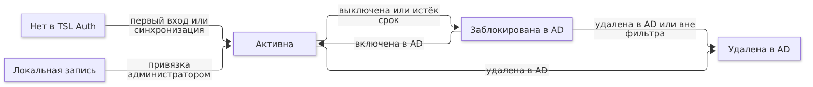
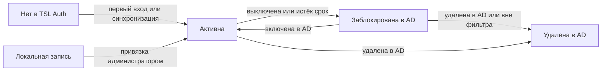

# ЧТЗ: интеграция TSL Auth с Active Directory

Статус — постановка, реализация не начата. Составлено 30.09.2026 по коду TSL Auth 1.5.1 (`79fd9a8`).
Требования Ф-AD-N при реализации переносятся в [`tz.md`](tz.md) (Ф-31 и далее), описание для интеграторов — в
[`integration.md`](integration.md), настройки — в [`configuration.md`](configuration.md).

## 1. Назначение и границы

Сотрудники входят в TSL Auth и все приложения ERP «Уклад» под своей доменной учётной записью Active Directory, а права выдаются через группы AD, сопоставленные с ролями матрицы доступа. Ручное заведение пользователей в TSL Auth для сотрудников домена больше не нужно.

Разделение ответственности:

| Что | Где ведётся | Кто меняет |
| --- | --- | --- |
| Логин, пароль, ФИО, e-mail, отдел, должность | AD | администратор AD |
| Блокировка и увольнение | AD | администратор AD, кадровая служба |
| Членство в группах AD | AD | администратор AD или владелец группы |
| Роли приложений, матрица доступа | TSL Auth | администратор доступа, оператор приложения |
| Сопоставление «группа AD → роль» | TSL Auth | администратор доступа, оператор приложения |
| Служебные и аварийные учётные записи | TSL Auth (локальные) | администратор TSL Auth |

Входит в задачу:

- вход по логину и паролю AD через LDAP/LDAPS с созданием учётной записи при первом входе;
- периодическая синхронизация профиля, блокировки и членства в группах;
- сопоставление групп AD с ролями приложений, в том числе вложенных групп;
- поиск по каталогу AD в админке и через App API;
- страницы админки и методы App API для настройки сопоставлений;
- прозрачный вход Kerberos/SPNEGO на машинах в домене (отдельный этап).

Не входит:

- запись в AD: TSL Auth не меняет пароли, группы и атрибуты в каталоге;
- смена и сброс пароля доменной учётной записи через TSL Auth;
- федерация через ADFS/SAML и другие каталоги (FreeIPA, OpenLDAP) — возможны позже по тому же интерфейсу;
- несколько лесов AD с доверием — в первой версии один лес, несколько доменов в нём допустимы.

## 2. Пользователи и роли

В процессе участвуют четыре роли людей и одна техническая учётная запись; новых ролей в модели прав TSL Auth не появляется, кроме права на настройку подключения к AD.

| Роль | Кто это | Что делает |
| --- | --- | --- |
| Сотрудник домена | любой пользователь с учётной записью AD | входит доменным логином или прозрачно (Kerberos), видит свои приложения и роли |
| Администратор AD | служба ИТ заказчика | заводит и блокирует учётные записи, ведёт группы, выдаёт служебную учётную запись и SPN для TSL Auth |
| Администратор TSL Auth | существующая роль admin | настраивает подключение к AD, расписание синхронизации, локальные и аварийные учётные записи |
| Администратор доступа приложения | оператор с правом управления матрицей приложения (managePermission) | сопоставляет группы AD с ролями своего приложения в админке или в интерфейсе самого приложения через App API; выдаёт ручные роли по исключению |
| Служебная учётная запись LDAP | учётная запись AD только для чтения | читает каталог: поиск пользователей и групп, синхронизация; прав на запись не имеет |

Право «настроить подключение к AD» есть только у администратора TSL Auth; оператор приложения видит и меняет сопоставления только своего приложения.

## 3. Процессы и сценарии

Новый сотрудник, добавленный в сопоставленную группу AD, получает доступ при первом же входе, без участия администратора TSL Auth. Изменения в AD доходят до токенов не позже, чем истечёт access token (15 минут по умолчанию).

### 3.1. Первый вход сотрудника

1. Пользователь открывает приложение, оно перенаправляет на страницу входа TSL Auth (authorize).
2. Пользователь вводит доменный логин (`ivanov`, `ivanov@corp.local` или `CORP\ivanov`) и пароль.
3. TSL Auth находит запись в AD служебной учётной записью и проверяет пароль привязкой (bind) от имени пользователя.
4. Если локальной записи нет — создаёт её с источником «AD» (JIT), заполняет профиль из атрибутов AD; пароль не сохраняется.
5. Читает группы пользователя с учётом вложенных, применяет сопоставления «группа → роль».
6. Дальше — обычный поток: проверка доступа к приложению по матрице, второй фактор (если включён), код авторизации, токены с ролями.
7. Нет ни одной роли в приложении — та же страница «нет доступа», что и сейчас; учётная запись всё равно создаётся.

### 3.2. Выдача доступа через группу

1. Администратор доступа приложения один раз сопоставляет группу (например, `ERP-Docflow-Clerks`) с ролью `clerk`, выбрав группу поиском по каталогу.
2. Дальше доступом управляет AD: добавили в группу — роль появится при следующем входе, обновлении токена или синхронизации; убрали — исчезнет так же.
3. Сотрудник, который ещё ни разу не входил, появляется в TSL Auth после ближайшей синхронизации (если включено предварительное создание) — его можно увидеть в списках приложения до первого входа.

### 3.3. Сроки доставки изменений

| Событие в AD | Когда сработает в TSL Auth |
| --- | --- |
| Новый сотрудник в сопоставленной группе | сразу, при первом входе |
| Добавление или удаление из группы | при следующем входе или обновлении токена — не позже 15 минут; при синхронизации — и без входа |
| Блокировка или удаление учётной записи | обновление токена отклоняется сразу; при синхронизации запись блокируется, токены и сессии отзываются |
| Смена ФИО, e-mail, отдела | при следующем входе или синхронизации |
| Смена пароля | старый пароль перестаёт работать сразу (проверка всегда в AD) |

### 3.4. Увольнение

Учётную запись блокируют в AD. При ближайшей синхронизации TSL Auth переводит запись в «Заблокирована в AD», отзывает токены и сессии, шлёт новый вебхук `user.disabled`. До синхронизации действует только уже выданный access token, обновить его нельзя.

### 3.5. Перевод в другой отдел

Сотрудника переносят в другие группы AD. Роли из старых групп снимаются, из новых — выдаются; ручные роли остаются, и оператор видит их с пометкой «вручную», чтобы решить, снять ли их.

### 3.6. Прозрачный вход (Kerberos, этап 3)

На машине в домене браузер сам передаёт билет Kerberos (SPNEGO), и пользователь попадает в приложение без ввода пароля. Билета нет (чужая машина, браузер не настроен) — показывается обычная форма входа. Группы и профиль читаются так же, как в 3.1.

## 4. Объекты и справочники

Появляются три новых объекта (подключение к каталогу, сопоставление группы, журнал синхронизации), а у пользователя и назначения роли — поля источника.

### 4.1. Учётная запись (дополнение)

| Поле | Значение | Источник |
| --- | --- | --- |
| Источник | `local` или `ad` | TSL Auth |
| Подключение | идентификатор каталога (для `ad`) | TSL Auth |
| Внешний идентификатор | `objectGUID` — не меняется при переименовании и переносе | AD |
| Логин | `sAMAccountName`; для входа также `userPrincipalName` | AD |
| ФИО, e-mail, телефон | `displayName`, `givenName`, `sn`, `mail`, `telephoneNumber` | AD |
| Отдел, должность | `department`, `title` | AD |
| Состояние в AD | из `userAccountControl` и `accountExpires` | AD |
| Последняя синхронизация | дата и время | TSL Auth |

Персональные данные из AD хранятся так же, как сейчас: AES-256-GCM и слепые индексы. Поля из AD в админке только для чтения. Соответствие атрибутов меняется в настройках подключения.

### 4.2. Подключение к каталогу

Одна запись на домен (в первой версии обычно одна): имя, серверы, базовые DN, фильтры, соответствие атрибутов, расписание, включено/выключено. Параметры — в разделе 8.

### 4.3. Сопоставление «группа AD → роль»

| Поле | Значение |
| --- | --- |
| Подключение | к какому каталогу относится группа |
| Группа | `objectGUID` группы + имя для показа (обновляется синхронизацией) |
| Приложение и роль | роль из матрицы доступа приложения |
| Вложенные группы | учитывать членов вложенных групп (по умолчанию — да) |
| Кто и когда создал | для аудита |

Одна группа может давать несколько ролей в разных приложениях; итоговые роли пользователя — объединение ролей из групп и ручных.

### 4.4. Назначение роли (дополнение)

У каждой роли пользователя — происхождение: «вручную» или «из группы X» (ссылка на сопоставление). Роль из группы нельзя снять вручную — только убрав пользователя из группы или удалив сопоставление.

### 4.5. Журнал синхронизации

Запись на каждый прогон: начало, конец, результат, сколько записей создано, изменено, заблокировано, сколько ролей выдано и снято, текст ошибки. Хранится по общему сроку аудита.

## 5. Статусы и переходы

Статус записи из AD в TSL Auth вручную не меняется: его определяют данные AD при входе, обновлении токена и синхронизации.

Исходник схемы (Mermaid)

В состоянии «Заблокирована в AD» токены и сессии отозваны; у удалённой записи логин освобождается, история остаётся в аудите. Пока каталог недоступен, статус не меняется, а refresh работает не дольше льготного срока (раздел 7).

## 6. Функциональные требования

Требования нумеруются Ф-AD-N; в главном ЧТЗ (`docs/tz.md`) они станут Ф-31 и далее. Этап — из раздела 12.

| Номер | Требование | Этап |
| --- | --- | --- |
| Ф-AD-1 | Подключение к AD по LDAPS (636) или LDAP + StartTLS (389); незащищённый LDAP — только явным флагом для тестового стенда. Несколько контроллеров домена с перебором при отказе | 1 |
| Ф-AD-2 | Вход по логину и паролю AD на странице входа TSL Auth: поиск записи служебной учётной записью, проверка пароля bind от имени пользователя. Формы логина: `sAMAccountName`, `UPN`, `ДОМЕН\логин` | 1 |
| Ф-AD-3 | Создание учётной записи при первом входе (JIT) с источником `ad` и профилем из AD; выключаемо в настройках (тогда вход только у заранее созданных) | 1 |
| Ф-AD-4 | При каждом входе — обновление профиля и ролей из групп по данным AD на момент входа | 1 |
| Ф-AD-5 | Сопоставление «группа AD → роль приложения»: создание, просмотр, удаление; учёт вложенных групп. Удаление сопоставления снимает выданные им роли сразу | 1 |
| Ф-AD-6 | Поиск по каталогу: группы и пользователи по части имени, не более 50 результатов, с показом числа членов группы | 1 |
| Ф-AD-7 | Периодическая синхронизация (по умолчанию раз в 15 минут, инкрементно по `uSNChanged`; полная — раз в сутки): профиль, блокировка, членство в сопоставленных группах. В кластере выполняет один узел (advisory-lock) | 2 |
| Ф-AD-8 | Заранее создавать учётные записи членов сопоставленных групп при синхронизации (флаг, по умолчанию выключен) | 2 |
| Ф-AD-9 | Блокировка в AD (выключена, истёк срок, удалена, вышла из фильтра) → блокировка в TSL Auth, отзыв токенов и сессий, вебхук `user.disabled`; разблокировка в AD → разблокировка | 2 |
| Ф-AD-10 | Обновление токена (refresh) для записи из AD перечитывает состояние и группы из AD не реже раза в 5 минут (кеш); запись заблокирована — отказ `invalid_grant` | 1 |
| Ф-AD-11 | App API: список, создание и удаление сопоставлений своего приложения (`/api/app/directory/mappings`), поиск групп и пользователей (`/api/app/directory/search`); изменения — только делегированным токеном оператора с managePermission, как в подчинённых клиентах | 1 |
| Ф-AD-12 | Admin API: подключения к каталогу (CRUD, «проверить подключение»), сопоставления любого приложения, запуск синхронизации, журнал прогонов | 1–2 |
| Ф-AD-13 | Админка: страница «Каталог AD» (настройки, проверка, журнал синхронизации), вкладка «Группы AD» в матрице приложения, источник и происхождение ролей в карточке пользователя, фильтр «источник» в списке пользователей | 1–2 |
| Ф-AD-14 | SDK пяти языков: методы App API для сопоставлений и поиска по каталогу, контракт — в `docs/client-contract.md` | 2 |
| Ф-AD-15 | Прозрачный вход Kerberos/SPNEGO (`Negotiate`) на странице входа с запасным переходом на форму; keytab из файла или OpenBao | 3 |
| Ф-AD-16 | Кнопка «Войти через домен» и скрытие локальной регистрации для доменных пользователей; саморегистрация и сброс пароля для записей `ad` недоступны | 1 |

## 7. Проверки и ограничения

При любом спорном случае TSL Auth отказывает во входе и пишет причину в аудит, а не догадывается.

| Ситуация | Поведение |
| --- | --- |
| Локальная запись с тем же логином или e-mail уже есть | автоматически не сливается: вход из AD отклоняется, администратор видит конфликт и может привязать локальную запись к AD (роли и история сохраняются, локальный пароль удаляется) |
| В AD переименовали логин | запись находится по `objectGUID`, логин обновляется; `sub` в токенах не меняется |
| Запись удалили и завели заново с тем же логином | новый `objectGUID` = новый пользователь; старая запись остаётся заблокированной, логин у неё освобождается |
| Вложенные группы | членство читается одним запросом (`tokenGroups` или `LDAP_MATCHING_RULE_IN_CHAIN`), циклы групп не ломают расчёт; первичная группа (`Domain Users`) учитывается |
| Сопоставление с широкой группой (`Domain Users`, `Everyone`) | допустимо, но админка предупреждает числом членов и просит подтверждение |
| Группу удалили в AD | сопоставление помечается «группа не найдена», роли из него снимаются |
| AD недоступен (все контроллеры) | вход доменным паролем невозможен (сообщение «каталог недоступен», не «неверный пароль»); уже выданные токены действуют; refresh работает по последним данным не дольше льготного срока (по умолчанию 1 час), дальше — отказ; локальные записи входят как обычно |
| Неверный пароль AD | счётчик неудач TSL Auth срабатывает раньше блокировки AD (по умолчанию 5 попыток за 15 минут), чтобы перебор через TSL Auth не блокировал учётную запись в домене |
| Пароль AD истёк или требуется смена | вход отклоняется с сообщением «смените пароль в Windows» (коды bind 532, 773) |
| Пустой пароль | отказ до обращения к AD: пустой bind в AD — анонимный и «успешен» |
| Логин со спецсимволами LDAP (`*`, `(`, `)`, `\`) | экранируется по RFC 4515, инъекция в фильтр невозможна |

Локальные записи остаются для служебных учётных записей, подрядчиков вне домена и аварийного администратора. Аварийный администратор входит без AD, его входы отмечаются в аудите отдельным событием.

## 8. Интеграции и настройки

Подключение к AD задаётся в админке или переменными окружения `Directory__*` (переменные сильнее админки и блокируют поля для редактирования). Пароль служебной учётной записи и keytab — только из переменной, файла или OpenBao, в БД не хранятся.

| Параметр | Пример | По умолчанию |
| --- | --- | --- |
| `Directory__Enabled` | `true` | `false` |
| `Directory__Name` | `CORP` | — |
| `Directory__Servers` | `ldaps://dc1.corp.local,ldaps://dc2.corp.local` | — |
| `Directory__Security` | `Ldaps` \| `StartTls` \| `None` (только тест) | `Ldaps` |
| `Directory__CaCertificateFile` | `/run/secrets/corp-ca.pem` | системные корневые |
| `Directory__BindDn` | `CN=svc-tslauth,OU=Service,DC=corp,DC=local` | — |
| `Directory__BindPassword` / `__BindPasswordFile` | секрет | — |
| `Directory__UserBaseDn` | `OU=Staff,DC=corp,DC=local` | корень домена |
| `Directory__UserFilter` | `(&(objectCategory=person)(objectClass=user))` | то же |
| `Directory__GroupBaseDn` | `OU=Groups,DC=corp,DC=local` | корень домена |
| `Directory__Attributes__*` | `Email=mail`, `Department=department` | как в разделе 4.1 |
| `Directory__JitProvisioning` | `true` | `true` |
| `Directory__PreProvisioning` | `false` | `false` |
| `Directory__SyncInterval` | `00:15:00` | 15 минут |
| `Directory__FullSyncTime` | `03:00` | 03:00 |
| `Directory__CacheTtl` | `00:05:00` | 5 минут |
| `Directory__OutageGrace` | `01:00:00` | 1 час |
| `Directory__Timeout` | `00:00:05` | 5 секунд |
| `Directory__Kerberos__Enabled` | `true` | `false` (этап 3) |
| `Directory__Kerberos__KeytabFile` | `/run/secrets/tslauth.keytab` | — |

Что нужно от администратора AD:

- служебная учётная запись с правом чтения пользователей и групп (прав Domain Users достаточно), пароль без срока действия или с регламентом смены;
- сертификат корневого ЦС домена для LDAPS;
- сетевой доступ с узлов TSL Auth к контроллерам по 636/tcp (для Kerberos — ещё 88/tcp,udp);
- группы для ролей приложений (рекомендуемое имя `ERP-<приложение>-<роль>`);
- для Kerberos: SPN `HTTP/auth.corp.local` на служебной учётной записи, keytab, адрес TSL Auth в зоне «Местная интрасеть» браузеров через групповую политику.

Вебхуки для приложений: новые `user.disabled`, `user.enabled`, `user.roles_changed` (с причиной `directory_sync`), существующий `user.created` (с источником `ad`).

## 9. Права доступа и аудит

Каждое действие с подключением и сопоставлениями и каждое изменение ролей из-за AD попадает в журнал аудита с исполнителем и причиной.

| Действие | Администратор TSL Auth | Администратор доступа приложения | Сервисный токен приложения |
| --- | --- | --- | --- |
| Настроить подключение, запустить синхронизацию | да | нет | нет |
| Смотреть журнал синхронизации | да | нет | нет |
| Искать группы и пользователей в каталоге | да | да | да (только чтение) |
| Смотреть сопоставления приложения | любого | своего | своего |
| Создать и удалить сопоставление | любого | своего | нет (нужен делегированный токен оператора) |
| Выдать ручную роль записи из AD | да | в своём приложении | как сейчас в App API |
| Привязать локальную запись к AD | да | нет | нет |

Новые события аудита:

| Событие | Когда |
| --- | --- |
| `directory.config_change` | изменены настройки подключения (без секретов) |
| `directory.mapping_change` | создано или удалено сопоставление; в журнал приложения тоже |
| `directory.login` / `directory.login_failed` | вход доменным паролем или Kerberos; причина отказа (неверный пароль, заблокирован, каталог недоступен, конфликт) |
| `directory.user_provisioned` | запись создана при входе или синхронизацией |
| `directory.roles_sync` | роли выданы или сняты из-за членства в группе (группа, роль, было/стало) |
| `directory.user_disabled` / `directory.user_enabled` | состояние изменено по данным AD |
| `directory.sync_run` | итог прогона синхронизации |
| `directory.user_linked` | локальная запись привязана к AD |

Пароли, содержимое keytab и полные DN записей в аудит и журналы не пишутся; логин и e-mail — по тем же правилам ПДн, что и сейчас.

## 10. Нефункциональные требования

Интеграция не должна ухудшать текущие показатели TSL Auth для локальных записей и остаётся в закрытом контуре: только контроллеры домена, никаких внешних сервисов.

| Требование | Значение |
| --- | --- |
| Время входа доменным паролем (p95, без сети до AD) | ≤ 500 мс сверх локального входа |
| Нагрузка на AD при входе | не больше 3 LDAP-операций (поиск, bind, группы); пул соединений служебной учётной записи |
| Нагрузка на AD при refresh | не чаще раза в 5 минут на пользователя (кеш) |
| Пиковый вход утром | 200 входов в минуту без ошибок (проверяется k6) |
| Полная синхронизация | 10 000 пользователей и 500 групп — не дольше 5 минут, постранично (paged results) |
| Отказ контроллера домена | переход на следующий за время тайм-аута (5 с), недоступный исключается на 1 минуту |
| Кластер | синхронизацию выполняет один узел; вход — любой; кеш групп — в БД, не в памяти узла |
| Готовность сервиса | недоступный AD не делает `/health/ready` красным (локальные входы работают), состояние — отдельной проверкой `directory` в `/health` |
| Метрики | `tslauth_directory_login_total{result}`, `tslauth_directory_request_seconds`, `tslauth_directory_up`, `tslauth_directory_sync_last_success_timestamp` + правила алертов в стенде мониторинга |
| Трассировка | спаны OTLP на каждую LDAP-операцию без ПДн в атрибутах |
| Безопасность канала | TLS 1.2+, проверка сертификата и имени контроллера обязательна; пароль пользователя не покидает память процесса и не хранится |
| Библиотека | `System.DirectoryServices.Protocols` (.NET, работает в Linux-образе с `libldap`); внешних сервисов и CDN нет |
| Совместимость | AD на Windows Server 2016–2025 и Samba AD DC 4.x |

## 11. Тестовые сценарии и критерии приёмки

Задача принята, когда вся пирамида тестов зелёная против Samba AD DC в Docker, а прозрачный вход проверен на машине Windows в домене.

Стенд: контейнер Samba AD DC (домен `TEST.LOCAL`, LDAPS с самоподписанным ЦС) с набором из скрипта `tests/directory/seed.sh`: 10 пользователей, 5 групп, одна вложенная группа, цикл групп, заблокированная и истёкшая записи. Интеграционные тесты поднимают его через Testcontainers, как PostgreSQL.

| Уровень | Что проверяем |
| --- | --- |
| Unit | экранирование фильтров, разбор `userAccountControl`/`accountExpires`, расчёт ролей из групп и ручных, формы логина, коды ошибок bind |
| Интеграционные (SQLite и PostgreSQL) | вход и JIT, роли из вложенной группы, синхронизация, блокировка → refresh `invalid_grant`, конфликт логинов, переименование, App API и Admin API, права по разделу 9 |
| Нагрузка (k6) | 200 входов в минуту доменным паролем, refresh под нагрузкой, счёт LDAP-операций |
| Отказоустойчивость | остановка одного из двух DC, остановка обоих (льготный срок, локальный администратор), отказ узла кластера во время синхронизации |
| Наблюдаемость | метрики и алерты из раздела 10, отсутствие паролей и DN в журналах |
| UI (Playwright) | страница «Каталог AD», «Проверить подключение», сопоставление группы через поиск, вход доменного пользователя в демо-приложение, происхождение ролей в карточке |
| Контрактные SDK | методы сопоставлений и поиска в пяти SDK |
| Ручная (этап 3) | машина Windows в домене: Edge и Яндекс Браузер входят без пароля; машина вне домена получает форму |

Приёмочные сценарии (сквозные, на демо-стенде):

- [ ] Новый пользователь AD в группе `ERP-Docflow-Clerks` входит в docflow-demo с ролью `clerk`, администратор TSL Auth ничего не делал.
- [ ] Пользователя убрали из группы — через ≤ 15 минут роль исчезла из токена.
- [ ] Учётную запись заблокировали в AD — refresh отклонён, после синхронизации сессии отозваны, приложение получило вебхук.
- [ ] Оператор приложения сопоставил группу из интерфейса своего приложения через App API и не смог сопоставить группу в чужом.
- [ ] Оба контроллера остановлены — аварийный администратор входит, доменные пользователи видят «каталог недоступен».
- [ ] Документация (`integration.md`, `configuration.md`, `administration.md`, `architecture.md`) и ЧТЗ обновлены, `validate-docs.ps1` без ошибок.

## 12. Этапы реализации и открытые вопросы

Работа делится на три выпуска; после первого доменные пользователи уже входят и получают роли из групп.

| Этап | Выпуск | Состав | Готово, когда |
| --- | --- | --- | --- |
| 1. Вход и группы | 1.6.0 | Ф-AD-1…6, 10–13, 16; стенд Samba AD; документация | первые три приёмочных сценария и сценарий с App API зелёные |
| 2. Синхронизация | 1.7.0 | Ф-AD-7…9, 14; журнал синхронизации, метрики, алерты | блокировка в AD доходит без входа пользователя; все приёмочные сценарии зелёные |
| 3. Прозрачный вход | 1.8.0 | Ф-AD-15; keytab, инструкция для администратора AD | вход без пароля на машине Windows в домене |

Открытые вопросы:

1. Один домен или несколько (разные юрлица, доверие между лесами)?
2. Нужно ли заранее создавать записи членов групп (Ф-AD-8) — чтобы приложения видели сотрудника до первого входа (например, назначить ему задачу в документообороте)?
3. Разрешать ли ручные роли для записей из AD или только группы (строже, но каждое исключение — заявка администратору AD)?
4. Какие браузеры и ОС на рабочих местах (для Kerberos важны групповые политики и Астра/РЕД ОС, если есть)?
5. Второй фактор для доменных пользователей: оставить по политике TSL Auth или выключить для входа по Kerberos?
6. Нужен ли вход доменных пользователей в Bot API (привязка мессенджера) и сброс пароля AD через бота — сейчас вне задачи?
