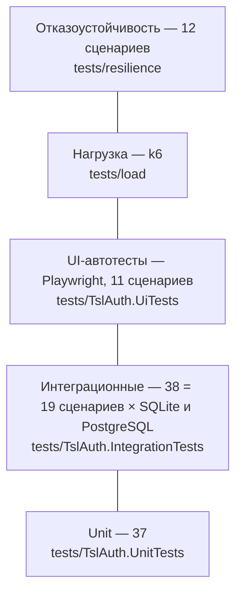

# Тестирование



| Уровень | Что проверяет | Окружение | Запуск |
|---|---|---|---|
| Unit | шифрование и слепые индексы, валидация имён и политик, генератор паролей, сроки хранения, подпись вебхуков, CSV-экранирование, согласованность языковых пакетов | нет | `dotnet test tests/TslAuth.UnitTests` |
| Интеграционные | сервис целиком в памяти на **SQLite и реальном PostgreSQL** (Testcontainers): OIDC, подпись JWT, RBAC-claims, ротация refresh, отзыв, блокировка, временный пароль, token exchange, сроки жизни, App API (изоляция), политика паролей, PAT, бот, события, заявки, шифрование в БД, перезапуск | Docker | `dotnet test tests/TslAuth.IntegrationTests` |
| UI (E2E) | реальный браузер против стенда: вход, «глазок», языки, вся админка, регистрация приложения и матрица, временный пароль, **SPA (Node) с брендингом, PKCE, token exchange Go→Node**, .NET MVC (OIDC), Python (password grant, App API), регистрация + одобрение, PAT | стенд | см. ниже |
| Нагрузка | выдача токенов по всем потокам, JWKS, Admin API под параллельной нагрузкой | стенд | `tests/load/run-load.ps1` |
| Отказоустойчивость | рестарты, `kill -9`, отказы узлов, БД и балансировщика под непрерывным трафиком | Docker | `tests/resilience/run-resilience.ps1` |

Все уровни, кроме UI/нагрузки/отказов, выполняются в CI на каждый push; полный стенд — workflow `E2E` (вручную и еженедельно).

## Запуск стенда для UI-тестов

```powershell
$env:BOOTSTRAP_API_CLIENT_ID='admin-cli'; $env:BOOTSTRAP_API_CLIENT_SECRET='demo-admin-cli-secret-2026'
docker compose up -d --build
./samples/seed-demo.ps1                                  # приложения, матрицы, alice/bob, секреты → samples/.env.demo
# демо-приложения: go run . (samples/go-api), node server.mjs (samples/node-spa),
# python app.py (samples/python-app), dotnet run (samples/dotnet-mvc) — секреты из samples/.env.demo
dotnet build tests/TslAuth.UiTests
./tests/TslAuth.UiTests/bin/Debug/net10.0/playwright.ps1 install chromium
dotnet test tests/TslAuth.UiTests                        # скриншоты шагов: tests/artifacts/ui
```

`UI_HEADED=1` — показать браузер. Адреса переопределяются `UI_AUTH_URL`, `UI_SPA_URL` и т.д.

## Результаты

### Функциональные

| Набор | Результат |
|---|---|
| Unit | 37 / 37 |
| Интеграционные (SQLite + PostgreSQL) | 38 / 38 |
| UI (Playwright) | 11 / 11 |

### Нагрузка

k6, 45 параллельных виртуальных пользователей (20 client_credentials, 10 refresh, 5 password, 5 JWKS, 5 Admin API), 60 с.

| Метрика | 1 узел, SQLite | 3 узла + PostgreSQL + nginx |
|---|---|---|
| Ошибки | 0 % | **0 %** (0 из 38 496) |
| Пропускная способность | 460 запросов/с | **633 запроса/с** |
| client_credentials, p95 | 2,15 с | **160 мс** |
| password (PBKDF2 100k), p95 | 4,26 с | **620 мс** |
| refresh, p95 | 3,74 с | **356 мс** |
| Распределение по узлам | — | 12 848 / 12 848 / 12 850 |

SQLite сериализует запись, поэтому одиночный режим рассчитан на небольшую нагрузку; для продуктива с
высокой нагрузкой используйте кластер на PostgreSQL. Нагрузочный тест выявил и позволил исправить
конфликт параллельных входов одного пользователя (HTTP 500) — теперь 0 ошибок.

### Отказоустойчивость

Для каждого сценария — непрерывный трафик через точку входа, затем проверка, что сессия (refresh-токен),
созданная **до** отказа, работает **после** восстановления и что ключи подписи не изменились.

| Режим | Сценарий | Ошибки клиентов | Сессии / ключи |
|---|---|---|---|
| 1 узел | штатный перезапуск | только на время подъёма (~3 с) | ✅ / ✅ |
| 1 узел | аварийное завершение `kill -9` | ~5 с | ✅ / ✅ |
| 1 узел | пересоздание контейнера (обновление образа) | ~4 с | ✅ / ✅ |
| кластер | синхронизация: вход на узле 1 → refresh на 2 → отзыв через 3 | — | отзыв действует на всех узлах сразу ✅ |
| 3 узла | поочерёдный рестарт (rolling update) | **0** | ✅ / ✅ |
| 3 узла | постепенный отказ до одного узла и возврат | **0** | ✅ / ✅ |
| 3 узла | `kill -9` одного узла | **0** | ✅ / ✅ |
| 3 узла | полный отказ всех узлов | на время отказа (~9 с), подъём 3 с | ✅ / ✅ |
| 2 узла | отказ одного и возврат | **0** | ✅ / ✅ |
| 2 узла | полный отказ обоих | на время отказа | ✅ / ✅ |
| кластер | отказ PostgreSQL и возврат | узлы живы 3/3, самовосстановление без рестарта | ✅ / ✅ |
| кластер | перезапуск nginx | ~1 с | ✅ / ✅ |

Отчёт прогона формируется в `tests/artifacts/resilience/report.md`.

### Безопасность

См. [результаты сканирования](security.md#результаты-сканирования): 0 уязвимостей, секретов и ошибок конфигурации.
