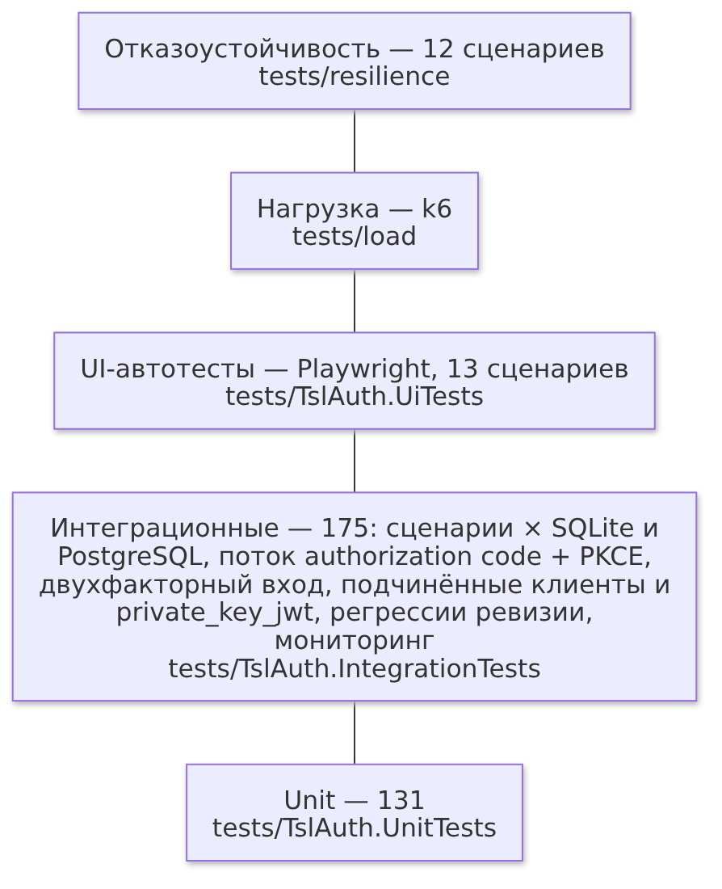
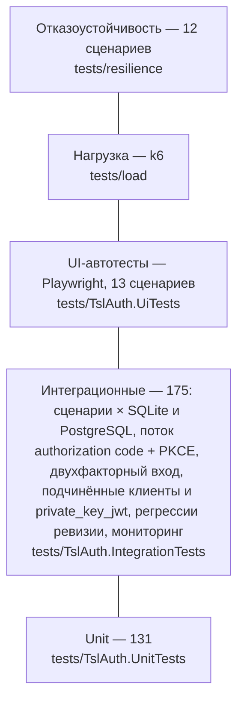

# Тестирование



<details><summary>Исходник схемы (Mermaid)</summary>


```mermaid
flowchart TB
    R["Отказоустойчивость — 12 сценариев<br/>tests/resilience"]
    L["Нагрузка — k6<br/>tests/load"]
    UI["UI-автотесты — Playwright, 13 сценариев<br/>tests/TslAuth.UiTests"]
    I["Интеграционные — 175: сценарии × SQLite и PostgreSQL, поток authorization code + PKCE, двухфакторный вход, подчинённые клиенты и private_key_jwt, регрессии ревизии, мониторинг<br/>tests/TslAuth.IntegrationTests"]
    U["Unit — 131<br/>tests/TslAuth.UnitTests"]
    R --- L --- UI --- I --- U
```

</details>

| Уровень | Что проверяет | Окружение | Запуск |
|---|---|---|---|
| Unit | шифрование и слепые индексы, валидация имён и политик, генератор паролей, сроки хранения, подпись вебхуков (точное значение HMAC), CSV-экранирование, согласованность языковых пакетов, политика адресов вебхуков (SSRF), доверенные прокси, канонизация кодов языков, **политика подчинённых клиентов, разбор JWKS (P-256, отпечаток RFC 7638, без закрытой части), правила assertion (`alg`, срок, `jti`), блокировка `client_id`** | нет | `dotnet test tests/TslAuth.UnitTests` |
| Интеграционные | сервис целиком в памяти на **SQLite и реальном PostgreSQL** (Testcontainers): OIDC, подпись JWT, RBAC-claims, ротация refresh, отзыв, блокировка, временный пароль, token exchange, сроки жизни, App API (изоляция), политика паролей, PAT, бот, события, заявки, шифрование в БД, перезапуск, **обновление схемы на живых данных**, перенос SQLite → PostgreSQL (`admin migrate-to-postgres`), **authorization code + PKCE через страницу входа** (отказы, introspection, revocation, выход, form_post), лимиты частоты, CORS, заголовки безопасности, права ролей администрирования, подпись вебхуков, приглашения, **двухфакторный вход по ролям** (код с почты и из мессенджера, `amr`, закрытый password grant), **отключение неактивных учётных записей**, **подчинённые клиенты и вход по ключу** (`ManagedClientScenarios`: делегированный токен оператора, `private_key_jwt`, повтор `jti` на двух узлах, смена ключей, отказы по `alg`/`aud`/сроку, отключение с отзывом и событием, 404 на чужих, 400 на обход через Admin API, предел числа, неактивность, блокировка `client_id`), регрессии ревизии кода | Docker | `dotnet test tests/TslAuth.IntegrationTests` |
| UI (E2E) | реальный браузер против стенда: вход, «глазок», языки, вся админка, регистрация приложения и матрица, временный пароль, **SPA (Node) с брендингом, PKCE, token exchange Go→Node**, .NET MVC (OIDC), Python (password grant, App API), регистрация + одобрение, PAT, **подчинённые клиенты в карточке владельца и отключение из админки** | стенд | см. ниже |
| E2E «внешний сервис» | `tests/e2e/external-service` (Go, на SDK): регистрация сервиса-владельца, оператор и делегированный токен, подчинённый агент с ключом ES256, вход по `private_key_jwt`, проверка токена сервисом (Verifier), ротация ключа, отключение (introspection, событие), журнал владельца, удаление, отказы (чужой ключ, повтор `jti`, сервисный токен на изменение, роль вне списка, обход через Admin API) — 43 проверки | стенд | `cd tests/e2e/external-service && go run .` |
| Контрактные (SDK) | пять клиентских библиотек против живого контейнера: 17 векторов (испорченные подписи, `alg=none`/`HS256`, неизвестный `kid`, чужая аудитория, просрочка по переведённым часам) + живые сценарии (ротация refresh, introspection после отзыва, кэш client_credentials, ротация JWKS, ответы middleware 401/403; .NET и Go — регистрация подчинённого со своим ключом и вход по `private_key_jwt`) — одинаковый результат у всех SDK | Docker | `tests/sdk-contract/run.ps1` |
| Нагрузка | выдача токенов по всем потокам, JWKS, Admin API под параллельной нагрузкой; входы по паролю — от пула пользователей `load-01…` (создаётся скриптом), а не от одного; отдельно — 200 подчинённых клиентов с ключами ES256 по `private_key_jwt` («токен каждому раз в 5 минут» сжато до 20 с) | стенд | `tests/load/run-load.ps1`, `tests/load/run-managed-load.ps1` |
| Отказоустойчивость | рестарты, `kill -9`, отказы узлов, БД и балансировщика под непрерывным трафиком (кластер — с `docker-compose.ha-nodes.yml`: сценарии обращаются к отдельным узлам) | Docker | `tests/resilience/run-resilience.ps1` |

Unit, интеграционные, контрактные тесты SDK и E2E-стенд (UI, нагрузка, отказы одиночного режима, секреты) выполняются
конвейером GitFlic на каждый push в `main` и тег; без них образ не публикуется. Кластер, стенд мониторинга и OpenBao
проверяются вручную скриптами `tests/resilience/run-*.ps1` перед релизом (см. `docs/gitflic-ci.md`). Журналы демо-приложений и контейнеров стенда сохраняются в артефакт
`e2e-artifacts` (`tests/artifacts/demo`, `container-*.log`).

## Запуск стенда для UI-тестов

```powershell
$env:BOOTSTRAP_API_CLIENT_ID='admin-cli'; $env:BOOTSTRAP_API_CLIENT_SECRET='demo-admin-cli-secret-2026'
docker compose up -d --build
./samples/seed-demo.ps1                                  # приложения, матрицы, alice/bob, секреты → samples/.env.demo
# демо-приложения: go run . (samples/go-api), node server.mjs (samples/node-spa),
# python app.py (samples/python-app), dotnet run (samples/dotnet-mvc) — секреты из samples/.env.demo
dotnet build tests/TslAuth.UiTests
./tests/TslAuth.UiTests/bin/Debug/net10.0/playwright.ps1 install chromium
dotnet test tests/TslAuth.UiTests                        # скриншоты шагов: tests/artifacts/ui
```

`UI_HEADED=1` — показать браузер. Адреса переопределяются `UI_AUTH_URL`, `UI_SPA_URL` и т.д.

## Результаты

### Функциональные

| Набор | Результат |
|---|---|
| Unit | 105 / 105 |
| Интеграционные (SQLite + PostgreSQL) | 155 / 155 |
| UI (Playwright) | 11 / 11 |
| Контрактные SDK (.NET, Node, Go, Python, Java) | все зелёные, см. workflow `SDK` |

### Нагрузка

k6, 45 параллельных виртуальных пользователей (20 client_credentials, 10 refresh, 5 password, 5 JWKS, 5 Admin API), 60 с.

| Метрика | 1 узел, SQLite | 3 узла + PostgreSQL + nginx |
|---|---|---|
| Ошибки | 0 % | **0 %** (0 из 38 496) |
| Пропускная способность | 460 запросов/с | **633 запроса/с** |
| client_credentials, p95 | 2,15 с | **160 мс** |
| password (PBKDF2 100k), p95 | 4,26 с | **620 мс** |
| refresh, p95 | 3,74 с | **356 мс** |
| Распределение по узлам | — | 12 848 / 12 848 / 12 850 |

SQLite сериализует запись, поэтому одиночный режим рассчитан на небольшую нагрузку; для продуктива с
высокой нагрузкой используйте кластер на PostgreSQL. Нагрузочный тест выявил и позволил исправить
конфликт параллельных входов одного пользователя (HTTP 500) — теперь 0 ошибок.

Подчинённые клиенты (`tests/load/run-managed-load.ps1`, 1 узел, SQLite): 200 подчинённых с ключами ES256, каждый
получает токен по `private_key_jwt` раз в 20 с (сценарий «раз в 5 минут» сжат в 15 раз), 60 с — 601 токен,
**0 ошибок**, p95 168 мс, медиана 18 мс (проверка подписи, одноразовый `jti` в БД и выдача JWT).

### Отказоустойчивость

Для каждого сценария — непрерывный трафик через точку входа, затем проверка, что сессия (refresh-токен),
созданная **до** отказа, работает **после** восстановления и что ключи подписи не изменились.

| Режим | Сценарий | Ошибки клиентов | Сессии / ключи |
|---|---|---|---|
| 1 узел | штатный перезапуск | только на время подъёма (~3 с) | ✅ / ✅ |
| 1 узел | аварийное завершение `kill -9` | ~5 с | ✅ / ✅ |
| 1 узел | пересоздание контейнера (обновление образа) | ~4 с | ✅ / ✅ |
| кластер | синхронизация: вход на узле 1 → refresh на 2 → отзыв через 3 | — | отзыв действует на всех узлах сразу ✅ |
| 3 узла | поочерёдный рестарт (rolling update) | **0** | ✅ / ✅ |
| 3 узла | постепенный отказ до одного узла и возврат | **0** | ✅ / ✅ |
| 3 узла | `kill -9` одного узла | **0** | ✅ / ✅ |
| 3 узла | полный отказ всех узлов | на время отказа (~9 с), подъём 3 с | ✅ / ✅ |
| 2 узла | отказ одного и возврат | **0** | ✅ / ✅ |
| 2 узла | полный отказ обоих | на время отказа | ✅ / ✅ |
| кластер | отказ PostgreSQL и возврат | узлы живы 3/3, самовосстановление без рестарта | ✅ / ✅ |
| кластер | перезапуск nginx | ~1 с | ✅ / ✅ |

Отчёт прогона формируется в `tests/artifacts/resilience/report.md`.

### Обновление версии на живых данных

`tests/TslAuth.IntegrationTests/UpgradeScenarios.cs`, на SQLite и PostgreSQL. Данные создаются обычными сценариями
(приложения, матрица прав, пользователи с паролями, сервисный клиент, вход с выдачей токенов), затем сервис
останавливается, а схема откатывается штатными Down-миграциями до **первой версии** (`InitialCreate`): новые столбцы
и таблицы удаляются, данные в таблицах первой версии остаются. После этого запускается текущая версия.

| Проверка после обновления | Результат |
|---|---|
| Схема докатана автоматически, все миграции применены | ✅ |
| Ключи подписи те же (JWKS не изменился) | ✅ |
| access-токен, выданный **до** обновления, принимается (`/connect/userinfo`) | ✅ |
| refresh-токен, выданный **до** обновления, работает, права те же | ✅ |
| Вход со старым паролем; роли и разрешения из матрицы на месте | ✅ |
| Сервисный клиент — старый секрет и старые права | ✅ |
| Зашифрованные логин и email читаются, смена пароля не требуется (даже при включённом сроке действия пароля) | ✅ |
| Новые функции работают на старых данных (история паролей) | ✅ |
| Повторный старт на обновлённой БД ничего не меняет | ✅ |

### Секреты в переменных и файле настроек (MVP)

E2E-скрипт `tests/resilience/run-env-secrets.ps1` проверяет режим без OpenBao. Отчёт — `tests/artifacts/env-secrets/report.md`.

E2E-скрипт `tests/resilience/run-observability.ps1` поднимает сервис со стендом мониторинга на Victoria и проверяет,
что данные доходят, хотя сервис сам в хранилища не пишет:

- VictoriaMetrics опрашивает `/metrics` сервиса и компоненты стенда, все цели доступны, метрики сервиса есть;
- stdout сервиса (JSON) Vector через Docker socket доставляет в VictoriaLogs, поля записи разобраны;
- трассировки через OpenTelemetry Collector доходят до VictoriaTraces;
- в Grafana (образ с плагином VictoriaLogs) отвечают все три источника данных.

Отчёт — `tests/artifacts/observability/report.md`. Стенд и тома удаляются после прогона.
Модульные тесты `ConfigFilesTests` проверяют файл вне каталога приложения и то, что пустые переменные его не затирают.

| Сценарий E2E | Результат |
|---|---|
| Переменные: сервис стартует с секретами из `.env` | ✅ |
| Переменные: секрет Admin API из переменной принимается | ✅ |
| Переменные: секреты дошли до контейнера (мастер-ключ, SMTP) | ✅ |
| Переменные: мастер-ключ из переменной, в томе не сгенерирован | ✅ |
| Переменные: перезапуск с тем же ключом — данные читаются | ✅ |
| Файл настроек: сервис стартует с секретами из `appsettings.json` | ✅ |
| Файл настроек: секрет Admin API из файла принимается | ✅ |

### Секреты из OpenBao

Проверки идут на всех уровнях пирамиды:

- **Модульные.** Имена ключей, ошибки конфигурации и защита от несовпадения мастер-ключа.
- **Интеграционные.** OpenBao в контейнере и TSL Auth. Секреты хранилища перекрывают окружение, неверный `secret_id` прерывает старт без повторов, недоступное и запечатанное хранилище приводят к повторам.
- **E2E.** Скрипт `tests/resilience/run-openbao.ps1`. Отчёт — `tests/artifacts/openbao/report.md`.

| Сценарий E2E | Результат |
|---|---|
| Одиночный режим: сервис готов с секретами из OpenBao | ✅ |
| Секрет Admin API из хранилища принимается | ✅ |
| В окружении контейнера нет значений секретов | ✅ |
| Мастер-ключ взят из OpenBao, в томе не сгенерирован | ✅ |
| Перезапуск OpenBao: хранилище распечатано заново, сервис стартует | ✅ |
| Кластер: PostgreSQL и три узла с секретами из OpenBao | ✅ |
| Кластер: вход через балансировщик на всех узлах | ✅ |

### Безопасность

См. [результаты сканирования](security.md#результаты-сканирования): 0 уязвимостей, секретов и ошибок конфигурации.
