# Техническое задание на сервис аутентификации и авторизации TSL Auth

Структура — по ГОСТ 34.602-2020, адаптированная для программного сервиса.
Документ описывает требования, которым соответствует текущая версия. Отклонения фиксируются в журнале изменений.
Версия для согласования в Word: [TZ-tsl-auth.docx](TZ-tsl-auth.docx).

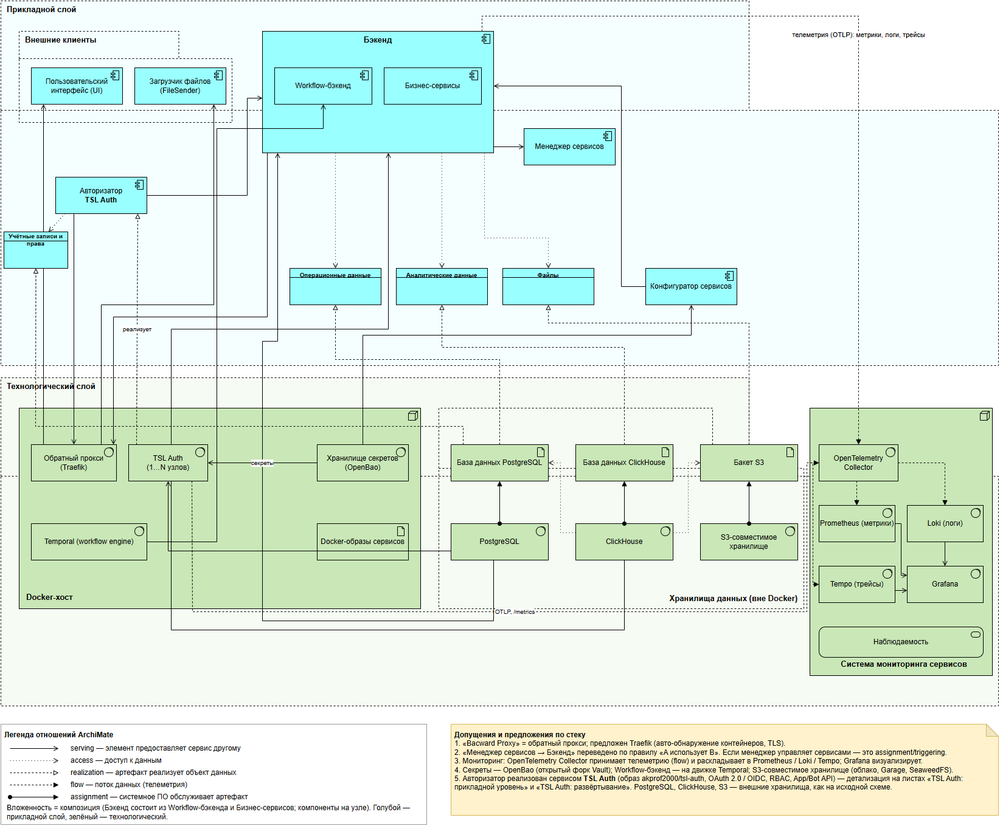

## 1. Общие сведения

| Пункт | Значение |
|---|---|
| Полное наименование | Сервис аутентификации и авторизации TSL Auth |
| Краткое наименование | TSL Auth, «Авторизатор» |
| Класс системы | Единый поставщик удостоверений (Identity Provider, IdP) по стандартам OAuth 2.0 / OpenID Connect |
| Заказчик | Команда ТСЛ |
| Исходный код | https://github.com/akprof2000/tsl-auth, лицензия MIT |
| Поставка | Docker-образ `akprof2000/tsl-auth` (Docker Hub, GHCR), подписанный cosign |
| Основание | Базовая архитектура ТСЛ ([ArchiMate-модель](archimate/base-architecture.drawio)): компонент «Авторизатор» |

## 2. Назначение и цели

**Назначение.** Единая точка входа пользователей и сервисов во все прикладные системы контура.
Сервис хранит учётные записи и выдаёт токены. Права задаются централизованно: у каждого приложения своя матрица «роль × разрешение».

**Цели:**

1. Убрать из прикладных систем хранение паролей и собственные механизмы входа.
2. Управлять доступом централизованно: роли и права меняются в одном месте и действуют во всех системах.
3. Работать в закрытом контуре без интернета, на одном узле или в кластере.
4. Дать прикладным системам и ботам API для самообслуживания.
5. Соответствовать требованиям ИБ: шифрование персональных данных, журнал безопасности, защищённый образ.

## 3. Характеристика объекта автоматизации

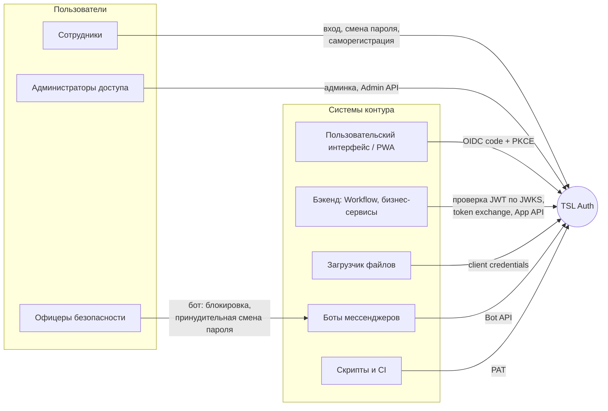

| Роль | Задачи |
|---|---|
| Сотрудник | Входит в системы, сам меняет и сбрасывает пароль, регистрируется и запрашивает роль |
| Администратор доступа | Регистрирует приложения, ведёт матрицы прав и пользователей, одобряет заявки, смотрит журнал |
| Аудитор | Только просмотр админки и журнала |
| Офицер безопасности | Через бота блокирует учётные записи и требует смену пароля |
| Прикладная система | Проверяет JWT; при включённом самоуправлении ведёт своих пользователей и роли через App API |

## 4. Требования к системе

### 4.1. Требования к архитектуре

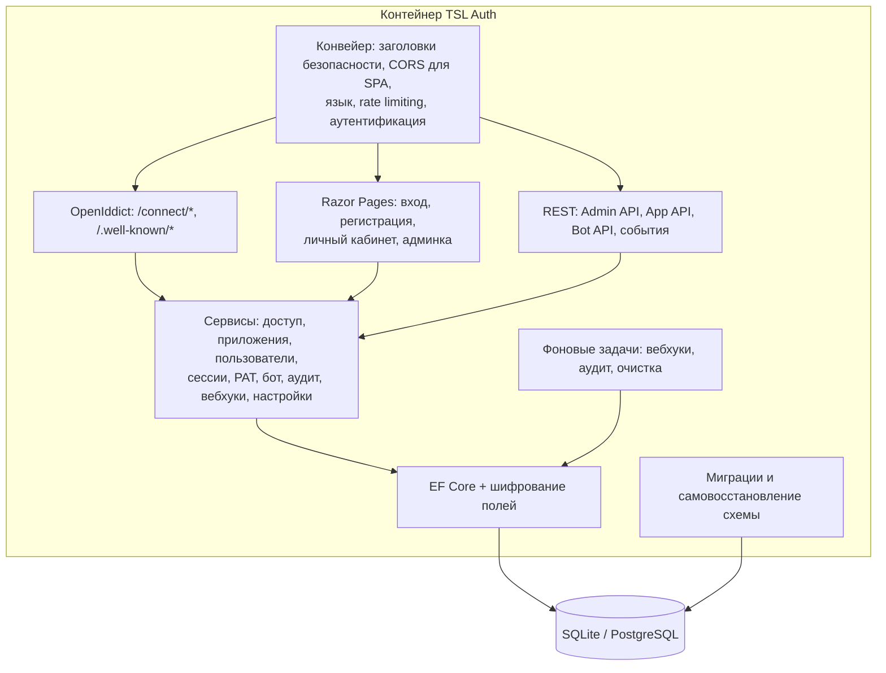

- **Технологии.** Сервис построен на .NET 10, ASP.NET Core, OpenIddict 7, ASP.NET Core Identity и EF Core.
- **Состояние.** Сервис не хранит состояния в памяти. Ключи подписи, сессии, настройки и очереди лежат в БД, поэтому любой узел кластера обслуживает любой запрос.
- **Хранилища.** Встроенная SQLite для одного узла или внешний PostgreSQL 14+ для кластера.
- **Контур.** В работе нет обращений в интернет. Интерфейс и справочник API работают без CDN.

### 4.2. Функциональные требования

#### 4.2.1. Протоколы и токены

| № | Требование |
|---|---|
| Ф-1 | OAuth 2.0 / OIDC: authorization code + PKCE (S256 обязателен), client credentials, refresh с ротацией, password (legacy), token exchange (RFC 8693), introspection, revocation, userinfo, logout, discovery, JWKS |
| Ф-2 | Access-токен — JWT RS256. Claims `role`, `permissions` (`<client_id>:<разрешение>`) и `resource_access` совместимы с Keycloak |
| Ф-3 | Сроки жизни задаются глобально и для приложения, клиент может их только сократить. По умолчанию: access и id — 15 мин, refresh — 14 дней, код авторизации — 5 мин, абсолютный срок сессии — 90 дней |
| Ф-4 | Изменения прав применяются со следующего refresh. Отзыв сессии действует на всех узлах сразу |
| Ф-5 | Персональные токены доступа (PAT) для скриптов не превышают текущих прав владельца |

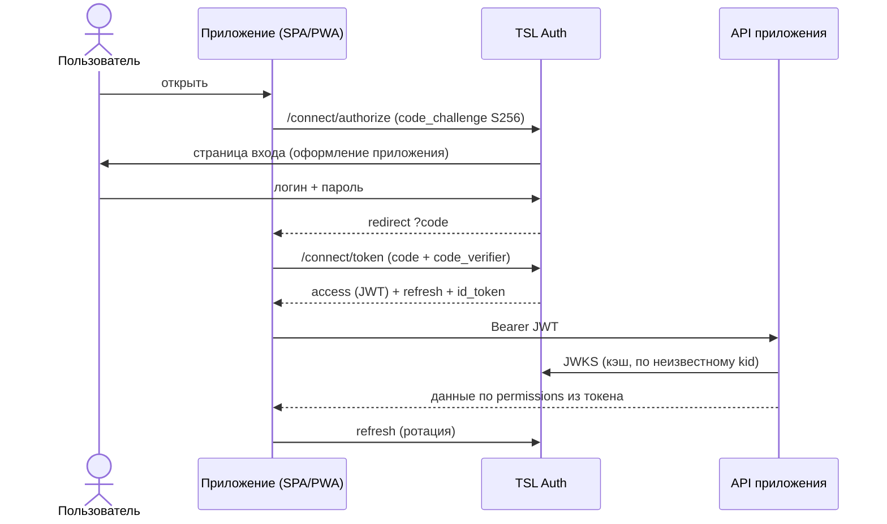

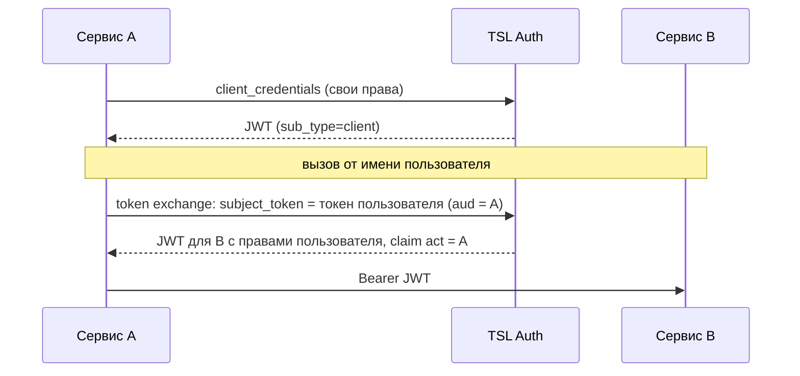

#### 4.2.2. Ролевая модель (RBAC)

| № | Требование |
|---|---|
| Ф-6 | У каждого приложения есть разрешения, роли и матрица «роль × разрешение». Роль имеет техническое имя (в токене) и название для людей |
| Ф-7 | Роли назначаются пользователям и сервисным клиентам. Одна учётная запись может иметь роли в нескольких приложениях |
| Ф-8 | Права администрирования самого сервиса — это матрица системного приложения `tsl-auth-admin`: `administrator`, `auditor`, `notifier`, `reset-bot`, `security-bot`, `security-officer` |
| Ф-9 | Роль можно пометить как «запрашиваемую»: её можно запросить при регистрации или заявкой |

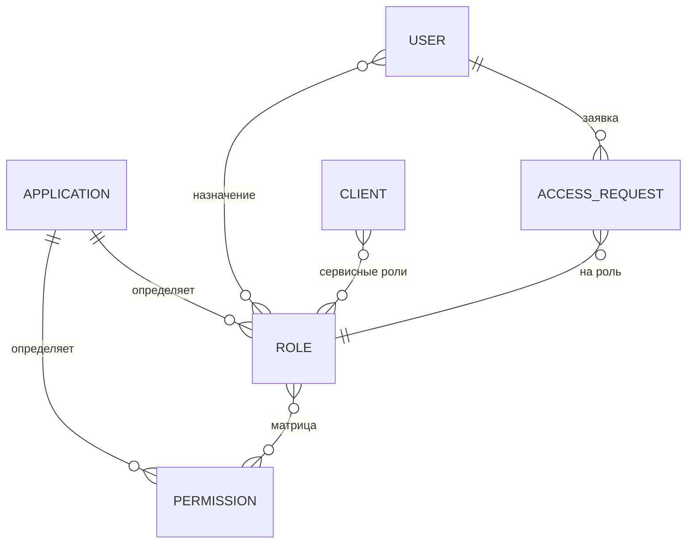

#### 4.2.3. Пользователи и учётные записи

| № | Требование |
|---|---|
| Ф-10 | Создание пользователя с паролем, временным паролем (смена при входе) или ссылкой-приглашением |
| Ф-11 | Сброс пароля по email и через бота мессенджера. Смена пароля в личном кабинете |
| Ф-12 | Политика паролей: длина, классы символов, запрет логина в пароле, история, срок действия. Блокировка после N неудачных попыток |
| Ф-13 | Саморегистрация в приложении с заявкой на роли. Заявку одобряет администратор, приложение через App API или бот |
| Ф-14 | Отключение учётной записи сразу отзывает все её сессии и refresh-токены |

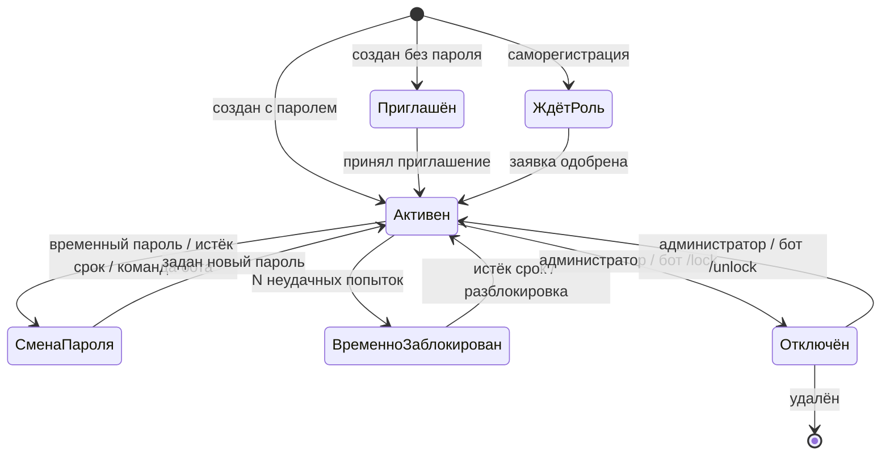

#### 4.2.4. Приложения и API

| № | Требование |
|---|---|
| Ф-15 | Регистрация клиентов: тип (public / confidential), grant types, scopes, redirect URI, CORS для SPA по redirect URI |
| Ф-16 | Оформление страницы входа под приложение: логотип, цвета, тексты, язык по умолчанию |
| Ф-17 | Admin API — всё, что умеет админка. App API — приложение ведёт свой срез пользователей, ролей, заявок и журнала. Чужие данные ему не видны |
| Ф-18 | Bot API: привязка мессенджера по одноразовому коду, сброс пароля, блокировка и разблокировка, принудительная смена пароля. Над чужими учётками — только по роли `security-officer` отправителя |
| Ф-19 | Лента событий: long-polling, SSE, вебхуки с HMAC-подписью, повторами и outbox. Вебхуки не отправляются на loopback и link-local адреса |
| Ф-20 | OpenAPI и интерактивный справочник `/docs/api`, руководство `/docs` |

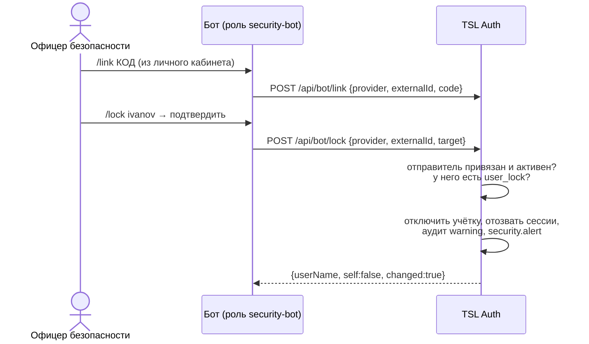

#### 4.2.5. Администрирование, аудит, локализация

| № | Требование |
|---|---|
| Ф-21 | Веб-админка: приложения, матрицы, пользователи, заявки, сессии, события, журнал безопасности, языки, настройки, оформление входа |
| Ф-22 | Журнал безопасности хранит сроки отдельно по типам событий. Есть выгрузка в CSV с защитой от формульных инъекций. События уровня warning и выше дублируются в ленту |
| Ф-23 | Интерфейс на русском и английском. Языковые пакеты можно загружать через админку |
| Ф-24 | CLI обслуживания: восстановление администратора, перенос SQLite → PostgreSQL, проверка и пересборка схемы БД |

### 4.3. Требования к надёжности

| № | Требование |
|---|---|
| Н-1 | Кластер из любого числа узлов за балансировщиком. Потеря узла незаметна клиентам: 0 ошибок при rolling update и `kill -9` узла |
| Н-2 | Сессии и ключи подписи переживают перезапуск узлов и сервиса целиком |
| Н-3 | При недоступности PostgreSQL узлы остаются живыми и восстанавливаются без рестарта |
| Н-4 | Схема БД обновляется автоматически при старте под advisory-lock'ом, узлы кластера ждут друг друга |
| Н-5 | **Самовосстановление БД.** Сервис стартует и сохраняет данные, если БД повреждена или её схема в неизвестном состоянии. Пересборка идёт с переносом данных и резервной копией |
| Н-6 | Запуск на схеме новее версии сервиса запрещён, пока это не разрешено явно |

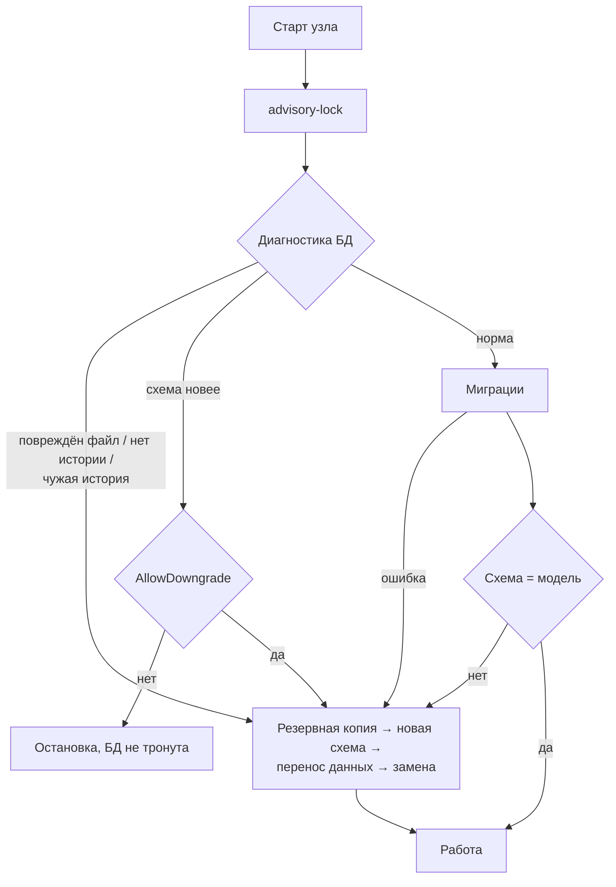

### 4.4. Требования к производительности

| Показатель | Одиночный режим (SQLite) | Кластер (3 узла + PostgreSQL) |
|---|---|---|
| Пропускная способность | не менее 400 запросов/с | не менее 600 запросов/с |
| client_credentials, p95 | до 2,5 с | до 200 мс |
| Вход по паролю (PBKDF2 100k), p95 | до 5 с | до 700 мс |
| Ошибки под нагрузкой | 0 % | 0 % |

Методика: k6, 45 виртуальных пользователей, 60 с (`tests/load`).

### 4.5. Требования к информационной безопасности

| № | Требование |
|---|---|
| Б-1 | Пароли хранятся как PBKDF2-HMAC-SHA512, 100 000 итераций. Персональные данные в БД шифруются AES-256-GCM, ключи выводятся из мастер-ключа через HKDF |
| Б-2 | Поиск по логину и email идёт через HMAC-индекс. Секреты клиентов, PAT и коды привязки хранятся только хешами |
| Б-3 | Мастер-ключ не хранится в БД. Он передаётся переменной, файлом или docker secret |
| Б-4 | Rate limiting на вход, `/connect/token`, introspect и revoke. Строгий CSP, antiforgery, SameSite cookie |
| Б-5 | `iss` и ссылки строятся только из `Auth__Issuer`. Заголовки прокси принимаются только из доверенных сетей |
| Б-6 | Образ distroless, non-root, read-only ФС, `cap_drop: ALL`. Trivy — 0 уязвимостей, Dockle — CIS пройден. Подпись cosign, SBOM, SLSA provenance |
| Б-7 | Все действия с учётными записями и правами пишутся в журнал безопасности |

### 4.6. Требования к развёртыванию

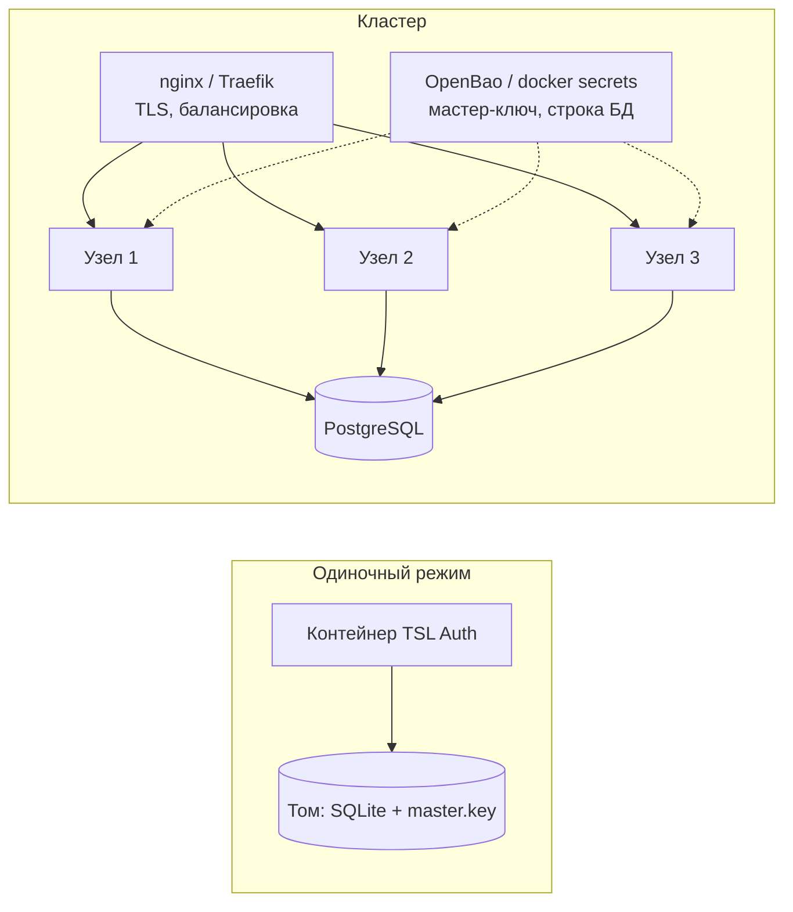

| № | Требование |
|---|---|
| Р-1 | Запуск одной командой `docker compose up -d` для одного узла и для кластера |
| Р-2 | Закрытый контур: образы переносятся через `docker save` / `docker load` (`scripts/export-images.*`) |
| Р-3 | HTTPS в контейнере или на обратном прокси |
| Р-4 | Секреты передаются файлами (`*File`), без переменных окружения |
| Р-5 | Наблюдаемость: `/health/live`, `/health/ready`, метрики Prometheus, трассировки и логи по OTLP, логи в Loki |

### 4.7. Требования к интеграции с прикладными системами

- **Проверка токена.** API проверяет JWT локально по JWKS: подпись RS256, `iss`, `aud`, `exp`. Доступ определяется claim `permissions`.
- **Готовые примеры.** В репозитории есть примеры интеграции на .NET, Node.js, Go и Python и демо «Документооборот»: PWA, App API и бот.
- **Совместимость.** Формат claims совместим с Keycloak, поэтому переход с Keycloak не требует переписывать проверку прав.

## 5. Состав и содержание работ

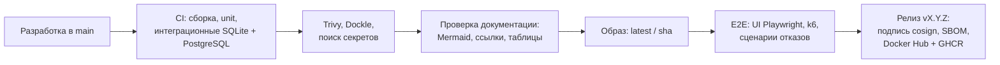

| Этап | Результат |
|---|---|
| Ядро: протоколы, RBAC, пользователи | Сервис с админкой и Admin API |
| Кластер и безопасность | PostgreSQL, шифрование, защищённый образ, нагрузочные тесты и тесты отказов |
| API самообслуживания | App API, Bot API, лента событий, саморегистрация |
| Надёжность данных | Обновление схемы на живых данных, перенос SQLite → PostgreSQL, самовосстановление БД |
| Наблюдаемость | Prometheus, OpenTelemetry, Loki |
| Демо и документация | Примеры интеграции, демо «Документооборот», документация, ТЗ, ArchiMate-модель |

## 6. Порядок контроля и приёмки

| Вид испытаний | Средство | Критерий |
|---|---|---|
| Модульные | xUnit (`tests/TslAuth.UnitTests`) | Все проходят |
| Интеграционные | xUnit + WebApplicationFactory на SQLite и PostgreSQL в контейнере | Все проходят, включая обновление схемы и самовосстановление |
| UI | Playwright | Сценарии входа, регистрации, админки |
| Нагрузочные | k6 | Показатели п. 4.4 |
| Отказоустойчивость | `tests/resilience` | Таблица «Отказоустойчивость» в [тестировании](testing.md) |
| Безопасность | Trivy, Dockle, поиск секретов | 0 уязвимостей, CIS пройден |
| Документация | `scripts/validate-docs.ps1` | 0 проблем |

Приёмка: зелёные CI и E2E на коммите релиза, опубликованный подписанный образ, документация соответствует версии.

## 7. Требования к документированию

| Документ | Файл |
|---|---|
| Обзор и быстрый старт | [README](../README.md) |
| Архитектура | [architecture.md](architecture.md) |
| Развёртывание | [deployment.md](deployment.md) |
| Конфигурация | [configuration.md](configuration.md) |
| Интеграция приложений | [integration.md](integration.md) |
| Администрирование | [administration.md](administration.md) |
| Безопасность | [security.md](security.md) |
| Тестирование | [testing.md](testing.md) |
| Эксплуатация | [operations.md](operations.md) |
| ArchiMate-модель | [archimate/base-architecture.drawio](archimate/base-architecture.drawio) |
