# 04.09.01. ЧТЗ. Сервис идентификации и доступа TSL Auth

Документ — частное техническое задание ERP «Уклад» на компонент «Управление идентификацией» (общее ТЗ, разделы 03.01, 04.02, 04.09, 04.15). Структура — по шаблону ЧТЗ (07.01). Документ отвечает на вопрос A02 архитектурного ЧТЗ 04.02.01: проверяет tsl-auth относительно OIDC-профиля общего ТЗ, минимальных полномочий, административного доступа, прекращения прав и восстановления собственного состояния.

Версия для согласования в Word: [TZ-tsl-auth.docx](TZ-tsl-auth.docx) (собирается `python scripts/build-tz-docx.py`).

У каждого требования указан статус:

| Статус | Значение |
|---|---|
| есть | Реализовано в текущей версии и проверяется автотестами |
| 1-я очередь | Доработка tsl-auth до пилота первой очереди ERP |
| ядро ERP | Выполняется операционным ядром ERP; tsl-auth передаёт нужные данные |
| не требуется | Исключено решением заказчика (раздел 18) |

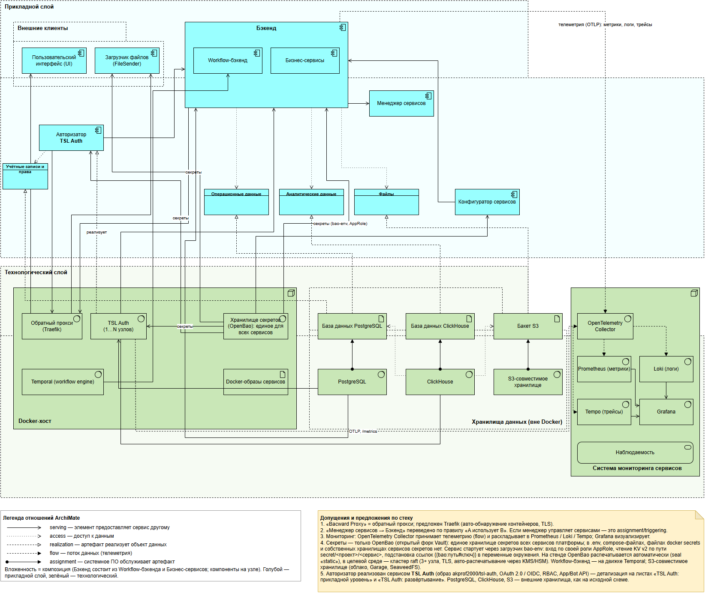

## 1. Назначение и границы

TSL Auth выполняет единую идентификацию и аутентификацию пользователей и технических клиентов ERP по OAuth 2.0 / OpenID Connect. Сервис хранит учётные записи, роли приложений, матрицы «роль × разрешение» и выдаёт подписанные токены. Прикладные системы проверяют токен локально и не хранят паролей.

| Параметр | Значение |
|---|---|
| Место в архитектуре ERP | Компонент «Управление идентификацией» (04.02); в базовой архитектуре ТСЛ — «Авторизатор» |
| Исходный код | https://gitflic.ru/project/uklad/tsl-auth (основной репозиторий, сборка и реестры); зеркало — https://github.com/akprof2000/tsl-auth; лицензия MIT |
| Поставка | Docker-образ `akprof2000/tsl-auth` (Docker Hub, GHCR), подписанный cosign |
| Технологии | .NET 10, ASP.NET Core, OpenIddict 7, ASP.NET Core Identity, EF Core; SQLite или PostgreSQL 14+ |
| Очередь | Первая: вход пользователей ERP, технические клиенты Flowable, обработчиков обмена, DWH и импорта из 1С |

Принятое решение. Граница ответственности:

| Входит в tsl-auth | Не входит в tsl-auth |
|---|---|
| Учётные записи, пароли, блокировка, двухфакторный вход, выход, сессии | Организационная и финансовая иерархия (ядро ERP) |
| Роли и разрешения на уровне операций приложения | Области доступа по организациям, подразделениям, ЦФО, проектам и объектам: применяются ядром ERP при выборке данных |
| Токены для пользователей и технических клиентов | Маскирование чувствительных полей в формах и отчётах ERP |
| Журнал безопасности входов, учётных записей и назначений | Аудит бизнес-действий с документами ERP (04.15, ядро ERP) |

Принятое решение (В-1): области доступа хранятся в отдельной базе ядра ERP рядом с оргструктурой; tsl-auth их не хранит и в токене не передаёт.

## 2. Пользователи и роли

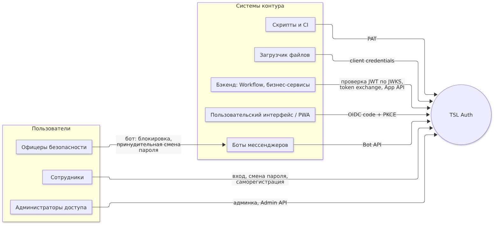

Исходник схемы (Mermaid)

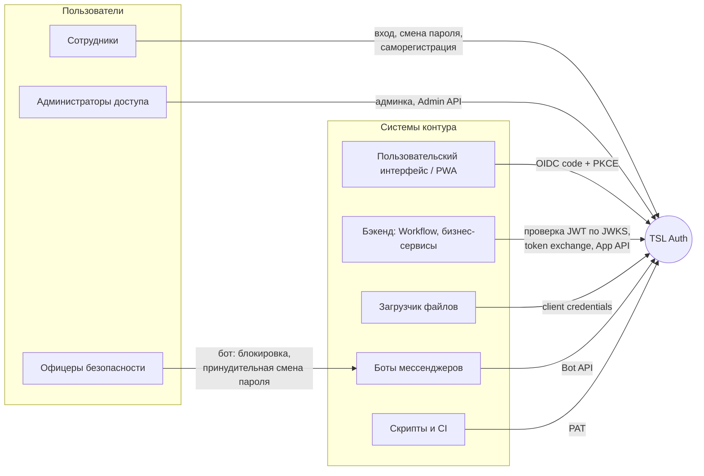
```mermaid
flowchart LR
    subgraph Пользователи
        EMP[Сотрудники]
        ADM[Администраторы доступа]
        SEC[Офицеры безопасности]
    end
    subgraph Системы контура
        UI[Пользовательский интерфейс / PWA]
        BE[Бэкенд: Workflow, бизнес-сервисы]
        FS[Загрузчик файлов]
        BOT[Боты мессенджеров]
        SCR[Скрипты и CI]
    end
    AUTH((TSL Auth))
    EMP -- "вход, смена пароля,<br/>саморегистрация" --> AUTH
    ADM -- "админка, Admin API" --> AUTH
    SEC -- "бот: блокировка,<br/>принудительная смена пароля" --> BOT
    UI -- "OIDC code + PKCE" --> AUTH
    BE -- "проверка JWT по JWKS,<br/>token exchange, App API" --> AUTH
    FS -- "client credentials" --> AUTH
    BOT -- "Bot API" --> AUTH
    SCR -- "PAT" --> AUTH
```

| Роль | Действия в tsl-auth | Роль ERP (03.01) |
|---|---|---|
| Пользователь ERP | Входит, меняет и сбрасывает пароль, запрашивает роль | Функциональный пользователь, руководитель ЦФО и другие бизнес-роли |
| Администратор доступа | Регистрирует приложения, ведёт матрицы, назначает роли, одобряет заявки | Функциональный администратор |
| Аудитор | Просматривает админку и журнал без права изменения | Аудитор |
| Офицер безопасности | Через бота блокирует учётные записи и требует смену пароля | Функциональный администратор (безопасность) |
| Технический администратор | Разворачивает, обновляет и восстанавливает сервис; доступа к ролям пользователей не получает | Технический администратор |
| Технический клиент | Получает токен по client credentials с минимальными полномочиями | Flowable, обработчики обмена, DWH, импорт из 1С |

Права администрирования самого сервиса задаются матрицей системного приложения `tsl-auth-admin`: `administrator`, `auditor`, `notifier`, `reset-bot`, `security-bot`, `security-officer`.

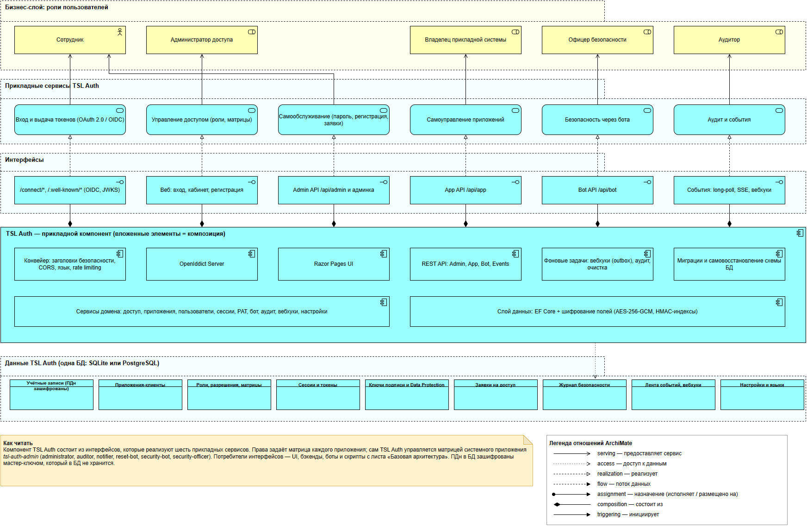

## 3. Процессы и сценарии

Основные сценарии:

1. Вход пользователя в приложение ERP по authorization code + PKCE.
2. Вызов API сервиса другим сервисом: client credentials; вызов от имени пользователя — token exchange.
3. Создание учётной записи администратором: с паролем, временным паролем или приглашением.
4. Саморегистрация с заявкой на роль; заявку одобряет администратор, приложение или бот.
5. Сброс пароля по email или через бота.
6. Блокировка учётной записи офицером безопасности через бота.
7. Прекращение доступа при увольнении или смене роли.
8. Двухфакторный вход: пароль → код с почты или из мессенджера (для ролей с флагом 2FA).
9. Автоматическое отключение учётной записи без входа 90 дней (кроме администраторов сервиса).
10. Подчинённые клиенты: сервис-владелец (например, Import API) по команде оператора заводит технического клиента
    агента через App API в рамках политики администратора; агент входит по ключу (`private_key_jwt`), а не по секрету;
    отключение агента действует на выдачу токенов во всех сервисах.

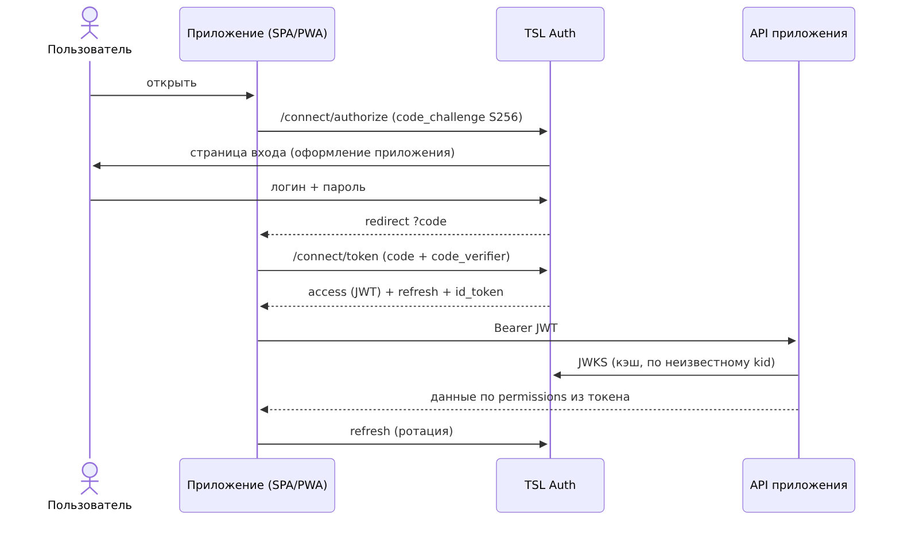

Исходник схемы (Mermaid)

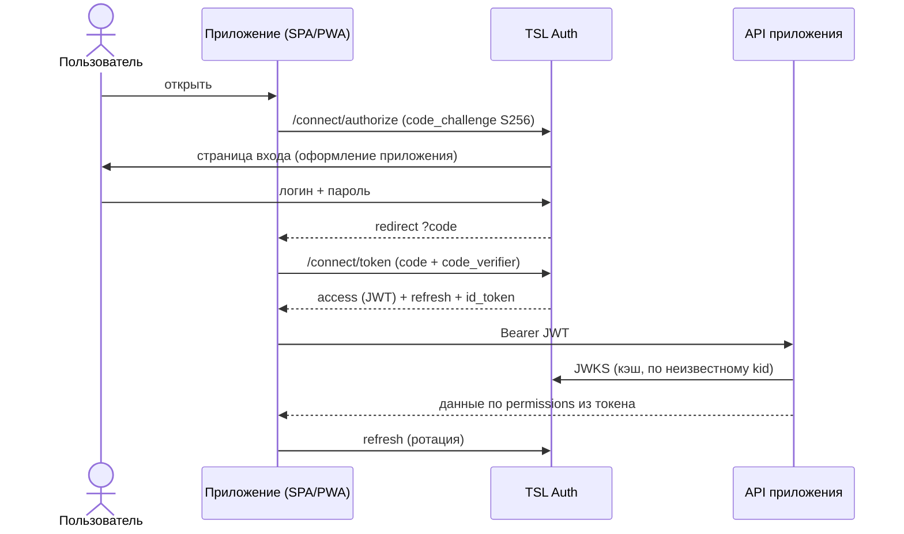
```mermaid
sequenceDiagram
    actor U as Пользователь
    participant App as Приложение (SPA/PWA)
    participant Auth as TSL Auth
    participant API as API приложения
    U->>App: открыть
    App->>Auth: /connect/authorize (code_challenge S256)
    Auth->>U: страница входа (оформление приложения)
    U->>Auth: логин + пароль
    Auth-->>App: redirect ?code
    App->>Auth: /connect/token (code + code_verifier)
    Auth-->>App: access (JWT) + refresh + id_token
    App->>API: Bearer JWT
    API->>Auth: JWKS (кэш, по неизвестному kid)
    API-->>App: данные по permissions из токена
    App->>Auth: refresh (ротация)
```

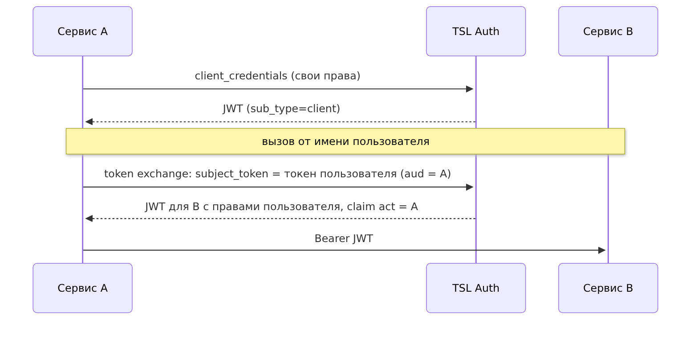

Исходник схемы (Mermaid)

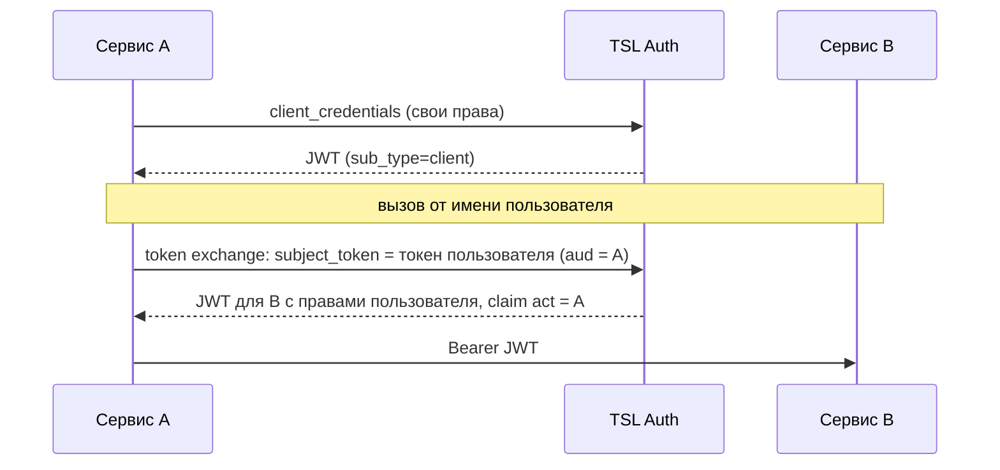
```mermaid
sequenceDiagram
    participant S1 as Сервис A
    participant Auth as TSL Auth
    participant S2 as Сервис B
    S1->>Auth: client_credentials (свои права)
    Auth-->>S1: JWT (sub_type=client)
    Note over S1,S2: вызов от имени пользователя
    S1->>Auth: token exchange: subject_token = токен пользователя (aud = A)
    Auth-->>S1: JWT для B с правами пользователя, claim act = A
    S1->>S2: Bearer JWT
```

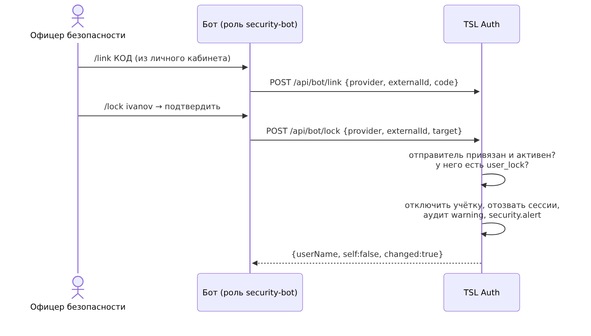

Исходник схемы (Mermaid)

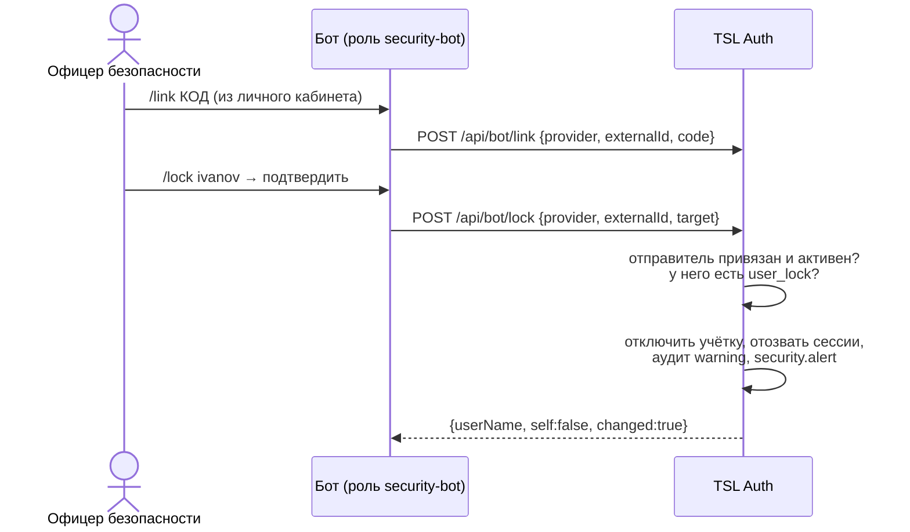
```mermaid
sequenceDiagram
    actor O as Офицер безопасности
    participant Bot as Бот (роль security-bot)
    participant Auth as TSL Auth
    O->>Bot: /link КОД (из личного кабинета)
    Bot->>Auth: POST /api/bot/link {provider, externalId, code}
    O->>Bot: /lock ivanov → подтвердить
    Bot->>Auth: POST /api/bot/lock {provider, externalId, target}
    Auth->>Auth: отправитель привязан и активен?<br/>у него есть user_lock?
    Auth->>Auth: отключить учётку, отозвать сессии,<br/>аудит warning, security.alert
    Auth-->>Bot: {userName, self:false, changed:true}
```

Исключительные сценарии: неверный пароль (счётчик попыток, временная блокировка), истёкший пароль (принудительная смена), отключённая учётная запись (отказ во входе, отзыв сессий), недоступность БД (узел остаётся живым, `/health/ready` сообщает об отказе), повреждённая схема БД (самовосстановление, раздел 15).

## 4. Объекты и справочники

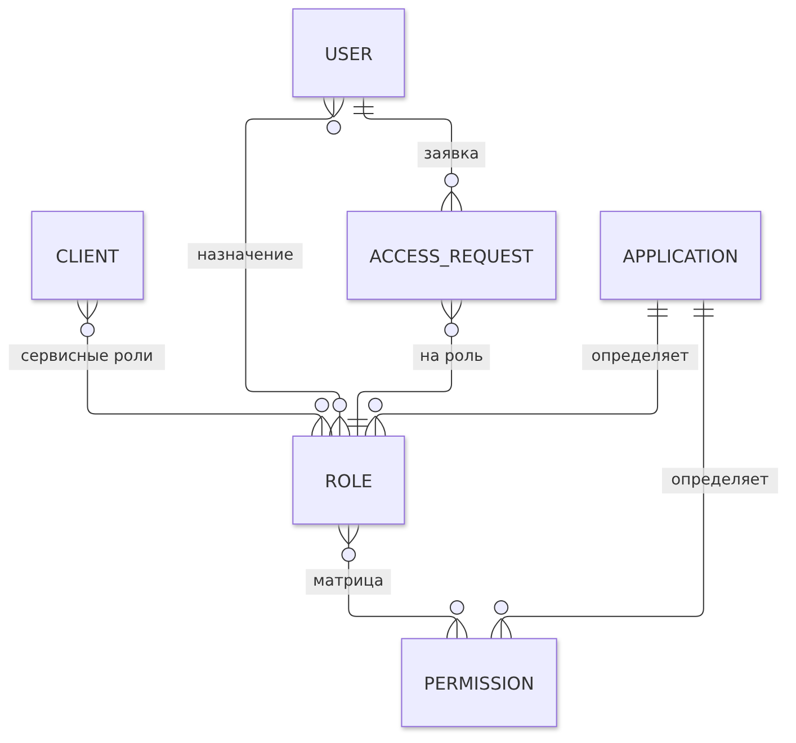

Исходник схемы (Mermaid)

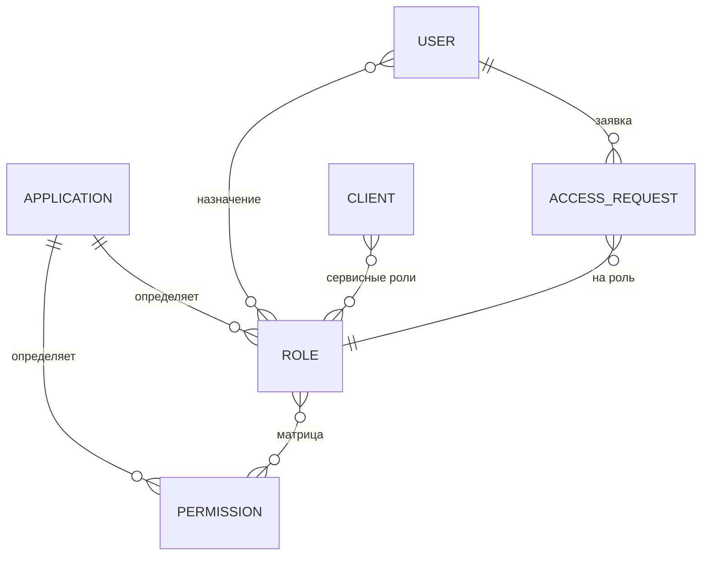
```mermaid
erDiagram
    APPLICATION ||--o{ PERMISSION : "определяет"
    APPLICATION ||--o{ ROLE : "определяет"
    ROLE }o--o{ PERMISSION : "матрица"
    USER }o--o{ ROLE : "назначение"
    CLIENT }o--o{ ROLE : "сервисные роли"
    USER ||--o{ ACCESS_REQUEST : "заявка"
    ACCESS_REQUEST }o--|| ROLE : "на роль"
```

| Объект | Мастер-система | Место первичного ввода |
|---|---|---|
| Учётная запись пользователя | tsl-auth | Админка, Admin API, саморегистрация; после В-3 — кадровое событие 1С:ЗУП |
| Сотрудник, должность, подразделение | 1С:ЗУП через ERP | 1С:ЗУП |
| Приложение (клиент OIDC) | tsl-auth | Админка, Admin API |
| Роль, разрешение, матрица | tsl-auth | Админка, Admin API, App API приложения |
| Назначение роли | tsl-auth | Админка, Admin API, одобрение заявки |
| Область доступа | ядро ERP (отдельная база) | ERP |

## 5. Статусы и переходы

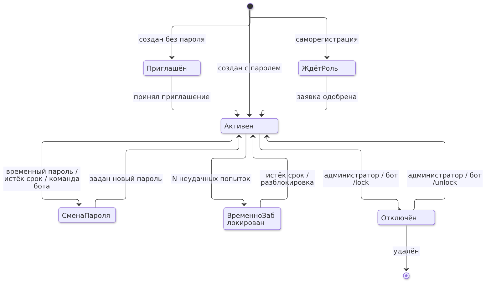

Исходник схемы (Mermaid)

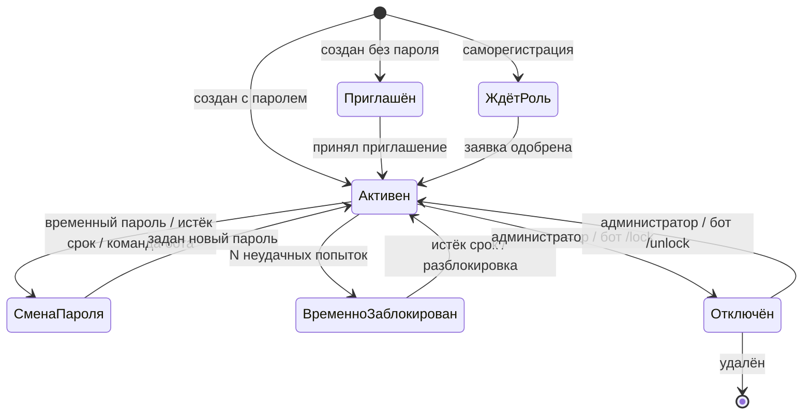
```mermaid
stateDiagram-v2
    [*] --> Приглашён: создан без пароля
    [*] --> Активен: создан с паролем
    [*] --> ЖдётРоль: саморегистрация
    Приглашён --> Активен: принял приглашение
    ЖдётРоль --> Активен: заявка одобрена
    Активен --> СменаПароля: временный пароль / истёк срок / команда бота
    СменаПароля --> Активен: задан новый пароль
    Активен --> ВременноЗаблокирован: N неудачных попыток
    ВременноЗаблокирован --> Активен: истёк срок / разблокировка
    Активен --> Отключён: администратор / бот /lock
    Отключён --> Активен: администратор / бот /unlock
    Отключён --> [*]: удалён
```

Отключение учётной записи сразу отзывает все её сессии и refresh-токены на всех узлах.

## 6. Функциональные требования

### 6.1. Протоколы и токены

| № | Требование | Статус |
|---|---|---|
| Ф-1 | Сервис выполняет OAuth 2.0 / OIDC: authorization code + PKCE (S256 обязателен), client credentials, refresh с ротацией, token exchange (RFC 8693), introspection, revocation, userinfo, logout, discovery, JWKS. Grant password оставлен для унаследованных клиентов и включается для приложения отдельно | есть |
| Ф-2 | Access-токен — JWT RS256. Claims `role`, `permissions` (`<client_id>:<разрешение>`) и `resource_access` совместимы с Keycloak | есть |
| Ф-3 | Сроки жизни задаются глобально и для приложения; клиент может их только сократить. По умолчанию: access и id — 15 мин, refresh — 14 дней, код авторизации — 5 мин, абсолютный срок сессии — 90 дней | есть |
| Ф-4 | Изменение прав применяется со следующего refresh, не позднее срока жизни access-токена. Отзыв сессии действует на всех узлах сразу | есть |
| Ф-5 | Персональный токен доступа (PAT) для скриптов не превышает текущих прав владельца и отзывается вместе с отключением учётной записи | есть |

### 6.2. Роли и полномочия (03.01, 04.09)

| № | Требование | Статус |
|---|---|---|
| Ф-6 | У каждого приложения есть разрешения на уровне операций (ввод, просмотр, проведение, формирование отчётов, удаление), роли и матрица «роль × разрешение». Роль имеет техническое имя для токена и название для людей | есть |
| Ф-7 | Роли назначаются пользователям и техническим клиентам. Одна учётная запись имеет роли в нескольких приложениях; итоговые разрешения — объединение разрешений ролей | есть |
| Ф-8 | Роль помечается как запрашиваемая: пользователь запрашивает её при регистрации или заявкой; назначение выполняется только после одобрения | есть |
| Ф-9 | Назначение роли имеет период действия (с, по). По окончании периода сервис снимает роль, отзывает refresh-токены и пишет событие в журнал | 1-я очередь |
| Ф-10 | Несовместимые роли не проверяются: доступ задаётся матрицей «роль × разрешение» приложения, пары несовместимых ролей заказчиком не определены (решение В-8) | не требуется |
| Ф-11 | Замещение назначает только администратор доступа: пользователь получает роли другого пользователя на указанный период. В токене замещающего передаётся claim с идентификатором замещаемого. По окончании периода роли снимаются | 1-я очередь |
| Ф-12 | Учётная запись без входа дольше 90 дней отключается автоматически при плановом обслуживании БД (раз в час); срок и включение меняются в настройках («Неактивные учётные записи»). Для никогда не входивших отсчёт идёт от даты создания. Пользователи с ролью `administrator` сервиса автоматически не отключаются — только вручную. Отключение отзывает сессии, пишется в журнал (`user.disabled_inactive`) и уходит в ленту `security.alert`. Отчёт для пересмотра прав с выгрузкой в CSV — 1-я очередь | есть (отключение); 1-я очередь (отчёт) |
| Ф-13 | Роли `tsl-auth-admin` отделены от ролей приложений ERP. Технический администратор сервиса не получает доступа к бизнес-данным ERP через tsl-auth | есть |

### 6.3. Учётные записи и аутентификация

| № | Требование | Статус |
|---|---|---|
| Ф-14 | Администратор создаёт пользователя с паролем, временным паролем (смена при первом входе) или ссылкой-приглашением | есть |
| Ф-15 | Пользователь сбрасывает пароль по email или через бота мессенджера и меняет пароль в личном кабинете | есть |
| Ф-16 | Политика паролей: длина, классы символов, запрет логина в пароле, история, срок действия. После N неудачных попыток учётная запись временно блокируется | есть |
| Ф-17 | Саморегистрация в приложении с заявкой на роли | есть |
| Ф-18 | Двухфакторный вход назначается ролям: администратор ставит у роли флаг «требовать 2FA» в матрице приложения или через Admin API (`PUT /api/admin/applications/{client}/roles/{role}/two-factor`); приложение через App API флаг не меняет. Если у пользователя есть хотя бы одна такая роль, после пароля открывается страница кода. Каналы: код на email (кнопка «Отправить код») и код в мессенджере (пользователь пишет боту `/code`, бот получает код по Bot API `POST /api/bot/2fa-code`). Коды одноразовые, по времени (TOTP по security stamp), не хранятся и действуют несколько минут; неверные коды считаются в блокировку. Нет ни email, ни мессенджера — вход не выполняется, пользователь видит причину. Password grant для таких пользователей закрыт. Сессия, полученная без кода, после назначения роли не продлевается. В токенах передаётся claim `amr` (`pwd` или `pwd`, `otp`, `mfa`). TOTP-приложения и аппаратные ключи — задел на будущее; повторное подтверждение критических операций — на стороне прикладной системы (решения В-7, В-9) | есть |
| Ф-19 | Прекращение доступа работает как отзыв refresh-токена: отключение учётной записи или снятие роли применяется при следующем refresh, не позднее срока жизни access-токена (15 мин). Отключение вызывает администратор или ERP через Admin API (решение В-3) | есть |

### 6.4. Приложения и API

| № | Требование | Статус |
|---|---|---|
| Ф-20 | Регистрация клиентов: тип (public / confidential), grant types, scopes, redirect URI, CORS для SPA по redirect URI | есть |
| Ф-21 | Технические клиенты Flowable, обработчиков обмена, DWH и импорта из 1С регистрируются отдельно, каждый — со своим секретом и минимальным набором разрешений | есть |
| Ф-22 | Страница входа оформляется под приложение: логотип, цвета, тексты, язык по умолчанию | есть |
| Ф-23 | Admin API выполняет всё, что доступно в админке. App API даёт приложению его срез пользователей, ролей, заявок и журнала; чужие данные ему не видны | есть |
| Ф-24 | Bot API: привязка мессенджера по одноразовому коду, сброс пароля, блокировка и разблокировка, принудительная смена пароля. Действия над чужими учётными записями — только по роли `security-officer` отправителя | есть |
| Ф-25 | Лента событий: long-polling, SSE, вебхуки с HMAC-подписью, повторами и outbox. Вебхуки не отправляются на loopback и link-local адреса | есть |
| Ф-26 | Интерфейсы описаны в OpenAPI; справочник `/docs/api` и руководство `/docs` работают без интернета. Так же документацию публикует каждый модуль с REST API: `/docs`, `/docs/api`, `/openapi/v1.json` (образцы — демо-приложения, [integration.md §12](integration.md#12-документация-rest-api-модуля-docs-и-docsapi)) | есть |
| Ф-27 | Клиентские библиотеки для .NET, Node.js/браузера, Go, Python и Java по единому контракту (`docs/client-contract.md`): проверка токена, защита маршрутов по `permissions`, клиент токенов (client credentials, exchange, refresh), браузерный PKCE. Контрактные тесты против живого сервиса в CI; пакеты выпускаются вместе с сервисом и переносятся в закрытый контур | есть |
| Ф-28 | Подчинённые клиенты (РС-16 проекта 1c-import): приложение-владелец через App API `/api/app/clients` заводит, меняет ключи, отключает и удаляет своих технических клиентов в рамках политики администратора (префикс `client_id`, белый список своих ролей, только `client_credentials`, способы входа, предел числа, срок токена, предел неактивности). Изменения — только делегированным токеном оператора (token exchange, `act.sub` = владелец) с разрешением политики в матрице владельца; сервисный токен — только чтение (в тестовых стендах — и изменения); клиентский токен, полученный обменом другим приложением, владельцем не считается; без самоуправления владельца доступа нет. Предел неактивности считается по отметке последнего выданного токена. Чужой клиент — 404; `tsl-auth-admin`, `tsl-auth-app`, чужие роли и потоки недоступны ни одним API. Каждое действие — в журнале безопасности с оператором и владельцем; метрика числа подчинённых по владельцам | есть |
| Ф-29 | Вход клиента по ключу `private_key_jwt` (RFC 7523): ключ хранится как открытый JWK EC P-256 (`kid` — отпечаток RFC 7638, до двух ключей для плавной смены), assertion только ES256, `iss = sub = client_id`, `aud` — issuer сервиса (как в discovery), `exp − iat` ≤ 5 мин, `iat`/`nbf`/`exp` — секунды, `jti` одноразовый для всего кластера; `alg=none`/`HS*` отклоняются; клиенту — только `invalid_client` на token, introspection и revocation, причина — в журнал (warning) и метрику; discovery публикует `private_key_jwt` и `ES256`. SDK .NET и Go входят по ключу; предел отказов по паре «`client_id` + IP» | есть |
| Ф-30 | Отключение клиента (`tsl_disabled`): администратор — любого, владелец — подчинённого; `invalid_client` на token и authorize, отзыв сессий и токенов (introspection `active=false`), события `application.disabled` / `application.enabled` / `application.deleted` с `client_id` и владельцем | есть |

### 6.5. Администрирование и локализация

| № | Требование | Статус |
|---|---|---|
| Ф-27 | Веб-админка: приложения, матрицы, пользователи, заявки, сессии, события, журнал безопасности, языки, настройки, оформление входа | есть |
| Ф-28 | Интерфейс на русском и английском; языковые пакеты загружаются через админку | есть |
| Ф-29 | CLI обслуживания: восстановление администратора, перенос SQLite → PostgreSQL, проверка и пересборка схемы БД | есть |

## 7. Проверки и ограничения

- Сервис отклоняет запрос без PKCE S256 для public-клиента.
- Сервис не выдаёт токен отключённой, заблокированной или ожидающей роли учётной записи.
- Клиент не получает scope и разрешения сверх назначенных ему ролей; token exchange не расширяет права пользователя.
- Приложение через App API не видит и не меняет данные другого приложения.
- Бот не выполняет действие над чужой учётной записью без роли `security-officer` у привязанного отправителя.
- Rate limiting ограничивает вход, `/connect/token`, introspect и revoke.

## 8. Интеграции

| Потребитель | Способ | Идентификация |
|---|---|---|
| UI ERP (React) | authorization code + PKCE, refresh с ротацией | public-клиент |
| Операционное ядро ERP (FastAPI) | Проверка JWT по JWKS: подпись RS256, `iss`, `aud`, `exp`, права по claim `permissions` | resource server |
| Flowable, обработчики RabbitMQ, Airflow/DWH, импорт из 1С | client credentials; вызов от имени пользователя — token exchange | confidential-клиенты |
| Ядро ERP (кадровые события, отчёт пересмотра прав) | Admin API, лента событий | confidential-клиент `admin-cli` |
| Боты мессенджеров | Bot API | confidential-клиент с ролью `security-bot` |

Контракт токена версионируется: состав claims меняется с обратной совместимостью либо с переходным периодом, как требует 04.12. В репозитории есть примеры интеграции на .NET, Node.js, Go, Python и Java и демо «Документооборот»: PWA, App API и бот. Пример для Python/FastAPI входит в первую очередь.

Подключение потребителей выполняется клиентскими библиотеками (`sdk/`): NuGet `TslAuth.Client`, npm `@tsl/auth-client`
(сервер и браузер), модуль Go, PyPI `tsl-auth-client`, Maven `ru.tsl.auth:tsl-auth-client`. Все пять реализуют один
контракт (`docs/client-contract.md`): порядок проверок, коды ошибок, чтение `permissions`, кэш JWKS, ротация refresh —
и проверяются контрактными тестами против живого контейнера. Пакеты версионируются вместе с сервисом и публикуются
в реестры пакетов GitHub и GitFlic; в закрытый контур переносятся вместе с образами.

## 9. Права доступа

- Минимальные полномочия: технический клиент получает только разрешения, нужные его операциям.
- Административные интерфейсы tsl-auth (админка, Admin API) доступны только ролям `tsl-auth-admin`; аудитор имеет права только на просмотр.
- Доступ к журналу безопасности выдаётся отдельной ролью и сам журналируется (1-я очередь).
- Аварийный доступ: CLI восстановления администратора запускается только из контейнера сервиса; запуск пишется в журнал.

## 10. Аудит и журналирование (04.15)

| № | Требование | Статус |
|---|---|---|
| А-1 | Журнал безопасности фиксирует входы, неудачные попытки, изменения состояния учётных записей, назначение и снятие ролей, изменение матриц, приложений и настроек | есть |
| А-2 | Событие содержит пользователя, время, объект, вид действия, приложение, результат, IP и User-Agent | есть |
| А-2а | Событие содержит идентификатор трассировки, по которому оно связывается с журналом приложения и запросом | 1-я очередь |
| А-3 | Для изменений событие дополнительно содержит прежнее и новое значение и основание (комментарий администратора) | 1-я очередь |
| А-4 | Журнал не изменяется и не удаляется через интерфейсы сервиса; удаление выполняется только по сроку хранения, отдельно для каждого типа событий. Сроки по умолчанию: входы, выходы и второй фактор (`auth.*`) — 1 год; блокировки, изменения учётных записей, паролей, ролей, настроек, действия администраторов и отказы в доступе — 5 лет; технические события токенов (`token.*`) — 90 дней. Сроки меняются в настройках (решение В-5) | есть |
| А-5 | Журнал не содержит паролей, токенов и секретов | есть |
| А-6 | Выгрузка журнала в CSV с защитой от формульных инъекций; события уровня warning и выше дублируются в ленту событий | есть |
| А-7 | Просмотр и выгрузка журнала сами пишутся в журнал | 1-я очередь |

Сроки хранения по умолчанию заданы решением В-5 и меняются в настройках.

## 11. Нефункциональные требования

### 11.1. Архитектура

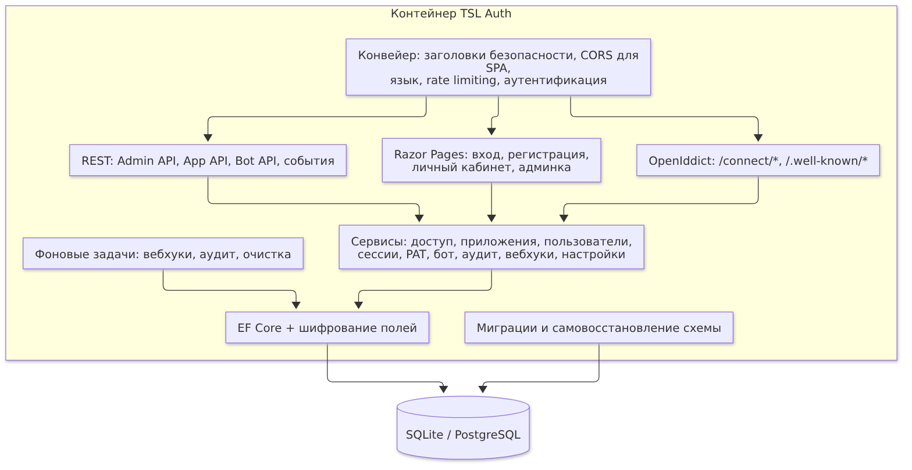

Исходник схемы (Mermaid)

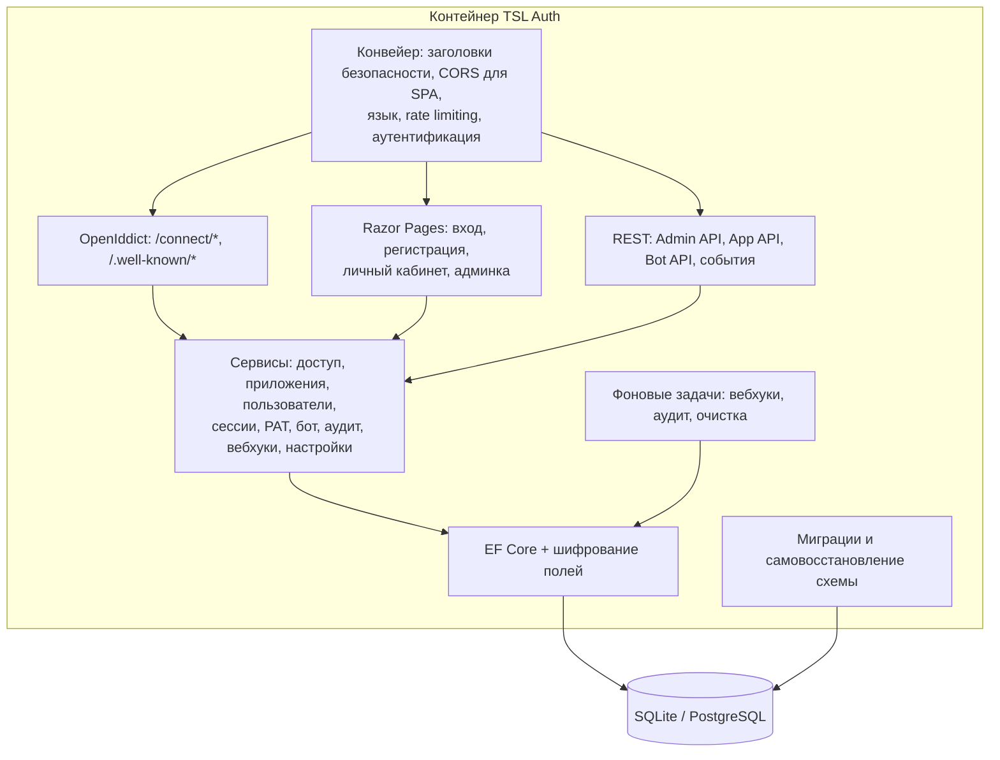
```mermaid
flowchart TB
    subgraph Контейнер TSL Auth
        MW[Конвейер: заголовки безопасности, CORS для SPA,<br/>язык, rate limiting, аутентификация]
        OIDC[OpenIddict: /connect/*, /.well-known/*]
        UIP[Razor Pages: вход, регистрация,<br/>личный кабинет, админка]
        API[REST: Admin API, App API, Bot API, события]
        SVC[Сервисы: доступ, приложения, пользователи,<br/>сессии, PAT, бот, аудит, вебхуки, настройки]
        BG[Фоновые задачи: вебхуки, аудит, очистка]
        EF[EF Core + шифрование полей]
        REP[Миграции и самовосстановление схемы]
    end
    DB[(SQLite / PostgreSQL)]
    MW --> OIDC & UIP & API --> SVC --> EF --> DB
    BG --> EF
    REP --> DB
```

Сервис не хранит состояния в памяти: ключи подписи, сессии, настройки и очереди находятся в БД, поэтому любой узел кластера обслуживает любой запрос. В работе нет обращений в интернет; интерфейс и справочник API работают без CDN. Сервис — отдельный компонент, а не модуль монолита ERP: ERP зависит только от стандартного OIDC-контракта, поэтому замена поставщика не меняет бизнес-логику (04.02, 04.14).

### 11.2. Производительность (04.05)

Для расчёта принимается верхняя граница первой очереди — 220 активных пользователей ERP одновременно.

| Показатель | Одиночный режим (SQLite) | Кластер (3 узла + PostgreSQL) |
|---|---|---|
| Пропускная способность | не менее 400 запросов/с | не менее 600 запросов/с |
| client_credentials, p95 | до 2,5 с | до 200 мс |
| Вход по паролю (PBKDF2 100 000 итераций), p95 | до 5 с | до 700 мс |
| Ошибки под нагрузкой | 0 % | 0 % |

Промышленный режим ERP — кластер: вход укладывается в 2 с для 95 % запросов, как требует 04.05 для типовой операции. Методика: k6, 45 виртуальных пользователей, 60 с (`tests/load`). В первой очереди профиль нагрузки дополняется сценарием 220 пользователей.

### 11.3. Доступность, RPO и RTO (04.07)

| № | Требование | Статус |
|---|---|---|
| Н-1 | Доступность не ниже 99,5 % в согласованные часы работы, как у операционного ядра ERP: без tsl-auth пользователи не входят в ERP | есть (кластер) |
| Н-2 | Кластер из любого числа узлов за балансировщиком. Потеря узла незаметна клиентам: 0 ошибок при rolling update и `kill -9` узла | есть |
| Н-3 | Уже выданные токены проверяются приложениями локально по кэшу JWKS, поэтому кратковременный отказ tsl-auth не прерывает работу вошедших пользователей | есть |
| Н-4 | Сессии и ключи подписи переживают перезапуск узлов и сервиса целиком | есть |
| Н-5 | При недоступности PostgreSQL узлы остаются живыми и восстанавливаются без рестарта | есть |
| Н-6 | RPO не более 15 минут, RTO не более 4 часов — за счёт резервного копирования PostgreSQL на площадке заказчика (11.4) | 1-я очередь |

### 11.4. Резервное копирование и восстановление (04.08)

Копируются БД сервиса (учётные записи, роли, клиенты, ключи подписи, журнал) и мастер-ключ; без мастер-ключа зашифрованные поля не восстанавливаются, поэтому мастер-ключ хранится отдельно от копий БД.

| № | Требование | Статус |
|---|---|---|
| К-1 | Режим копирования PostgreSQL — по 04.08: полная копия еженедельно, ежедневная инкрементальная, журналы транзакций с интервалом не более 15 минут; суточные копии хранятся 35 дней, недельные — 6 месяцев. Мастер-ключ в промышленной среде хранится в OpenBao отдельно от копий БД (решение В-6) | 1-я очередь |
| К-2 | Перед пересборкой схемы сервис сам делает резервную копию БД | есть |
| К-3 | Восстановление проверяется раз в квартал в изолированной среде: данные, права, вход пользователей и технических клиентов. Результат оформляется протоколом | 1-я очередь |

### 11.5. Обновление схемы и самовосстановление

| № | Требование | Статус |
|---|---|---|
| Н-7 | Схема БД обновляется автоматически при старте под advisory-lock; узлы кластера ждут друг друга | есть |
| Н-8 | Сервис стартует и сохраняет данные, если БД повреждена или её схема в неизвестном состоянии. Пересборка идёт с переносом данных и резервной копией | есть |
| Н-9 | Запуск на схеме новее версии сервиса запрещён, пока это не разрешено явно | есть |

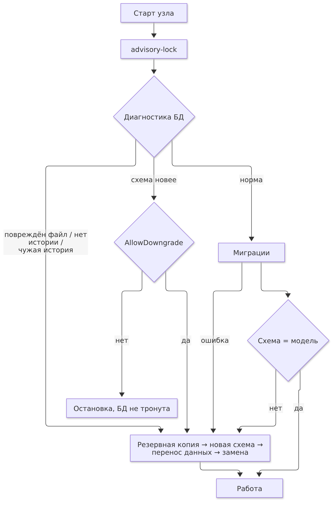

Исходник схемы (Mermaid)

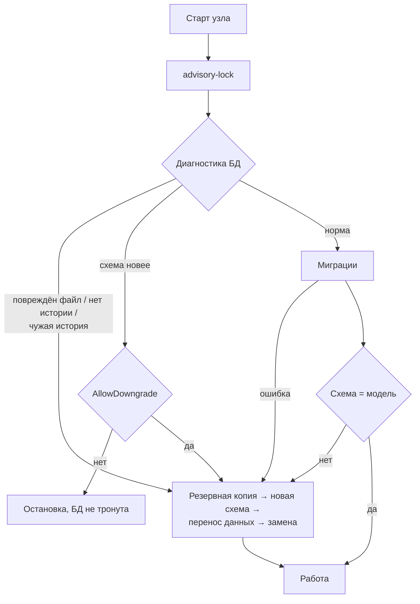
```mermaid
flowchart TD
    S[Старт узла] --> L[advisory-lock]
    L --> D{Диагностика БД}
    D -- "повреждён файл / нет истории /<br/>чужая история" --> R
    D -- "схема новее" --> N{AllowDowngrade}
    N -- нет --> X[Остановка, БД не тронута]
    N -- да --> R
    D -- норма --> M[Миграции]
    M -- ошибка --> R
    M --> V{Схема = модель}
    V -- нет --> R
    V -- да --> OK[Работа]
    R[Резервная копия → новая схема →<br/>перенос данных → замена] --> OK
```

### 11.6. Информационная безопасность (04.09)

| № | Требование | Статус |
|---|---|---|
| Б-1 | Пароли хранятся как PBKDF2-HMAC-SHA512, 100 000 итераций. Персональные данные в БД шифруются AES-256-GCM, ключи выводятся из мастер-ключа через HKDF | есть |
| Б-2 | Поиск по логину и email идёт через HMAC-индекс. Секреты клиентов, PAT и коды привязки хранятся только хешами | есть |
| Б-3 | Мастер-ключ не хранится в БД. В первой очереди он, как и остальные секреты, задаётся переменной окружения контейнера или файлом настроек вне репозитория; в одиночном режиме генерируется в томе | есть |
| Б-4 | Секреты не попадают в исходный код, журналы и формы. CI проверяет всю историю репозитория на секреты (gitleaks) | есть |
| Б-5 | Защищённое хранилище секретов: OpenBao KV v2 по AppRole под теми же ключами настроек, без изменения кода. На MVP секреты задаются в `.env` и файле настроек; в промышленной среде — OpenBao (решения В-4, В-6) | есть (поддержка) |
| Б-6 | Каналы шифруются: HTTPS в контейнере или на обратном прокси, TLS к PostgreSQL | есть |
| Б-7 | Rate limiting на вход, `/connect/token`, introspect и revoke. Строгий CSP, antiforgery, SameSite cookie | есть |
| Б-8 | `iss` и ссылки строятся только из `Auth__Issuer`. Заголовки прокси принимаются только из доверенных сетей | есть |
| Б-9 | Образ distroless, non-root, read-only ФС, `cap_drop: ALL`. Trivy — 0 уязвимостей, Dockle — CIS пройден. Подпись cosign, SBOM, SLSA provenance. Релиз с критической уязвимостью не выпускается | есть |
| Б-10 | Анализ угроз сервиса оформлен в [security.md](security.md) и обновляется при существенном изменении | есть |
| Б-11 | Технические клиенты прикладных сервисов заводятся без ключа Admin API (подчинённые клиенты, Ф-28) и входят без общего секрета (ключ ES256, Ф-29); привязка токена к ключу (DPoP, RFC 9449) — после появления поддержки в OpenIddict (В-11) | есть |

### 11.7. Мониторинг и эксплуатация (04.10)

Сервис отдаёт `/health/live` и `/health/ready`, метрики в формате Prometheus (`/metrics`, их опрашивает VictoriaMetrics), трассировки по OTLP (через коллектор в VictoriaTraces), журналы в stdout (их собирает Vector в VictoriaLogs). Метрики: число входов и отказов, выдача токенов по grant type, блокировки, очередь вебхуков, время ответа. Идентификатор трассировки связывает запрос и журнал приложения; с событием журнала безопасности — после А-2а. Пороги уведомлений и ответственные — по решению A17 архитектурного ЧТЗ.

### 11.8. Среды (04.11)

Среды разработки, тестирования и промышленной эксплуатации используют отдельные экземпляры tsl-auth с отдельными БД, мастер-ключами, секретами клиентов и `Auth__Issuer`. Токен одной среды не принимается в другой. Автотесты создают учётные записи и секреты при запуске и не используют продуктивных данных.

## 12. Развёртывание и выпуск (04.12)

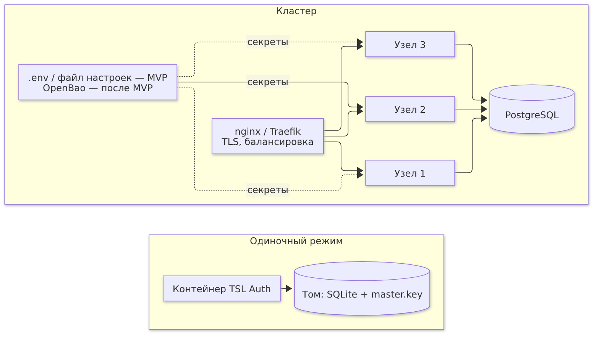

Исходник схемы (Mermaid)

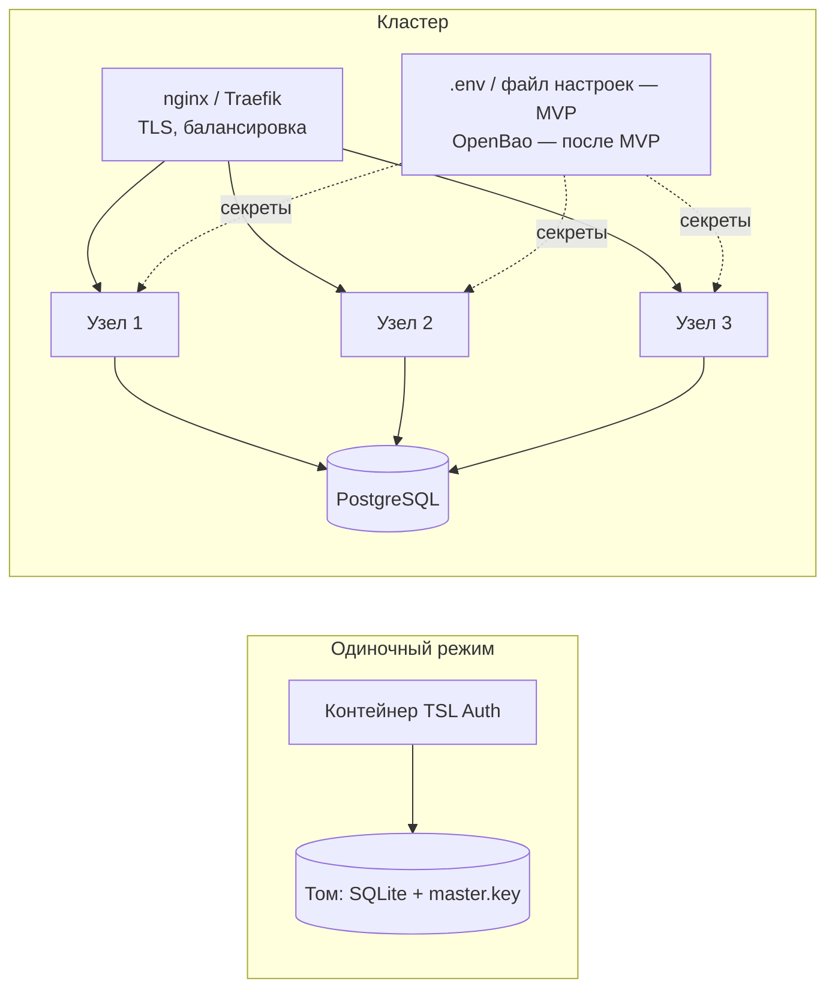
```mermaid
flowchart LR
    subgraph Одиночный режим
        C1[Контейнер TSL Auth] --> V1[(Том: SQLite + master.key)]
    end
    subgraph Кластер
        LB[nginx / Traefik<br/>TLS, балансировка] --> N1[Узел 1] & N2[Узел 2] & N3[Узел 3]
        N1 & N2 & N3 --> PG[(PostgreSQL)]
        SEC[.env / файл настроек — MVP<br/>OpenBao — после MVP] -. "секреты" .-> N1 & N2 & N3
    end
```

| № | Требование | Статус |
|---|---|---|
| Р-1 | Одиночный режим и кластер запускаются одной командой `docker compose up -d` | есть |
| Р-2 | Закрытый контур: образы переносятся через `docker save` / `docker load` (`scripts/export-images.*`) | есть |
| Р-3 | Секреты задаются в `.env` (переменные контейнеров) или в файле настроек (`deploy/appsettings.mvp.example.json`); необязательно — файлы docker secrets или OpenBao | есть |
| Р-4 | Выпуск — идентифицируемый артефакт: тег `vX.Y.Z` на коммите с зелёными CI и E2E, подписанный образ, SBOM, заметки о выпуске | есть |
| Р-5 | Возврат к предыдущей версии — смена тега образа и перезапуск, не более 30 минут. Миграция схемы, не совместимая с предыдущей версией, выпускается с отдельным планом отката | есть |

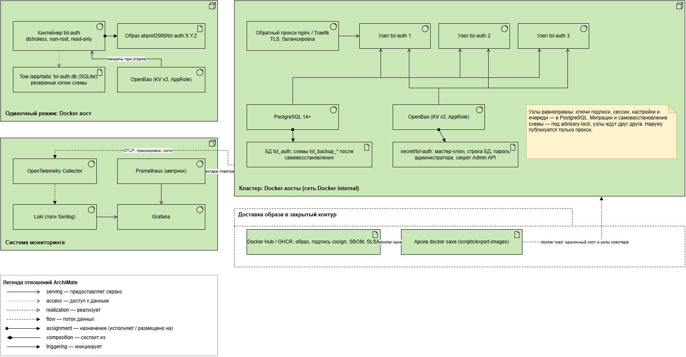

## 13. Миграция данных

Переход с другого поставщика: формат claims совместим с Keycloak, поэтому проверка прав в приложениях не переписывается. Учётные записи создаются через Admin API; пароли не переносятся — пользователи получают приглашение или временный пароль. Перенос одиночного режима в кластер выполняет CLI `migrate-to-postgres`.

## 14. Тестовые сценарии и критерии приёмки

| Вид испытаний | Средство | Критерий |
|---|---|---|
| Модульные | xUnit (`tests/TslAuth.UnitTests`) | Все проходят |
| Интеграционные | xUnit + WebApplicationFactory на SQLite и PostgreSQL в контейнере | Все проходят, включая обновление схемы и самовосстановление |
| UI | Playwright | Сценарии входа, регистрации, админки |
| Нагрузочные | k6 | Показатели 11.2 |
| Отказоустойчивость | `tests/resilience` | 0 ошибок при rolling update и отказе узла |
| Решения заказчика | `TwoFactorScenarios` (SQLite и PostgreSQL), `SettingsTests` | Двухфакторный вход по роли: страница кода, неверный код отклонён, код с почты и из мессенджера принят, `amr` в токенах и после refresh; password grant закрыт; без каналов вход не выполняется; неактивные отключены, администратор — нет; сроки журнала по умолчанию |
| Секреты в переменных и файле | `tests/resilience/run-env-secrets.ps1` | Сервис стартует с секретами из `.env` и из файла настроек |
| Подчинённые клиенты и вход по ключу | `ManagedClientScenarios` (SQLite и PostgreSQL), `ManagedClientsTests`, `tests/load/run-managed-load.ps1`, UI-сценарий, контрактные тесты SDK .NET и Go | Создание с ключом → токен по `private_key_jwt` с ролью и сроком политики; повтор `jti`, `alg=none`, HS256, чужая подпись, срок > 5 мин, чужая `aud` — `invalid_client`; отключение → нет токена, introspection `active=false`, событие; удаление; чужой клиент — 404; роль вне списка, чужой scope, Admin API — 400; сервисный токен на изменение — 403; оператор без разрешения — 403; предел числа; два `kid`; два узла и общий `jti`; блокировка `client_id`; 200 подчинённых под нагрузкой без роста ошибок; владелец и подчинённые в админке, отключение из админки |
| Безопасность | Trivy, Dockle, gitleaks | 0 уязвимостей, CIS пройден, 0 секретов |
| Документация | `scripts/validate-docs.ps1` | 0 проблем |
| Восстановление | Проверка по К-3 | Протокол с фактическим RTO |

Приёмка версии: зелёные CI и E2E на коммите релиза, опубликованный подписанный образ, документация соответствует версии. Приёмка для первой очереди ERP дополнительно требует выполнения требований со статусом «1-я очередь» и сценария C07 архитектурного ЧТЗ: проверены технические клиенты, ограничения полномочий, административный доступ и секреты.

## 15. Этапы

| Этап | Результат | Статус |
|---|---|---|
| Ядро: протоколы, роли, пользователи | Сервис с админкой и Admin API | выполнен |
| Кластер и безопасность | PostgreSQL, шифрование, защищённый образ, нагрузочные тесты и тесты отказов | выполнен |
| API самообслуживания | App API, Bot API, лента событий, саморегистрация | выполнен |
| Надёжность данных | Обновление схемы, перенос SQLite → PostgreSQL, самовосстановление БД | выполнен |
| Наблюдаемость | `/metrics`, OpenTelemetry; VictoriaMetrics, VictoriaLogs, VictoriaTraces | выполнен |
| Решения заказчика по вопросам ЧТЗ | Двухфакторный вход по ролям (Ф-18), отключение неактивных учётных записей (Ф-12), сроки хранения журнала по умолчанию (А-4) | выполнен |
| Подчинённые клиенты и вход по ключу (РС-16) | Ф-28, Ф-29, Ф-30, Б-11: App API `/api/app/clients`, `private_key_jwt`, отключение клиентов, SDK .NET и Go, выпуск 1.5 | выполнен |
| Доработка для первой очереди ERP | Ф-9, Ф-11, отчёт Ф-12, А-2а, А-3, А-7, Н-6, К-1, К-3, пример FastAPI, профиль нагрузки 220 пользователей | запланирован |

## 16. Обучение и инструкции

| Документ | Файл |
|---|---|
| Обзор и быстрый старт | [README](../README.md) |
| Архитектура | [architecture.md](architecture.md) |
| Развёртывание | [deployment.md](deployment.md) |
| Конфигурация | [configuration.md](configuration.md) |
| Интеграция приложений | [integration.md](integration.md) |
| Руководство администратора | [administration.md](administration.md) |
| Безопасность | [security.md](security.md) |
| Тестирование | [testing.md](testing.md) |
| Регламент эксплуатации | [operations.md](operations.md) |
| ArchiMate-модель | [archimate/auth-architecture.drawio](archimate/auth-architecture.drawio) |

Документация актуализируется вместе с кодом; расхождение документации и поведения считается дефектом (04.14).

## 17. Соответствие общему ТЗ ERP

| Требование общего ТЗ | Раздел | Где выполняется |
|---|---|---|
| Единая учётная запись, единая идентификация и аутентификация | 03.01, 04.09 | Ф-1, Ф-7 |
| OIDC для пользователей и технических клиентов | 04.02 | Ф-1, Ф-21 |
| Матрица прав на уровне операций | 03.01, 04.09 | Ф-6 |
| Совмещение ролей и блокировка несовместимых полномочий | 03.01, 04.09 | Ф-7; несовместимые роли не определены (В-8) |
| Области доступа по организациям, подразделениям, ЦФО, проектам, объектам | 03.01, 04.09 | ядро ERP (В-1) |
| Период действия прав, делегирование, замещение | 03.01, 04.09 | Ф-9, Ф-11 |
| Прекращение доступа при смене роли или увольнении | 03.01, 04.09 | Ф-14, Ф-19 |
| Периодическая проверка актуальности прав | 03.01, 04.09 | Ф-12 |
| Разделение технического администрирования и бизнес-данных | 03.01, 04.09 | Ф-13, раздел 9 |
| Многофакторная аутентификация для административных ролей и критических операций | 04.09 | Ф-18 |
| Секреты в защищённом хранилище, контроль секретов в коде | 04.09 | Б-3–Б-5 |
| Шифрование данных и каналов | 04.09 | Б-1, Б-6 |
| Маскирование чувствительных полей | 04.09 | ядро ERP |
| Аудит входов, учётных записей, назначений; защита журнала | 04.15 | А-1–А-7, А-2а |
| Доступность 99,5 %, RPO 15 мин, RTO 4 ч | 04.07 | Н-1–Н-6 |
| Резервное копирование и проверка восстановления | 04.08 | К-1–К-3 |
| Мониторинг, метрики, трассировка | 04.10 | 11.7 |
| Разделение сред | 04.11 | 11.8 |
| Выпуск и откат не более 30 минут | 04.12 | Р-4, Р-5 |
| Передача исходного кода, тестов, документации | 04.14 | разделы 14, 16 |

## 18. Принятые решения по вопросам

Ответы заказчика на [вопросы для ЧТЗ](tz-questions.md).

| № | Вопрос | Решение |
|---|---|---|
| В-1 | Где хранятся области доступа | В отдельной базе ядра ERP рядом с оргструктурой. tsl-auth их не хранит |
| В-2 | Делегирование и замещение | Замещение назначает администратор доступа (Ф-11) |
| В-3 | Прекращение доступа при увольнении | Как отзыв refresh-токена: применяется при следующем refresh, не позднее 15 минут (Ф-19) |
| В-4 | Срок развёртывания OpenBao | На MVP секреты хранятся в `.env` и файле настроек |
| В-5 | Сроки хранения журнала | По умолчанию: входы — 1 год, изменения и действия администраторов — 5 лет, технические события — 90 дней (А-4, реализовано) |
| В-6 | Резервное копирование и мастер-ключ | В промышленной среде мастер-ключ и секреты — в OpenBao, отдельно от копий БД (К-1) |
| В-7 | Критические операции с повторным подтверждением | Не относится к tsl-auth: определяется прикладной системой, например документооборотом. tsl-auth передаёт claim `amr` |
| В-8 | Несовместимые роли | Не требуются: доступ задаётся матрицей «роль × разрешение» (Ф-10) |
| В-9 | Способ второго фактора | Код на email и в мессенджер через бота; какие роли требуют второй фактор, задаёт администратор флагом роли. TOTP и аппаратные ключи — задел на будущее (Ф-18, реализовано) |
| В-10 | Отключение неактивных учётных записей | Автоматически после 90 дней без входа, кроме администраторов сервиса — их отключают только вручную (Ф-12, реализовано) |
| В-11 | Привязка токена подчинённого клиента к ключу (DPoP, RFC 9449; постановка `task-managed-clients.md`, этап 2) | Отложено: OpenIddict 7.7 не поддерживает DPoP. Пока риск кражи access-токена ограничен сроком 5 минут и отключением клиента; вернуться при появлении поддержки в OpenIddict или переходе на mTLS (RFC 8705) |

Остаются открытыми: частота пересмотра прав и ответственные за него; срок, после которого отключённая учётная запись удаляется.

## Использованные материалы

Статьи базы знаний: UKA-A-91 (03.01), UKA-A-122 и UKA-A-311 (04.02, 04.02.01, вопрос A02), UKA-A-124 (04.05), UKA-A-126 (04.07), UKA-A-127 (04.08), UKA-A-128 (04.09), UKA-A-129 (04.10), UKA-A-130 (04.11), UKA-A-131 (04.12), UKA-A-133 (04.14), UKA-A-98 (04.15), UKA-A-99 (07.01, шаблон ЧТЗ).

Допущения: для расчёта нагрузки принимается 220 одновременно активных пользователей; требования к доступности tsl-auth приняты равными требованиям к операционному ядру ERP, потому что без входа ядро недоступно.
