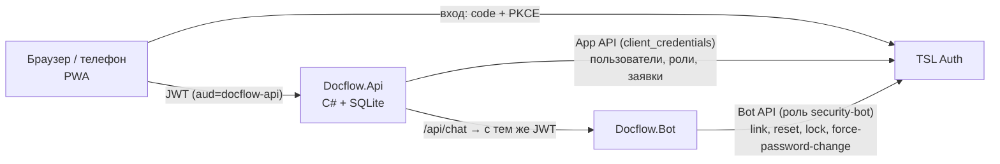

# Демо «Документооборот» на TSL Auth

PWA-приложение документооборота (React + TypeScript), API на C# и бот безопасности.
Показывает, как приложение живёт поверх TSL Auth:

- **роли и права** настраиваются только в TSL Auth (матрица приложения `docflow-api`);
- **сотрудники и назначение ролей** — внутри демо, через App API TSL Auth;
- **бот** принудительно меняет пароль и блокирует учётные записи через Bot API TSL Auth.



## Возможности

| Раздел | Что умеет |
|---|---|
| Обзор | Сводка, график за 8 недель, статусы и типы, задачи, лента событий |
| Документы | Реестр с фильтрами и поиском, черновики, версии, вложения, обсуждение, история |
| Маршрут | Несколько шагов «согласование» и «утверждение»; исполнитель — сотрудник или любой с ролью |
| Мои задачи | Документы, ждущие вашего решения; уведомления в колокольчике |
| Пользователи | Создание сотрудника (временный пароль или приглашение), выдача ролей существующему, заявки на роли |
| Бот безопасности | Чат: привязка, сброс пароля, блокировка, принудительная смена пароля |
| Профиль | Роли, матрица прав, claims токена, установка PWA |

## Роли (матрица `docflow-api` в TSL Auth)

| Роль | Название | Разрешения |
|---|---|---|
| `employee` | Сотрудник | `documents.view`, `documents.create`, `dashboard.view` |
| `reviewer` | Согласующий | то же + `documents.review` |
| `approver` | Руководитель | то же + `documents.review`, `documents.approve` |
| `clerk` | Делопроизводитель | `documents.view`, `documents.archive`, `dashboard.view` |
| `docflow-admin` | Администратор документооборота | все, включая `users.manage` |

Изменили матрицу в админке TSL Auth — права в приложении меняются со следующим токеном, без изменения кода.

## Бот безопасности

Клиент `docflow-security-bot` имеет роль `security-bot` в `tsl-auth-admin`. «Мессенджер» — чат внутри PWA:
отправитель определяется по его access-токену (`provider = docflow-chat`, `externalId = sub`).

| Команда | Кто может |
|---|---|
| `/link КОД` | любой: код — в личном кабинете TSL Auth, раздел «Мессенджер» |
| `/reset` | привязанный пользователь, для себя: одноразовая ссылка сброса |
| `/forcepwd`, `/lock` | привязанный пользователь, для себя: завершить сеансы и сменить пароль или заблокироваться |
| `/lock логин`, `/unlock логин`, `/forcepwd логин` | пользователь с ролью `security-officer` в `tsl-auth-admin` |

Бот понимает и фразы: «заблокируй petrov», «смени пароль у ivanova», «забыл пароль».
Разрушительные действия подтверждаются кнопкой. Все команды пишутся в журнал TSL Auth и в ленту `security.alert`.

## Запуск в Docker

```powershell
cd samples/docflow-demo
docker compose up -d tsl-auth
./seed.ps1                       # приложения, роли, сотрудники; секреты → .env
docker compose up -d --build     # http://localhost:5200
```

Команды `/lock`, `/unlock`, `/forcepwd` появились в Bot API после версии образа с этим демо.
Пока релиз не опубликован, соберите образ из репозитория и укажите его в `TSL_AUTH_IMAGE`:

```powershell
docker build -t tsl-auth:local ../..
$env:TSL_AUTH_IMAGE = "tsl-auth:local"; docker compose up -d tsl-auth
```

Сотрудники: `ivanova` (сотрудник), `petrov` (согласующий), `sidorova` (руководитель), `kozlov` (делопроизводитель),
`admin-doc` (администратор и офицер безопасности). Пароль — `Demo-Passw0rd!`. Только для демо-стенда.

## Запуск без Docker

```powershell
# TSL Auth уже запущен на http://localhost:8080 с клиентом Admin API admin-cli
./seed.ps1
cd web; npm ci; npm run build; cd ..   # PWA → api/wwwroot
./run-local.ps1 bot                     # http://localhost:5201
./run-local.ps1 api                     # http://localhost:5200
```

Для разработки интерфейса: `cd web; npm run dev` — Vite на `http://localhost:5173` проксирует `/api` на API.

## Структура

```
api/    Docflow.Api — Minimal API: документы, маршруты, дашборд, прокси App API и чата, раздача PWA
bot/    Docflow.Bot — разбор команд чата и вызовы Bot API TSL Auth
web/    PWA: React 19, TypeScript, Vite, Tailwind CSS 4, oidc-client-ts, Recharts
seed.ps1        регистрация приложений, матрицы и сотрудников в TSL Auth
run-local.ps1   запуск API или бота с секретами из .env
```
